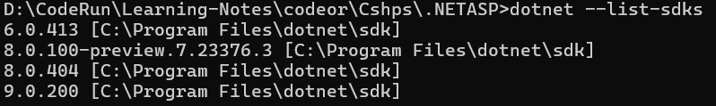
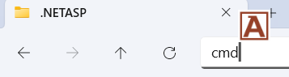
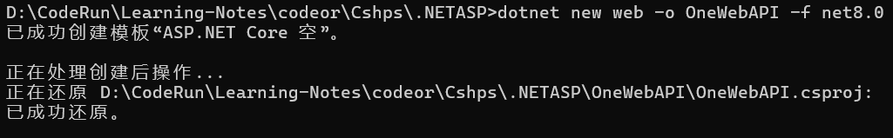
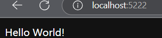
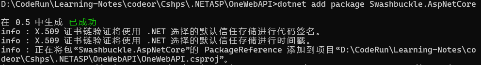
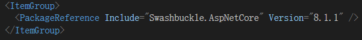
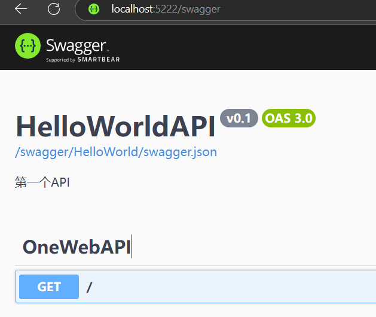

# .NET ASP 第一个API

## 一| 前置条件

### 1.安装.NET 8+运行环境

在浏览器搜索`.NET8 SDK`或直接点击链接下载[.NET8](https://dotnet.microsoft.com/en-us/download/dotnet/8.0)，安装完成后建议重启电脑。
随后打开控制台输入`dotnet --list-sdks`，如果出现带有 `8.0` 及以上则是成功



## 二| 创建项目

### 1.项目选址

这正式创建项目之前，需要先确定项目的存储位置，无需创建与项目同名的目录，`dotnet`会自动创建子目录。
在你期望的目录地址栏输入，`cmd`可以打开控制台



### 2.项目创建

控制台开启后，执行 `dotnet new web -o 项目名称 -f net8`，其中`-o`表示输出到给定目录，`-f`表示框架版本，这里使用`.NET8`。



## 三| 项目运行

项目创建完成后，由于我们使用了`-o`所以进入到项目实际的目录，使用`cd ./项目名称`命令
随后执行`dotnet run` ，若出现如下日志则成功

```shell
> dotnet run
从 D:\CodeRun\Learning-Notes\codeor\Cshps\.NETASP\OneWebAPI\Properties\launchSettings.json 使用启动设置...
正在生成...
info: Microsoft.Hosting.Lifetime[14]
      Now listening on: http://localhost:5222
info: Microsoft.Hosting.Lifetime[0]
      Application started. Press Ctrl+C to shut down.
info: Microsoft.Hosting.Lifetime[0]
      Hosting environment: Development
info: Microsoft.Hosting.Lifetime[0]
      Content root path: D:\CodeRun\Learning-Notes\codeor\Cshps\.NETASP\OneWebAPI
```

随后在浏览器输入提示的`uri`即可看到`hello world` `http://localhost:5222`


对于这个`uri`可以前往项目文件的`Properties/launchSettings.json` 中进行配置，这个是`http`，`https`可以进行额外配置


## 四| 添加服务

> 添加`Swagger`来自动化API文档

### 1. 安装NuGet包

​	如果服务正在运行`dotnet run`，那么使用`CTRL + C` 停止，随后执行`dotnet add package Swashbuckle.AspNetCore` ，也可以使用`--version 6.5.0`参数指定版本



### 2.安装验证

​	使用`Visual Studio Code` / `Visual Stduio` 打开项目文件`项目名称.csproj`，如出现以下相关条目则成功


### 3.使用服务

​	打开项目目录下的`Program.cs`文件进行编辑，默认使用顶级语句，在这里的一切操作与操作`控制台应用程序`的`main`方法一样。

​	我们将在`var builder = WebApplication.CreateBuilder(args);`下添加内容
```cs
var builder = WebApplication.CreateBuilder(args);
builder.Services.AddEndpointsApiExplorer();
builder.Services.AddSwaggerGen(sw => {
    //创建单个API文档
    sw.SwaggerDoc("HelloWorld", new Microsoft.OpenApi.Models.OpenApiInfo() { 
        Title = "HelloWorldAPI", 
        Description = "第一个API", 
        Version = "v0.1" 
    });
});

var app = builder.Build();

if(app.Environment.IsDevelopment()) //如果是开发环境
{
    app.UseSwagger(); //注册Swagger
    app.UseSwaggerUI(suo => {
        //这边地址中 `HelloWorld` 要与接口文档对应
        suo.SwaggerEndpoint("/swagger/HelloWorld/swagger.json", "HelloWorld v0.1"); 
    });
}
app.MapGet("/", () => "Hello World!");
```

​	随后在控制台执行`dotnet run` ，在浏览器输入 `http://localhost:5222/swagger`

​	如果上次失败了，更改完成后还是一样的错误，建议使用`无痕模式` / `清除缓存` 后重试

