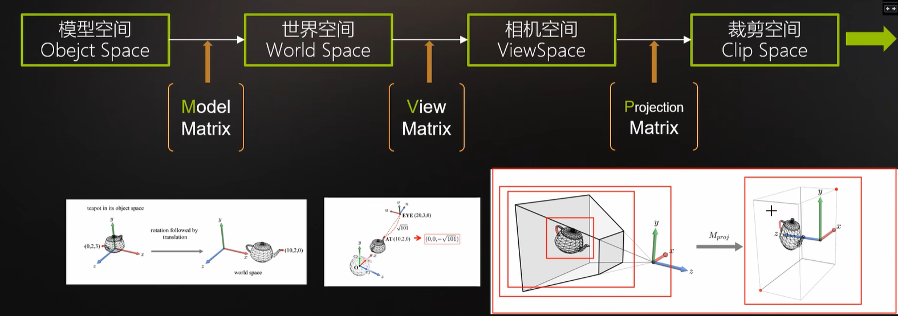

# Unity

## 子父关系

​	子物体的`Transform`是基于父的(相对坐标)，也就是`local`，而父的才是世界座标系，如果要创建多对象实体，可以创建空对象后设置其为顶级父对象，在挂组件时给父挂就行。

​	移动时，只需要移动父物体，子物体会跟着移动，若要移动子物体，可以更改`localPosition`。
​	在将子物体移动到父物体内后，通常建议将`Transform`组件`Rest`

## 渲染模式

| 模式        | 说明                            |
| ----------- | ------------------------------- |
| Opaque      | 不透明，透明层会渲黑            |
| Cutout      | 透明剔除                        |
| Fade        | 渐变，整体遵循A通道，可完全透明 |
| Transparent | 透明，不能完全透明，用于玻璃    |

## 摄像机

> 摄像机能有多个，但是活跃的Audio Listener只能有一个

### 默认组件

| 名称           | 用途                 |
| -------------- | -------------------- |
| Transform      | 无法缩放，可移动旋转 |
| Flare Layer    | 激活可显示光源耀斑   |
| Audio Listener | 接收音频             |
| Camera         | 相机                 |

### Camera

| 属性            | 说明                                                         |                                                              |
| --------------- | ------------------------------------------------------------ | ------------------------------------------------------------ |
| Clear Flags     | 屏幕空白区域怎么处理                                         |                                                              |
| Culling Mask    | 选择遮罩 (每个对象都有 Tag和Layer)<br>这个就是选择遮罩层 <br>如果对象设置了 Layer 并在相机中取消勾选<br>那么他将不显示，Unity也不会给他渲染了 | 例如2D地图<br>可以在玩家头顶添加一个层<br>地图相机可见他<br>主相机不可见<br>实际中地图是额外的材质，一个地图片在顶上 |
| Projection      | 相机模式选择， 正交 / 投影，2D选正交                         |                                                              |
| Clipping Planes | 裁剪面<br>Near 最近渲染多少（这个值以内的看不见）<br>Far 最远渲染多少 （这个值以外的看不见） |                                                              |
| Viewpoit Rect   | 相机占整个视口的大小，使用`uv` (0 - 1)，如 双人小游戏        |                                                              |
| Depth           | 渲染深度，值越大越在上面，类似 z-index                       | Clear Flags设置为Depth only时，不会显示低于自己的图像        |

### 天空盒

> 围绕整个场景的包装器，用于模拟天空的材质

​	为`Camera`添加`Skybox`就可以为其设置自定义天空盒，但只在目标相机有效，如果要在预览窗格中显示自定义天空盒，可以单击` Window -> Rendering -> Lighting -> Environment -> Skybox Material`，使用此设置天空盒，可作为反射源进行反射，物体上或许会有天空盒的颜色。


​	自定义的天空盒材质，可以选择`Unity`提供的 `SkyShader`


## InstantOC

### 渲染管线

> 游戏 -> 图形API ->  CPU|GPU -> 顶点处理 -> 图元装配 -< 光栅化 -> 像素处理 -> 缓存

​	CPU判断哪些物体需要渲染，如果需要渲染则调用图形API，没有一个物体需要绘制，都会调用一次`Draw Call`，这个也是渲染的性能指标，每帧调用显卡渲染物体的次数，在不考虑光照的情况下，一个物体一个`DrawCall`。`批处理可以减少`，在`Game`视图中，单击`Stats`可以查看。


​	GPU会接收模型顶点数据，并进行坐标转换，从模型坐标转换到屏幕坐标，转换完成后进行图元装配，将每个顶点组装起来。然后进行光栅化，这将计算三角面上的像素值，并为后面的着色阶段提供合理的插值参数。

​	渲染好的图形会被存入帧缓存（帧缓冲区），现在会不断从帧缓存中不断读取并输出到屏幕。
缓冲区中还会存储深度信息，存储像素的深度信息，即物体到摄像机的距离。这些信息在光栅化时进行计算，如果深度值比现有值更近，则像素会被写入到帧缓冲区，并替换深度缓存。


### Occlusion Culling

> 遮挡剔除
> 当一个物体被送进渲染流水线之前，将摄像机内看不到的物体进行剔除，减少每帧渲染的数据量。

​	如果是使用射线检测的话需要使用`Box Collider`，`CPU`会有额外开销，如果场景中有大量遮挡才使用。


### LOD

> 多细节层次
> 根据物品模型的节点在显示环境中所处的位置和重要度，决定渲染的资源分配，降低非重要物体的面数和细节度，从而获取高效率的渲染运算。

​	增加CPU利用，内存占用更大。


## 光照系统

> 全局光照
> 要添加光源，可以直接使用`Light`添加光源对象 （跟创建正方形一样），对于光源也可以设置`Culling Mask`选择哪些物体受光照。

| 类型  | 用途         |
| ----- | ------------ |
| Point | 火把         |
| Spot  | 手电筒，吊灯 |

### 阴影

​	光照中可以设置光照阴影，分为硬和软，软的更平滑，硬的更硬(性能更好) `Shadow Type`，`Mesh Renderer`可以选择受不受其他对象的阴影，需要设置`Receove Shadows`，`Cast Shadows`可以设置实体是否投射阴影

### 间接光

> 物体表面在接受光照后反射出的光

​	由于其计算量较大，因此需要将对象设置为静态，并在运行过程中无法移动。


### 烘培

> 将光线效果渲染成贴图再作用到物体上模拟光影

1. 设置实体为静态
2. 设置光照的`Baking`设置为`Baked`
3. 设置`Baking GI`为开启 然后`Build`


## 声音

| 属性          | 说明     |
| ------------- | -------- |
| Play On Awake | 启动播放 |
| Loop          | 一直循环 |
| Volume        | 音量     |

| 3D 属性        | 说明                          |
| -------------- | ----------------------------- |
| Volume Rolloff | 衰减方式                      |
| Max Distance   | 最大距离                      |
| Min Distance   | 最小距离 这个距离以内没有衰减 |
| 图表           | x是距离 y是大小               |


## 用户输入

> Edit -> Project Settings -> Input Manager


# 脚本

> 逻辑脚本中不建议出现属性。业务脚本遵循常规开发要求。

## 生命周期

​	Unity的生命周期是单线程的，当有多个脚本被挂载时，会把全部的Awake执行完再执行。

```cs
foreach(var objectO in objects){
    objectO.Awake();
}
foreach(var objectO in objects){
    objectO.Start();
}
```


| 名称           | 说明                                                         |
| -------------- | ------------------------------------------------------------ |
| Awake          | 物体载入调用一次，常用于初始化                               |
| OnEnable       | 脚本被启用时调用一次                                         |
| Start          | 物体载入并且脚本对象启用时执行一次<br>时机晚于Awake          |
| FixedUpdate    | 固定间隔调用，适用于编写游戏逻辑<br>Edit -> Project Setting -> Time -> Fixed Timestep |
| Update         | 渲染帧执行，间隔时间不固定                                   |
| LateUpdate     | Update执行完成后执行，可用于相机跟随等                       |
| OnCollisionXXX | 当满足碰撞时调用                                             |
| OnTriggerXXX   | 当瞒住条件时触发                                             |

鼠标相关

| 名称         | 说明                   |
| ------------ | ---------------------- |
| OnMouseEnter | 鼠标移入Collider时调用 |
| ...Over      | 经过调用               |
| ...Exit      | 离开调用               |
| ...Down      | 按下调用               |
| ...Up        | 抬起调用               |

场景渲染

| 名称              | 说明                                    |
| ----------------- | --------------------------------------- |
| OnBecameVisible   | 当Mash Renderer在任何相机上可见时调用   |
| OnBecameInvisible | 当Mash Renderer在任何相机上不可见时调用 |

结束阶段

| 名称              | 说明                           |
| ----------------- | ------------------------------ |
| OnDisable         | 对象变为不可用调用             |
| OnDestroy         | 脚本销毁或附属对象被销毁时调用 |
| OnApplicationQuit | 应用程序退出调用               |


## 编辑器编辑

| 特性名称        | 说明                     |
| --------------- | ------------------------ |
| SerializeField  | 在编辑器中显示私有字段   |
| HideInInspector | 在编辑器中不显示公共字段 |
| Range(min. max) | 范围控制                 |


## 常用API

​	在脚本中使用this. 就相对于直接获取了所在实体对象中的内容

| 名                         |                                                 |
| -------------------------- | ----------------------------------------------- |
| Component                  |                                                 |
| Transform                  |                                                 |
| GameObject                 |                                                 |
| Object                     |                                                 |
| Time                       |                                                 |
| GetComponentsInChildren<T> | 获取后代和自己的指定组件<br>不加s就是获取第一个 |
| GetComponentsInParent<T>   | 获取父组件的指定组件<br>不加s就是获取第一个     |
| CompareTag                 | 对象标签是否是给定名称                          |

- 使用GetComponent获取Mash Menderer并更改颜色

```cs
this.GetComponent<MeshMenderer>().material.color = Color.White;
```


## Transform

> 其与`MonoBehaviour`没有直接关系，因此不能像`Component`一样直接用。
> 获取到了别的组件的`Transform`就可以获取到对象的所有组件了
> 旋转-> 绕哪个轴哪个轴就不动

​	直接对`this.transform`进行`foreach`能获取单辈子组件的`transform`组件

| 属性                     | 说明                                                         |
| ------------------------ | ------------------------------------------------------------ |
| position                 | 物体世界座标系中的位置                                       |
| localPosition            | 相对于父物体轴心点的位置<br>在编辑页面中的position其实就是local的 |
| rotation / localRotation | 旋转                                                         |
| localScale               | 相对于父物体缩放比例                                         |
| lossyScale               | 物体与模型的缩放比例<br>自身缩放比例 * 父物体缩放比例        |

| 方法名          | 用途                                                         |
| --------------- | ------------------------------------------------------------ |
| Translate       | 移动变换组件在translation的方向和距离<br>设置Space后可以旋转相对于谁的座标系，默认自身<br>`this.transform.Translate(0,0,1,Space.World);` |
| Rotate          | 旋转，单位是度，使用方式与Translate一样                      |
| RotateAround    | 围绕旋转<br>绕哪个点，哪个轴，多少度<br>(Vector3.zero, Vector3.up, 1) |
| LookAt          | 旋转变换，让其Z向量指向目标                                  |
| SetSiblingIndex | 设置同级对象的索引                                           |


## GameObject

> 提供了操作游戏对象的功能

| 名称                               | 说明`this.gameObject`                                        | 类型       |
| ---------------------------------- | ------------------------------------------------------------ | ---------- |
| activeInHierarchy                  | 物体实际激活状态（在场景中的激活状态）                       | 字段       |
| activeSelf                         | 物体自身激活状态 （在Inspector面板中的）                     | 字段       |
| SetActive()                        | 设置激活状态                                                 | 方法       |
| Find(string name)                  | 在场景中根据名称寻找物体<br>GameObject.Find("对象名称")<br>慎用 | 静态、方法 |
| FindGameObjectsWithTag(string tag) | 通过标签获取(全部)                                           | 静态、方法 |
| FindWithTag(string tag)            | 获取使用此标签的物体(单个)                                   | 静态、方法 |

- 使用脚本添加游戏对象

```cs
//Unity中不能new完组件再添加，而是往一个对象去添加 让Unity自己New
var gameObject = new GameObject();
//添加组件，会返回此组件对象的引用
var light = gameObject.AddComponent<Light>();
light.type = LightType.Point;
light.color = Color.red;
//设置新对象的父为当前对象
gameObject.transform.parent = this.gameObject.transform;
```


## Object

| 名称                                              | 说明                                                 | 类型       |
| ------------------------------------------------- | ---------------------------------------------------- | ---------- |
| Destroy                                           | 删除一个游戏对象、组件或资源                         | 静态、方法 |
| DestoryImmediate                                  | 立即销毁，建议使用上面那个                           | 静态、方法 |
| DontDesroyOnLoad                                  | 保护给定对象<br>可以在跨场景时，使对象不被销毁       | 静态、方法 |
| FindObjectOfType<T>();<br>FindObjectsOfType<T>(); | 根据类型查找全部场景对象<br>可以用来查找全部敌人脚本 | 静态、方法 |
| Instantiate                                       | 克隆                                                 | 静态、方法 |

- 获取生命值最小的敌人

```cs
var lifeLastObjects = Object.FindObjectsOfType<GetLifeLast>();
GetLifeLast lastLifeEntity = null;
foreach (var item in lifeLastObjects) {
    if(lastLifeEntity == null) {
        lastLifeEntity = item;
    }
    if(lastLifeEntity.Options.Life <= item.Options.Life) {
        lastLifeEntity = item;
    }
}
```


## Time

| 名称              | 说明                                                         |
| ----------------- | ------------------------------------------------------------ |
| time              | 游戏开始了几秒                                               |
| deltaTime         | 完成最后一帧的时间(最后一帧的间隔)<br>可用于控制速度`this.transform.Rotate(0, 1 * Time.deltaTime, 0);`<br>这样可以保证旋转速度不受渲染速度影响<br>值 * 每帧消耗时间 |
| timeScale         | 时间缩放，可以慢动作和暂停游戏<br>FixedUpdate受影响<br>Update不受影响，但是Time.deltaTime受影响，因此也可以间接受影响 |
| unscaledDeltaTime | 不受时间缩放影响的时间帧间隔<br>可用于部分内容在暂停后依然不受影响 |

- 自己写的 

```cs
public int startTime = 0;
public int maxTime = 120;
private Text textTimer;
private void Start()
{
    textTimer = this.gameObject.GetComponent<Text>();
    startTime = (int)Time.time;
}
private void Update()
{
    //string.Format("{0}:{1}", Time.time / 60, Time.time % 60);
    if(textTimer != null && (int)(120 - Time.time) > 0) {
        textTimer.text = TimeSpan.FromSeconds((int)(120 - Time.time)).ToString();
    }
}
```

- 方法1

```cs
using UnityEngine;
using UnityEngine.UI;
public class EditTime2 : MonoBehaviour
{
    private Text textTimer;
    private void Start()
    {
        textTimer = this.gameObject.GetComponent<Text>();
    }
    /// <summary>
    /// 每次减少的间隔
    /// </summary>
    private float goByTime = 1;
    /// <summary>
    /// 总时长
    /// </summary>
    public float totalTime = 120;
    private void Update()
    {
        //每帧判断是否经过一秒
        if(Time.time >= goByTime && totalTime > 0) {
            //每经过一秒进行一次计算
            textTimer.text = string.Format("{0:d2}:{1:d2}", (int)(totalTime / 60),(int)(totalTime % 60));
            //总计时减少
            totalTime -= 1;
            //累积计时增加
            goByTime = Time.time + 1;
        }
        if(totalTime < 10) {
            textTimer.color = Color.red;
        }
    }
}
```


## MonoBehaviour

| 名称            | 说明                 |                                               |
| --------------- | -------------------- | --------------------------------------------- |
| InvokeRepeating | 重复调用给定方法     | InvokeRepeating(方法名称, 开始时间, 间隔时间) |
| CancelInvoke    | 删除给定任务         | CancelInvoke(方法名称);                       |
| Invoke          | 延迟给定时间调用一次 |                                               |


# 快捷键

| 键位                        | 功能                     |
| --------------------------- | ------------------------ |
| 选中实体 + Ctrl + Shift + F | 快速将选定实体定位到视口 |
| 选中实体 + F                | 将视口定位到给定实体     |
|                             |                          |


# 更改输入模式

​	`Edit` -> `Project Settings` -> `Player` -> `Configuration` -> `Active Input Handling`


# 预制件

​	这是一种资源类型，可以多次在场景中进行实例。

​	如果单独修改实例的属性值，则该值不再随预制件变化。

​	直接将Hierarchy中的物体坨拽到Project资源面板，便会生成一个预制件，在资源面板中更改可以更改全局属性，在Hierarchy面板中可以定制内容。

​	如果要全局应用某一个行为，Hierarchy面板中单击那个物体，然后中Inspector中找到`Prefab`然后单击`Apply`

| 按钮名称 | 说明                   |
| -------- | ---------------------- |
| Select   | 单击后，定位到预制件   |
| Apply    | 更改应用到预制件       |
| Revert   | 后悔，恢复到预制件属性 |


# 英雄无敌

## 敌人模块

> 敌人生成器需要生成敌人，并为敌人设置线路。

| 说明            | 用处     |
| --------------- | -------- |
| EntityAI        | 实体AI   |
| EntityAnimation | 实体动画 |
| EntityStatus    | 实体状态 |
| EntityMotor     | 移动实体 |

### EntityMotor

| 名称     | 说明 |
| -------- | ---- |
| Move     | 移动 |
| Rotation | 旋转 |
| FindPath | 寻路 |


### EntityGenerate

| 名称                 | 说明                         |
| -------------------- | ---------------------------- |
| WayLine[] lines      | 存储所有路线                 |
| GameObject[] entitys | 记录敌人预制件               |
| int startCount       | 记录开始时需要创建的敌人数量 |
| int spawnedCount     | 记录已经生成的数量           |
| int maxCount         | 记录最大敌人上限             |
| int maxDelay         | 记录最大生成间隔             |


## 敌人类型设计

​	敌人对象只需要挂`Entity`脚本就可以，Status、Motor 由Entity`Start`中自行创建，wayLine由`EntityGenerate`设置

|                |                                                              |
| -------------- | ------------------------------------------------------------ |
| Entity         | 实体类，包含<br>EntityStatus<br />EntityMotor<br />WayLine -> 所走的路线 |
| EntityGenerate | 实体生成器，包含<br>全部活跃Entity，<br />全部WayLine<br />响应Entity的Kill事件 |


## 创建路线

> 每个点就是此路线的经过点，每个WayLine就是一条完整路线，路线类型包含Vetcor3[] 是全部路线，路线类拥有 IsUseable 是否启用

​	路线的初始化至于`EntityGenerate`的`Start`中，使用`GameObject.FindObjectsByType`获取

路线.png)

​	

## 自己写的

> 没看，直接写了，写到后面就发现设计问题了，Entity类型是多余的，完全没必要的，gameObject本身就是最好的实体，往他身上加组件，就是加EntityStatus等的字段

### 说明

线路有如下要求

1. 需要挂载`WayLine`脚本
2. 点需要以Pointx 命名，其中x是第几个，只支持 < 10

### WayLine类

路线点初始化由`WayLine`类型的`Start`方法完成

```cs
using System.Collections.Generic;
using System.Linq;
using UnityEngine;

namespace Assets.EntityDome
{
    internal class WayLine : MonoBehaviour
    {
        [Tooltip("线路点")]
        public List<Vector3> points;
        [Tooltip("是否启用")]
        public bool isEndbale;

        private void Start()
        {
            //获取线路的全部线路点，并按照最后一个字符判断是第几个点
            var points = this.transform.GetComponentsInChildren<Transform>();
            foreach (var item in points.OrderBy(f => f.name.Trim()[^1]).ToArray()) {
                this.points.Add(item.position);
            }
            ;
        }
    }
}

```


### EntityStatus类

​	此类型存储实体的基本状态

```cs
using UnityEngine;

namespace Assets.EntityDome
{
    internal class EntityStatus : MonoBehaviour
    {
        /// <summary>
        /// 生命值
        /// </summary>
        [Tooltip("生命值")]
        public int life = 100;

        /// <summary>
        /// 此实体的路线
        /// </summary>
        [Tooltip("此实体的路线")]
        public WayLine wayLine;
    }
}
```


### EntityMotor类

​	此类型控制实体移动

```cs
using System;
using UnityEngine;

namespace Assets.EntityDome
{
    internal class EntityMotor : MonoBehaviour
    {
        //本实体要走的线路
        private WayLine wayLine;
        //本对象的变换组件
        private Transform thisTransform;
        //当前走到的线路的第几个点
        private int currentWayLinePoint;

        private void Start()
        {
            //初始化变换组件
            thisTransform = this.transform;
            currentWayLinePoint = 0;
        }

        //平滑进度
        private float lerpT = 0f;
        private void Update()
        {
            //初始化线路，如果线路未找到不执行操作
            if (!InitWayLine()) {
                return;
            }

            //获取当前的目标点
            var targetPoint = wayLine.points[currentWayLinePoint]; //目标点
            //获取本对象距离目标点的距离
            var distanceTargetPoint = Vector3.Distance(thisTransform.position, targetPoint);
            //距离小于1则认为他已经到了
            if (distanceTargetPoint < 1) { //距离小于1
                                           //判断是不是已经到最终点 如果不是那么进入下一个点
                if (currentWayLinePoint + 1 < wayLine.points.Count) {
                    currentWayLinePoint++;
                    lerpT = 0;
                } else {
                    this.GetComponent<EntityStatus>().life = 0;
                }
            }
            //平滑本对象的位置和目标点位置
            var translateVector3 = Vector3.Lerp(thisTransform.position, targetPoint, lerpT);
            //防止lerp超限
            lerpT = Math.Clamp(lerpT + Time.deltaTime, 0, 1);
            //移动
            transform.position = translateVector3;
        }

        /// <summary>
        /// 初始化<see cref="wayLine"/>
        /// <para> 如果完成后wayLine不为null，则返回true </para>
        /// </summary>
        /// <returns></returns>
        private bool InitWayLine()
        {
            if (wayLine != null)
                return true;

            if (wayLine == null) {
                var entity = this.GetComponent<Entity>();
                if (entity == null) {
                    return false;
                }
                wayLine = entity.wayLine;
            }
            return !(wayLine == null);
        }
    }
}
```


### EntityGenerate类

​	此类型控制实体生成，应当全局只挂一个

```cs
using System.Collections.Generic;
using UnityEngine;

namespace Assets.EntityDome
{
    /// <summary>
    /// 用于生成敌人
    /// </summary>
    internal class EntityGenerate : MonoBehaviour
    {
        //敌人对象的材质
        public GameObject entityObject;
        //全部的线路
        public List<WayLine> lines;
        //已经创建的全部实体
        public List<Entity> entitys;
        private void Start()
        {
            #region 初始化路线集合
            lines = new();
            var wayLines = GameObject.FindObjectsByType<WayLine>(FindObjectsSortMode.None);
            for (int i = 0; i < wayLines.Length; i++) {
                lines.Add(wayLines[i]);
            }
            #endregion
            InvokeRepeating(nameof(CreateEntity), 1, 3);
        }


        public void CreateEntity()
        {
            if (entityObject == null) {
                Debug.Log("实体对象为空");
                return;
            }
            //实例化一个目标对象
            var instantiateObject = Instantiate(entityObject);
            //设置缩放 不然太小看不到
            instantiateObject.transform.localScale = new Vector3(10, 10, 10);
            //添加实体必要的组件
            instantiateObject.AddComponent<EntityMotor>();
            instantiateObject.AddComponent<EntityStatus>();

            //设置实体线路并初始化位置
            var instantiateObjectEntity = instantiateObject.AddComponent<Entity>();
            instantiateObjectEntity.wayLine = lines[0];
            instantiateObjectEntity.transform.position = instantiateObjectEntity.wayLine.points[0];

            //添加到实体列表，并订阅死亡事件，避免内存泄漏
            entitys.Add(instantiateObjectEntity);
            instantiateObjectEntity.KillEvent += RemoveEntity;
        }

        private void RemoveEntity(Entity obj)
        {
            obj.KillEvent -= RemoveEntity;
            entitys.Remove(obj);
        }
    }
}
```


### Entity类

​	实体类

```cs
using System;
using UnityEngine;

namespace Assets.EntityDome
{
    internal class Entity : MonoBehaviour
    {
        /// <summary>
        /// 实体死亡触发
        /// </summary>
        public event Action<Entity> KillEvent;
        /// <summary>
        /// 实体状态
        /// </summary>
        public EntityStatus thisStatus;
        /// <summary>
        /// 实体移动脚本
        /// </summary>
        public EntityMotor thisMotor;
        /// <summary>
        /// 所走的路线
        /// </summary>
        public WayLine wayLine;

        public void Update()
        {
            if(thisStatus == null && thisMotor == null) {
                thisStatus = this.GetComponent<EntityStatus>();
                thisMotor = this.GetComponent<EntityMotor>();
            }

            if (thisStatus.life <= 0 && thisStatus != null) {
                KillEvent.Invoke(this);
                UnityEngine.Object.Destroy(this.gameObject);
            }
        }
    }
}
```


## 老师写的

> 我想 我不会去看老师怎么写了，但是他已经给我模板了
>
> 后加: 我还是不做了，按照老师的逻辑来，我不行

| 类              | 说明                                           | 是否是脚本            |
| --------------- | ---------------------------------------------- | --------------------- |
| AnimationAction | 动画行为类，提供有关动画行为的类型             | No                    |
| EmemyStatusInfo | 定义敌人信息类，定义敌人信息，提供受伤死亡功能 | Yes                   |
| EnemyAI         | 敌人AI类                                       | Yes                   |
| EnemyAnimation  | 敌人动画，定义需要播放的动画片段名称           | Yes                   |
| EnemyMotor      | 敌人马达 提供移动 旋转 寻路功能                | Yes                   |
| EnemySpawn      | 敌人生成器                                     | Yes                   |
| WayLine         | 路线类                                         | Yes / No<br>我觉得Yes |

### WayLine

​	这个值得我单独拿出来说，我认为老师这样定义，肯定是想要手动在Inspector面板里面给点一个一个赋值的，我是这样做的。他在视频中没有指定任何脚本要使用这个WayLine，然后他又不是脚本，我觉得这是有问题的，所有我把我自己写的Line抄过来了。

# 动画通用

| 名称       | 说明                         |
| ---------- | ---------------------------- |
| Play       | 播放动画                     |
| CrossFade  | 淡入新动画，淡出老动画       |
| PlayQueued | 前一个动画完成马上播放新动画 |


## 录制并使用动画

> 时间轴上的 0:20 表示0秒20帧，1:20 表示一秒20帧（时长 1s + 帧）

​	开门的动画，在程序中设置其旋转也可以达到效果，但是动画更好操作。要打开动画面板需要按照下列步骤 `Window -> Animation -> Animation`

1. 为需要播放动画的实体添加`Animation`（老版本）组件

   

2. 在`Project`文件面板中，创建`Animation Clip` ，然后拖动到目标中

   


3. 在动画面板中，添加属性，我们要创建旋转动画，因此要操作`Transform`，然后就可以Key帧了，在时间轴右键可以添加关键帧。

   

4. 要真正使用动画需要将`Animation`的`Animation`设置一下，下面的列表是可选的动画列表，这个属性才是播放的动画。

   


## 使用脚本开启动画

> 必须条件: 
>
> 1. 物体需要有 Box Collider
> 2. 相机需要有 `Physics Raycaster` 射线检测
> 3. 脚本需要挂到实体上
> 4. 添加Event System对象 (右键 -> UI -> Event System) 
> 5. 倒放需要设置 time = 动画长度;

当物体拥有碰撞体后，就可以响应`OnMouse`相关事件。

```cs
public class DoorAnimation : MonoBehaviour
{
    public Animation doorAnimation;
    // Start is called once before the first execution of Update after the MonoBehaviour is created
    void Start()
    {
        doorAnimation = gameObject.GetComponent<Animation>();
    }

    public string animationName = "DoorAnimation";
    /// <summary>
    /// false 关门  true 开门
    /// </summary>
    [Tooltip("false关门，true开门")]
    [Range(-1, 1, order = 2)]
    public int doorStatu = 1;
    private void OnMouseDown()
    {
        if (doorAnimation == null)
            return;
        //速度决定方向，-就是逆向
        var doorAnimationStatu = doorAnimation[animationName];
        doorAnimationStatu.speed = doorStatu;
        doorAnimationStatu.time = doorStatu == 1 ? 0 : doorAnimationStatu.length;
        //应用动画
        doorAnimation.Play();
        //状态置反
        doorStatu = -doorStatu;
        //doorAnimation.PlayQueued(animation.name); //如果不想状态覆盖可以使用队列
    }
}
```


# Input

> 封装后包装了输入功能，建议在Update中监听用户输入

​	中Axes输入中，Fire1代表Mouse 0，Fire 2代表1，Fire 3代表2

| 方法                  | 说明                                        |
| --------------------- | ------------------------------------------- |
| GetMouseButton(0)     | 鼠标一直按下，一直返回true                  |
| GetMouseButtonDown(0) | 只受到按下的一下                            |
| GetMouseButtonUp(0)   | 只受到抬下的一下                            |
| GetKey(KeyCode.A)     | 键盘一直按下，一直返回true<br>还有Down / Up |

- 缩放相机 设置FOV

```cs
using UnityEngine;

public class CameraScale : MonoBehaviour
{
    public Camera thisCamera;
    // Start is called once before the first execution of Update after the MonoBehaviour is created
    void Start()
    {
        thisCamera = this.gameObject.GetComponent<Camera>();
    }


    public int defaultFieldOfView = 60;
    public int currentFieldOfView = 60;
    public float count = 60f;
    // Update is called once per frame
    void Update()
    {
        if(thisCamera == null) {
            return ;
        }

        //左
        if (Input.GetButton("Fire1")) {
            count += Time.deltaTime * 3;
        }

        //右
        if (Input.GetButton("Fire2")) {
            count -= Time.deltaTime * 3;
        }

        currentFieldOfView = (int)count;
        thisCamera.fieldOfView = currentFieldOfView;
    }
}
```

## 平滑

```cs

using UnityEngine;

public class CameraScale : MonoBehaviour
{
    public Camera thisCamera;
    // Start is called once before the first execution of Update after the MonoBehaviour is created
    void Start()
    {
        thisCamera = this.gameObject.GetComponent<Camera>();
    }

    public int max = 60;
    public int min = 20;
    public bool isMax = true;
    // Update is called once per frame
    void Update()
    {
        if(thisCamera == null) {
            return ;
        }

        if (Input.GetButtonDown("Fire2")) {
            isMax = !isMax;
        }

        if (isMax && thisCamera.fieldOfView != max) {
            thisCamera.fieldOfView = Mathf.Lerp(thisCamera.fieldOfView, max, 0.1f);
            if(Mathf.Abs(thisCamera.fieldOfView - max) < 0.3f) {
                thisCamera.fieldOfView = max;
            }
        } else if(!isMax && thisCamera.fieldOfView != min) {
            thisCamera.fieldOfView = Mathf.Lerp(thisCamera.fieldOfView, min, 0.1f);
            if (Mathf.Abs(thisCamera.fieldOfView - min) < 0.3f) {
                thisCamera.fieldOfView = min;
            }
        }
    }
}
```

## 可扩展的相机缩放

> 高级货: `(index + 1) % array.Length`， 索引越界自动回0

```cs
using UnityEngine;

public class CameraScale : MonoBehaviour
{
    public Camera thisCamera;
    // Start is called once before the first execution of Update after the MonoBehaviour is created
    void Start()
    {
        thisCamera = this.gameObject.GetComponent<Camera>();
    }

    public float defaultFOV = 60f;
    public float[] fovLevel;
    public int level;
    public bool isMax = true;
    // Update is called once per frame
    void Update()
    {
        if(thisCamera == null) {
            return ;
        }

        if (Input.GetButtonDown("Fire2")) {
            isMax = !isMax;
        }

        if (isMax && thisCamera.fieldOfView != defaultFOV) {
            thisCamera.fieldOfView = Mathf.Lerp(thisCamera.fieldOfView, defaultFOV, 0.1f);
            if(Mathf.Abs(thisCamera.fieldOfView - defaultFOV) < 0.3f) {
                thisCamera.fieldOfView = defaultFOV;
            }
        } else if(!isMax && thisCamera.fieldOfView != fovLevel[level]) {
        {
            var fovlevel = fovLevel[level];
            thisCamera.fieldOfView = Mathf.Lerp(thisCamera.fieldOfView, fovlevel, 0.1f);
            if (Mathf.Abs(thisCamera.fieldOfView - fovlevel) < 0.3f) {
                thisCamera.fieldOfView = fovlevel;
            }
        }
        }
    }
}
```


# 三维数学

## Lerp

`Lerp(起点, 终点, 比例)` 对于比例 0是起点，1是终点，0.1就是取两者10%。如果起点一直在变，他只能无限接近终点。

# 制作地板

​	在Unity中，如要地板可以阻止物体下坠，可以为物体添加 `Box Collider` 组件，取消勾选`Is Trigger` `Provides Contacts`，然后为物体添加 `Box Collider` 组件，一样取消勾选那两个，然后添加`Rigidbody`勾选`Use Gravity`就可以了，地板不用`Rigidbody`


# 渲染管线

## CPU应用程序阶段

---

### 剔除

- 视锥体剔除(Frustum Culling)

  相机发射射线，检测物体的AABB是否发射碰撞，没有的就不渲染

- 层级剔除，遮挡剔除等

### 排序

- 渲染队列 Render Queue

- 不透明队列 Render Queue < 2500

  按摄像机距离从前到后排序

- 半透明队列 Render Queue > 2500

   按摄像机距离从后到前排序


### 打包数据

---

包含模型信息:

1. 顶点坐标、法线、UV、切线、顶点色、索引列表。顶点就是一堆三维的数据，因为GPU只能渲染三角形

包含变换矩阵:

1. 世界变换矩阵、VP矩阵: 根据摄像机位置和fov等参数构建

包含灯光、材质参数:

1. Shader、材质参数、灯光信息


### 绘制调用 DrawCall

​	此阶段会先调用SetPass Call告知用什么shader以及混合模式，设置好背面剔除等设置，然后调用Draw Call告知用什么模型数据进行渲染


## GPU渲染管线

---

​	简要介绍 `模型顶点空间 -> [顶点Shader] -> 裁剪空间 -> [视口变换] -> 屏幕空间坐标 -> [图元装配] -> 图元 -> [光珊化] -> 片段 -> [片段Shader] -> 片段着色 -> [输出合并] -> 像素`，我们可操作的就是顶点Shader和片段Shader


### 顶点Shader

​	最重要的任务就是将顶点坐标从模型空间变换到裁剪空间，从正常模型压扁到2D中。通俗的说就是模拟拍照的过程，模拟投影成像。正常模型是3D的变换后2D显示不会那么别扭。

​	经过顶点Shader处理后，相机金字塔状的视锥体被转换变形成一个比例为2x2x1的立方体(CVV)(裁剪空间)。

​	顶点Shader不产生2D图像，仅使场景中的2D对象产生变形


### 变换过程

> 这个就是顶点Shader干的活
> MVP矩阵
> 裁剪空间用于判断顶点坐标是否位于视觉锥体范围之外

模型空间 -> [Model Matrix] -> 世界空间 -> [View Matrix] -> 相机空间 -> [Projection Matrix] -> 裁剪空间
	Model Matrix 是为了规范各个建模软件带来的差异。从模型空间变换到世界空间。而世界空间便是由引擎定义的。这样就能在统一的座标系描述对象。

​	View Matrix 是站在相机的角度从新定义物体的坐标(站在相机的角度观察世界，将世界中心变为相机)

​	Projection Matrix 将三维世界的效果映射到二维，形成近大远小




### 片元Shader

纹理采样: 给定纹理坐标，去纹素地址寻找对应位置的颜色 (u, v) = (0.5, 0.5) => (x, y) = (0.5 * w, 0.5 * h)

纹理过滤机制: 如果是临近点采样会造成明显失真，可以采样周围4个像素进行差值(双线性差值 Bilinear)，解决小图像映射到大屏幕的失真。

Mipmap: 大图像映射到小屏幕，针对原图生成大小不同的图片，形成纹理页，根据映射区域的大小确定要使用哪一块图片

纹理寻址模式: 如果uv超过纹素范围，可以设置超越的寻址模式，Wrap Mode

纹理压缩格式: RGBA真彩，ASTC压缩效果最好

### 光照计算

> 属于片元Shader

Phong光照模型


### 输出合并

混合 Blending

半透明混合 Aplpha Blend = SrcColor * SrcAlpha + DestColor * (1.0 - SrcAplha)
SrcColor : 当前渲染的颜色值
DestColor : 缓冲区的颜色值
Blend SrcAlpha OneMinusSrcAlpha
需要关闭ZWrite

叠加变量混合 Soft Additive = SrcColor * SrcAlpha + DestColor * 1.0
Blend SrcAlpha One


# Vector3

|          |                    |
| -------- | ------------------ |
| Distance | 计算两个向量的距离 |
|          |                    |
|          |                    |


# Math

|       |                            |
| ----- | -------------------------- |
| Floor | 返回小于或等于给定数的整数 |
|       |                            |
|       |                            |


# 高斯模糊

 **核心原理：纹理空间与屏幕空间的关系**

## 纹理坐标系

- UV坐标系：纹理坐标是归一化的 `[0,1]` 范围
- 像素（纹素）坐标：实际纹理像素位置，范围是 `[0, textureWidth-1] × [0, textureHeight-1]`

```cs
//textureSize需要外部给

// 从UV到像素坐标
float2 pixelCoord = uv * textureSize;
// 从像素坐标回到UV
float2 uv = pixelCoord / textureSize;
// 一个像素对应的UV偏移量
float2 texelSize = 1.0 / textureSize;
```

## 基于纹理尺寸的采样

> 每个像素在UV空间中占据 `1/textureWidth * 1/textureHeight`的区域
> 水平方向移动一个像素 = `当前uv.x += 1/textureWidth`
> 垂直方向移动一个像素 = `当前uv.y += 1/textureHeight`

```cs
Texture2D sourceTexture;
float2 textureSize;  // 纹理的宽度和高度

float4 GetNeighborColors(float2 uv) {
    // 计算一个纹素对应的UV偏移
    float2 texelSize = 1.0 / textureSize;
    
    // 相邻像素在UV空间中的位置
    float2 uvLeft   = uv - float2(texelSize.x, 0);
    float2 uvRight  = uv + float2(texelSize.x, 0);
    float2 uvTop    = uv + float2(0, texelSize.y);
    float2 uvBottom = uv - float2(0, texelSize.y);
    
    // 采样
    float4 center = sourceTexture.Sample(linearSampler, uv);
    float4 left   = sourceTexture.Sample(linearSampler, uvLeft);
    float4 right  = sourceTexture.Sample(linearSampler, uvRight);
    
    return float4(center.rgb, 1.0);
}
```

## 最简模糊

```cs
float4 SimpleGaussianBlur(Texture2D tex, SamplerState samp, float2 uv, float2 texelSize, float intensity) {
    float4 color = float4(0, 0, 0, 0);
    
    // 基础权重
    float centerWeight = 0.4;
    float neighborWeight = 0.2;
    
    // 根据强度调整权重分布
    centerWeight = lerp(1.0, centerWeight, intensity);  // 强度为0时完全用中心像素
    neighborWeight = lerp(0.0, neighborWeight, intensity); // 强度为0时忽略邻居
    
    // 计算单个像素的uv大小
    float2 pixeluvSize = 1.0 / texelSize;
    
    // 采样
    color += tex.Sample(samp, uv) * centerWediight;                   // 中心
    color += tex.Sample(samp, uv + float2(pixeluvSize.x, 0)) * neighborWeight;  // 右
    color += tex.Sample(samp, uv - float2(pixeluvSize.x, 0)) * neighborWeight;  // 左
    color += tex.Sample(samp, uv + float2(0, pixeluvSize.y)) * neighborWeight;  // 上
    color += tex.Sample(samp, uv - float2(0, pixeluvSize.y)) * neighborWeight;  // 下
    
    // 重新归一化
    float totalWeight = centerWeight + neighborWeight * 4.0;
    return color / totalWeight;
}
```

