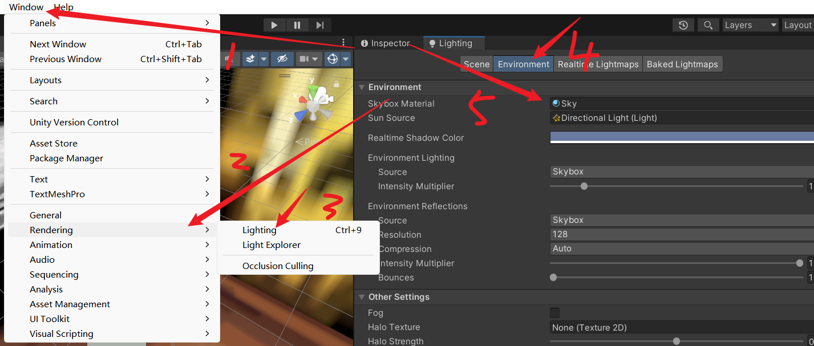
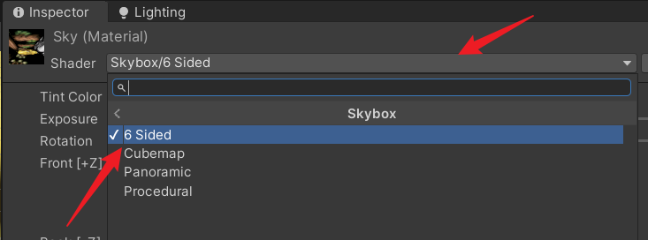
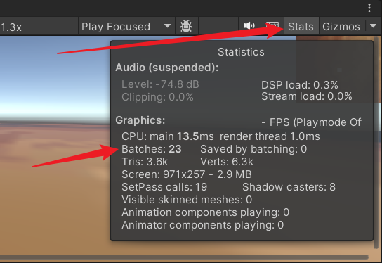
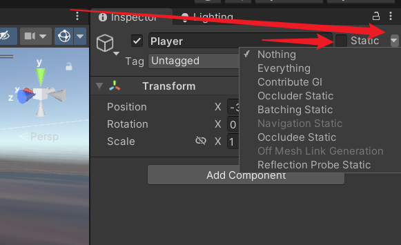
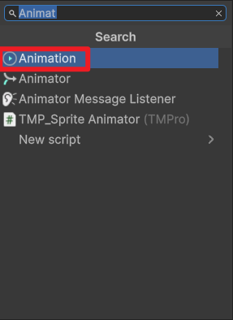
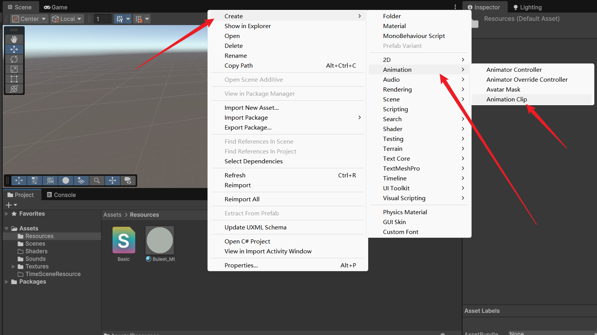
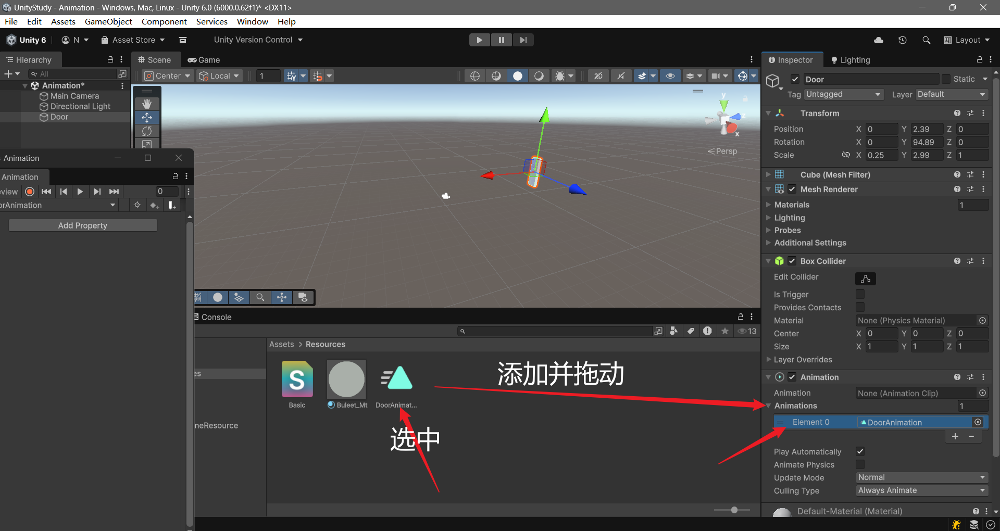
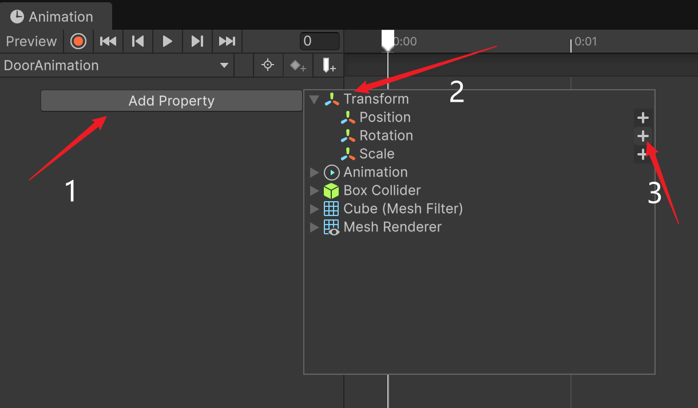
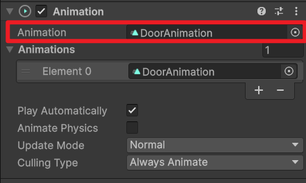

# Unity

## 子父关系

​	子物体的`Transform`是基于父的(相对坐标)，也就是`local`，而父的才是世界座标系，如果要创建多对象实体，可以创建空对象后设置其为顶级父对象，在挂组件时给父挂就行。

​	移动时，只需要移动父物体，子物体会跟着移动，若要移动子物体，可以更改`localPosition`。
​	在将子物体移动到父物体内后，通常建议将`Transform`组件`Rest`

## 渲染模式

| 模式        | 说明                            |
| ----------- | ------------------------------- |
| Opaque      | 不透明，透明层会渲黑            |
| Cutout      | 透明剔除                        |
| Fade        | 渐变，整体遵循A通道，可完全透明 |
| Transparent | 透明，不能完全透明，用于玻璃    |

## 摄像机

> 摄像机能有多个，但是活跃的Audio Listener只能有一个

### 默认组件

| 名称           | 用途                 |
| -------------- | -------------------- |
| Transform      | 无法缩放，可移动旋转 |
| Flare Layer    | 激活可显示光源耀斑   |
| Audio Listener | 接收音频             |
| Camera         | 相机                 |

### Camera

| 属性            | 说明                                                         |                                                              |
| --------------- | ------------------------------------------------------------ | ------------------------------------------------------------ |
| Clear Flags     | 屏幕空白区域怎么处理                                         |                                                              |
| Culling Mask    | 选择遮罩 (每个对象都有 Tag和Layer)<br>这个就是选择遮罩层 <br>如果对象设置了 Layer 并在相机中取消勾选<br>那么他将不显示，Unity也不会给他渲染了 | 例如2D地图<br>可以在玩家头顶添加一个层<br>地图相机可见他<br>主相机不可见<br>实际中地图是额外的材质，一个地图片在顶上 |
| Projection      | 相机模式选择， 正交 / 投影，2D选正交                         |                                                              |
| Clipping Planes | 裁剪面<br>Near 最近渲染多少（这个值以内的看不见）<br>Far 最远渲染多少 （这个值以外的看不见） |                                                              |
| Viewpoit Rect   | 相机占整个视口的大小，使用`uv` (0 - 1)，如 双人小游戏        |                                                              |
| Depth           | 渲染深度，值越大越在上面，类似 z-index                       | Clear Flags设置为Depth only时，不会显示低于自己的图像        |

### 天空盒

> 围绕整个场景的包装器，用于模拟天空的材质

​	为`Camera`添加`Skybox`就可以为其设置自定义天空盒，但只在目标相机有效，如果要在预览窗格中显示自定义天空盒，可以单击` Window -> Rendering -> Lighting -> Environment -> Skybox Material`，使用此设置天空盒，可作为反射源进行反射，物体上或许会有天空盒的颜色。



​	自定义的天空盒材质，可以选择`Unity`提供的 `SkyShader`




## InstantOC

### 渲染管线

> 游戏 -> 图形API ->  CPU|GPU -> 顶点处理 -> 图元装配 -< 光栅化 -> 像素处理 -> 缓存

​	CPU判断哪些物体需要渲染，如果需要渲染则调用图形API，没有一个物体需要绘制，都会调用一次`Draw Call`，这个也是渲染的性能指标，每帧调用显卡渲染物体的次数，在不考虑光照的情况下，一个物体一个`DrawCall`。`批处理可以减少`，在`Game`视图中，单击`Stats`可以查看。



​	GPU会接收模型顶点数据，并进行坐标转换，从模型坐标转换到屏幕坐标，转换完成后进行图元装配，将每个顶点组装起来。然后进行光栅化，这将计算三角面上的像素值，并为后面的着色阶段提供合理的插值参数。

​	渲染好的图形会被存入帧缓存（帧缓冲区），现在会不断从帧缓存中不断读取并输出到屏幕。
缓冲区中还会存储深度信息，存储像素的深度信息，即物体到摄像机的距离。这些信息在光栅化时进行计算，如果深度值比现有值更近，则像素会被写入到帧缓冲区，并替换深度缓存。


### Occlusion Culling

> 遮挡剔除
> 当一个物体被送进渲染流水线之前，将摄像机内看不到的物体进行剔除，减少每帧渲染的数据量。

​	如果是使用射线检测的话需要使用`Box Collider`，`CPU`会有额外开销，如果场景中有大量遮挡才使用。


### LOD

> 多细节层次
> 根据物品模型的节点在显示环境中所处的位置和重要度，决定渲染的资源分配，降低非重要物体的面数和细节度，从而获取高效率的渲染运算。

​	增加CPU利用，内存占用更大。


## 光照系统

> 全局光照
> 要添加光源，可以直接使用`Light`添加光源对象 （跟创建正方形一样），对于光源也可以设置`Culling Mask`选择哪些物体受光照。

| 类型  | 用途         |
| ----- | ------------ |
| Point | 火把         |
| Spot  | 手电筒，吊灯 |

### 阴影

​	光照中可以设置光照阴影，分为硬和软，软的更平滑，硬的更硬(性能更好) `Shadow Type`，`Mesh Renderer`可以选择受不受其他对象的阴影，需要设置`Receove Shadows`，`Cast Shadows`可以设置实体是否投射阴影

### 间接光

> 物体表面在接受光照后反射出的光

​	由于其计算量较大，因此需要将对象设置为静态，并在运行过程中无法移动。




### 烘培

> 将光线效果渲染成贴图再作用到物体上模拟光影

1. 设置实体为静态
2. 设置光照的`Baking`设置为`Baked`
3. 设置`Baking GI`为开启 然后`Build`


## 声音

| 属性          | 说明     |
| ------------- | -------- |
| Play On Awake | 启动播放 |
| Loop          | 一直循环 |
| Volume        | 音量     |

| 3D 属性        | 说明                          |
| -------------- | ----------------------------- |
| Volume Rolloff | 衰减方式                      |
| Max Distance   | 最大距离                      |
| Min Distance   | 最小距离 这个距离以内没有衰减 |
| 图表           | x是距离 y是大小               |


## 用户输入

> Edit -> Project Settings -> Input Manager


# 脚本

> 逻辑脚本中不建议出现属性。业务脚本遵循常规开发要求。

## 生命周期

​	Unity的生命周期是单线程的，当有多个脚本被挂载时，会把全部的Awake执行完再执行。

```cs
foreach(var objectO in objects){
    objectO.Awake();
}
foreach(var objectO in objects){
    objectO.Start();
}
```


| 名称           | 说明                                                         |
| -------------- | ------------------------------------------------------------ |
| Awake          | 物体载入调用一次，常用于初始化                               |
| OnEnable       | 脚本被启用时调用一次                                         |
| Start          | 物体载入并且脚本对象启用时执行一次<br>时机晚于Awake          |
| FixedUpdate    | 固定间隔调用，适用于编写游戏逻辑<br>Edit -> Project Setting -> Time -> Fixed Timestep |
| Update         | 渲染帧执行，间隔时间不固定                                   |
| LateUpdate     | Update执行完成后执行，可用于相机跟随等                       |
| OnCollisionXXX | 当满足碰撞时调用                                             |
| OnTriggerXXX   | 当瞒住条件时触发                                             |

鼠标相关

| 名称         | 说明                   |
| ------------ | ---------------------- |
| OnMouseEnter | 鼠标移入Collider时调用 |
| ...Over      | 经过调用               |
| ...Exit      | 离开调用               |
| ...Down      | 按下调用               |
| ...Up        | 抬起调用               |

场景渲染

| 名称              | 说明                                    |
| ----------------- | --------------------------------------- |
| OnBecameVisible   | 当Mash Renderer在任何相机上可见时调用   |
| OnBecameInvisible | 当Mash Renderer在任何相机上不可见时调用 |

结束阶段

| 名称              | 说明                           |
| ----------------- | ------------------------------ |
| OnDisable         | 对象变为不可用调用             |
| OnDestroy         | 脚本销毁或附属对象被销毁时调用 |
| OnApplicationQuit | 应用程序退出调用               |


## 编辑器编辑

| 特性名称        | 说明                     |
| --------------- | ------------------------ |
| SerializeField  | 在编辑器中显示私有字段   |
| HideInInspector | 在编辑器中不显示公共字段 |
| Range(min. max) | 范围控制                 |


## 常用API

​	在脚本中使用this. 就相对于直接获取了所在实体对象中的内容

| 名                         |                                                 |
| -------------------------- | ----------------------------------------------- |
| Component                  |                                                 |
| Transform                  |                                                 |
| GameObject                 |                                                 |
| Object                     |                                                 |
| Time                       |                                                 |
| GetComponentsInChildren<T> | 获取后代和自己的指定组件<br>不加s就是获取第一个 |
| GetComponentsInParent<T>   | 获取父组件的指定组件<br>不加s就是获取第一个     |
| CompareTag                 | 对象标签是否是给定名称                          |

- 使用GetComponent获取Mash Menderer并更改颜色

```cs
this.GetComponent<MeshMenderer>().material.color = Color.White;
```


## Transform

> 其与`MonoBehaviour`没有直接关系，因此不能像`Component`一样直接用。
> 获取到了别的组件的`Transform`就可以获取到对象的所有组件了
> 旋转-> 绕哪个轴哪个轴就不动

​	直接对`this.transform`进行`foreach`能获取单辈子组件的`transform`组件

| 属性                     | 说明                                                         |
| ------------------------ | ------------------------------------------------------------ |
| position                 | 物体世界座标系中的位置                                       |
| localPosition            | 相对于父物体轴心点的位置<br>在编辑页面中的position其实就是local的 |
| rotation / localRotation | 旋转                                                         |
| localScale               | 相对于父物体缩放比例                                         |
| lossyScale               | 物体与模型的缩放比例<br>自身缩放比例 * 父物体缩放比例        |

| 方法名          | 用途                                                         |
| --------------- | ------------------------------------------------------------ |
| Translate       | 移动变换组件在translation的方向和距离<br>设置Space后可以旋转相对于谁的座标系，默认自身<br>`this.transform.Translate(0,0,1,Space.World);` |
| Rotate          | 旋转，单位是度，使用方式与Translate一样                      |
| RotateAround    | 围绕旋转<br>绕哪个点，哪个轴，多少度<br>(Vector3.zero, Vector3.up, 1) |
| LookAt          | 旋转变换，让其Z向量指向目标                                  |
| SetSiblingIndex | 设置同级对象的索引                                           |


## GameObject

> 提供了操作游戏对象的功能

| 名称                               | 说明`this.gameObject`                                        | 类型       |
| ---------------------------------- | ------------------------------------------------------------ | ---------- |
| activeInHierarchy                  | 物体实际激活状态（在场景中的激活状态）                       | 字段       |
| activeSelf                         | 物体自身激活状态 （在Inspector面板中的）                     | 字段       |
| SetActive()                        | 设置激活状态                                                 | 方法       |
| Find(string name)                  | 在场景中根据名称寻找物体<br>GameObject.Find("对象名称")<br>慎用 | 静态、方法 |
| FindGameObjectsWithTag(string tag) | 通过标签获取(全部)                                           | 静态、方法 |
| FindWithTag(string tag)            | 获取使用此标签的物体(单个)                                   | 静态、方法 |

- 使用脚本添加游戏对象

```cs
//Unity中不能new完组件再添加，而是往一个对象去添加 让Unity自己New
var gameObject = new GameObject();
//添加组件，会返回此组件对象的引用
var light = gameObject.AddComponent<Light>();
light.type = LightType.Point;
light.color = Color.red;
//设置新对象的父为当前对象
gameObject.transform.parent = this.gameObject.transform;
```


## Object

| 名称                                              | 说明                                                 | 类型       |
| ------------------------------------------------- | ---------------------------------------------------- | ---------- |
| Destroy                                           | 删除一个游戏对象、组件或资源                         | 静态、方法 |
| DestoryImmediate                                  | 立即销毁，建议使用上面那个                           | 静态、方法 |
| DontDesroyOnLoad                                  | 保护给定对象<br>可以在跨场景时，使对象不被销毁       | 静态、方法 |
| FindObjectOfType<T>();<br>FindObjectsOfType<T>(); | 根据类型查找全部场景对象<br>可以用来查找全部敌人脚本 | 静态、方法 |
| Instantiate                                       | 克隆                                                 | 静态、方法 |

- 获取生命值最小的敌人

```cs
var lifeLastObjects = Object.FindObjectsOfType<GetLifeLast>();
GetLifeLast lastLifeEntity = null;
foreach (var item in lifeLastObjects) {
    if(lastLifeEntity == null) {
        lastLifeEntity = item;
    }
    if(lastLifeEntity.Options.Life <= item.Options.Life) {
        lastLifeEntity = item;
    }
}
```


## Time

| 名称              | 说明                                                         |
| ----------------- | ------------------------------------------------------------ |
| time              | 游戏开始了几秒                                               |
| deltaTime         | 完成最后一帧的时间(最后一帧的间隔)<br>可用于控制速度`this.transform.Rotate(0, 1 * Time.deltaTime, 0);`<br>这样可以保证旋转速度不受渲染速度影响<br>值 * 每帧消耗时间 |
| timeScale         | 时间缩放，可以慢动作和暂停游戏<br>FixedUpdate受影响<br>Update不受影响，但是Time.deltaTime受影响，因此也可以间接受影响 |
| unscaledDeltaTime | 不受时间缩放影响的时间帧间隔<br>可用于部分内容在暂停后依然不受影响 |

- 自己写的 

```cs
public int startTime = 0;
public int maxTime = 120;
private Text textTimer;
private void Start()
{
    textTimer = this.gameObject.GetComponent<Text>();
    startTime = (int)Time.time;
}
private void Update()
{
    //string.Format("{0}:{1}", Time.time / 60, Time.time % 60);
    if(textTimer != null && (int)(120 - Time.time) > 0) {
        textTimer.text = TimeSpan.FromSeconds((int)(120 - Time.time)).ToString();
    }
}
```

- 方法1

```cs
using UnityEngine;
using UnityEngine.UI;
public class EditTime2 : MonoBehaviour
{
    private Text textTimer;
    private void Start()
    {
        textTimer = this.gameObject.GetComponent<Text>();
    }
    /// <summary>
    /// 每次减少的间隔
    /// </summary>
    private float goByTime = 1;
    /// <summary>
    /// 总时长
    /// </summary>
    public float totalTime = 120;
    private void Update()
    {
        //每帧判断是否经过一秒
        if(Time.time >= goByTime && totalTime > 0) {
            //每经过一秒进行一次计算
            textTimer.text = string.Format("{0:d2}:{1:d2}", (int)(totalTime / 60),(int)(totalTime % 60));
            //总计时减少
            totalTime -= 1;
            //累积计时增加
            goByTime = Time.time + 1;
        }
        if(totalTime < 10) {
            textTimer.color = Color.red;
        }
    }
}
```


## MonoBehaviour

| 名称            | 说明                 |                                               |
| --------------- | -------------------- | --------------------------------------------- |
| InvokeRepeating | 重复调用给定方法     | InvokeRepeating(方法名称, 开始时间, 间隔时间) |
| CancelInvoke    | 删除给定任务         | CancelInvoke(方法名称);                       |
| Invoke          | 延迟给定时间调用一次 |                                               |


# 快捷键

| 键位                        | 功能                     |
| --------------------------- | ------------------------ |
| 选中实体 + Ctrl + Shift + F | 快速将选定实体定位到视口 |
| 选中实体 + F                | 将视口定位到给定实体     |
|                             |                          |


# 更改输入模式

​	`Edit` -> `Project Settings` -> `Player` -> `Configuration` -> `Active Input Handling`


# 预制件

​	这是一种资源类型，可以多次在场景中进行实例。

​	如果单独修改实例的属性值，则该值不再随预制件变化。

​	直接将Hierarchy中的物体坨拽到Project资源面板，便会生成一个预制件，在资源面板中更改可以更改全局属性，在Hierarchy面板中可以定制内容。

​	如果要全局应用某一个行为，Hierarchy面板中单击那个物体，然后中Inspector中找到`Prefab`然后单击`Apply`

| 按钮名称 | 说明                   |
| -------- | ---------------------- |
| Select   | 单击后，定位到预制件   |
| Apply    | 更改应用到预制件       |
| Revert   | 后悔，恢复到预制件属性 |


# 动画通用

## 录制并使用动画

> 时间轴上的 0:20 表示0秒20帧，1:20 表示一秒20帧（时长 1s + 帧）

​	开门的动画，在程序中设置其旋转也可以达到效果，但是动画更好操作。要打开动画面板需要按照下列步骤 `Window -> Animation -> Animation`

1. 为需要播放动画的实体添加`Animation`（老版本）组件

   

2. 在`Project`文件面板中，创建`Animation Clip` ，然后拖动到目标中

   



3. 在动画面板中，添加属性，我们要创建旋转动画，因此要操作`Transform`，然后就可以Key帧了，在时间轴右键可以添加关键帧。

   

4. 要真正使用动画需要将`Animation`的`Animation`设置一下，下面的列表是可选的动画列表，这个属性才是播放的动画。

   
