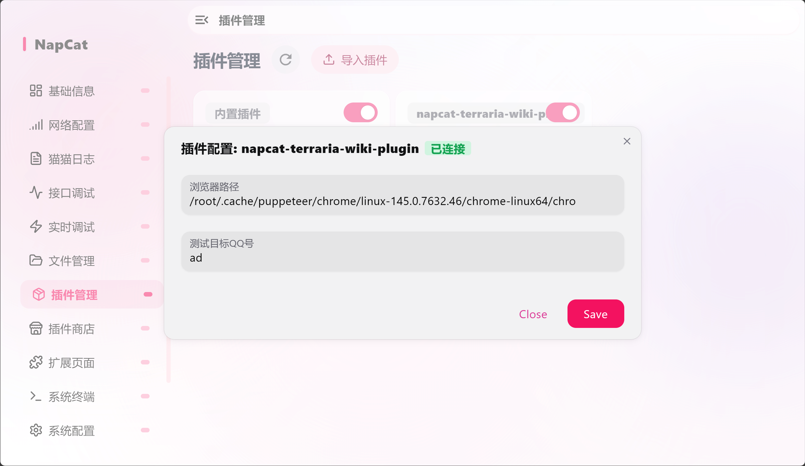

# NapCat的插件开发之旅

# 项目创建

1. 创建项目

```shell
# 创建一个ts原生项目
npm create vite@latest napcat-terraria-wiki-plugin vanilla-ts
```

2. 在package.json中添加项目依赖

```json
"dependencies": {
  "napcat-types": "0.0.11"
},
```


# 配置界面

NapCat会查看`index`是否导出了名为`plugin_config_ui`的成员。若使用强类型，他会是`PluginConfigSchema`

```ts
let global_config_schema: PluginConfigSchema = [];
```

在初始化时为他赋值，将可以在插件的配置面板中看到对应的内容。可以使用`context.NapCatConfig.combine`生成此对象。

```ts
let value = this.context.NapCatConfig.combine(
    this.context.NapCatConfig.text(
        ConfigEnum.browser_path, 
        "浏览器路径",
        defaultPath,
        undefined,
        true 
    ),
    this.context.NapCatConfig.text(
        ConfigEnum.ower_id,
        "测试目标QQ号",
        undefined,
        undefined,
        true
    )
)
```




# 读取被保存的配置

要读取被保存的配置需要在`plugin_init`中。

```ts
if (existsSync(this.context.configPath)) {
    const savedConfig = JSON.parse(readFileSync(this.context.configPath, 'utf-8'));
    this.context.logger.error("被保存的配置: \n" + JSON.stringify(savedConfig));
}
```

输出:

```sh
[Plugin: napcat-terraria-wiki-plugin] 被保存的配置: 
{"ower_id":"ad","browser_path":"/root/.cache/puppeteer/chrome/linux-145.0.7632.46/chrome-linux64/chro"}
```

可以定义类型，将其转换为给定类型对象。


# 导入外部库

NapCat好像只支持单文件，不支持外部文件？我插件使用了`puppeteer-core`，可以设置vite的build设置导出为单文件。

```json
rollupOptions: {
    output: {
        inlineDynamicImports: true  
    }
}
```


