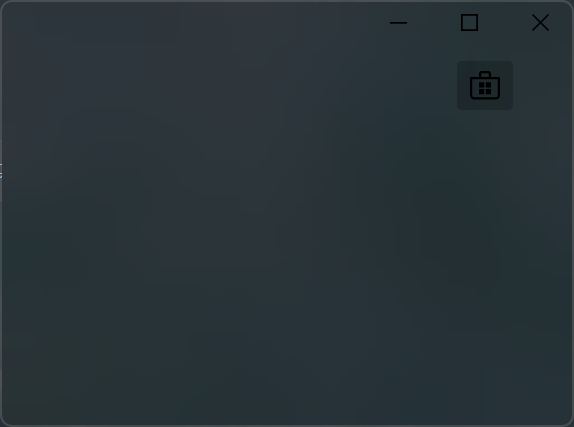
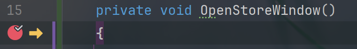
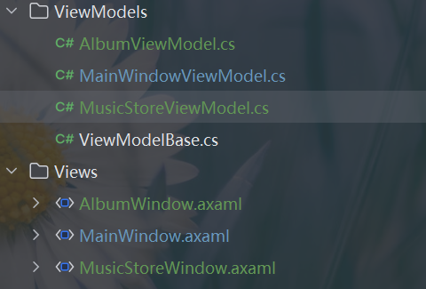
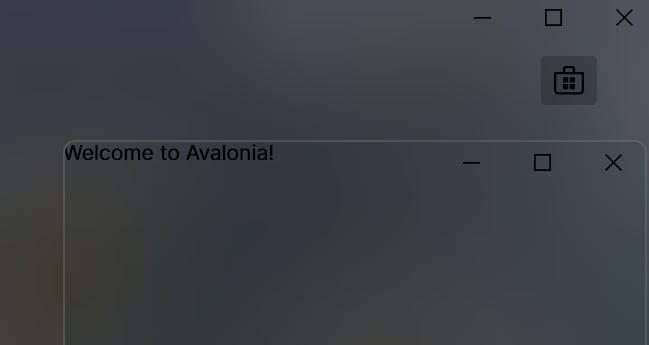
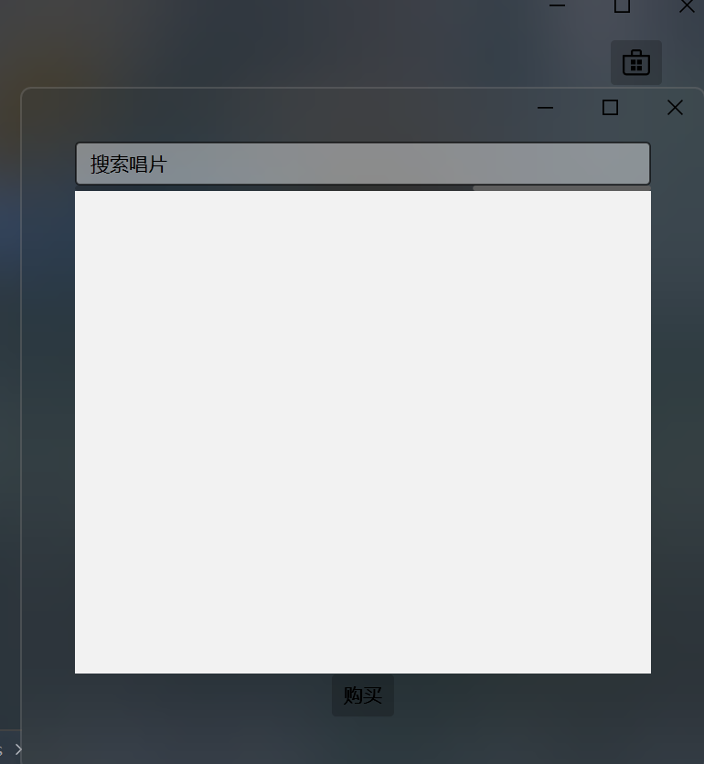
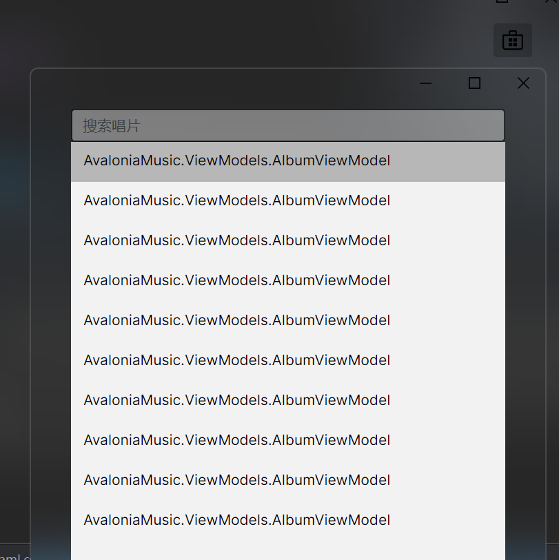
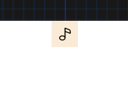
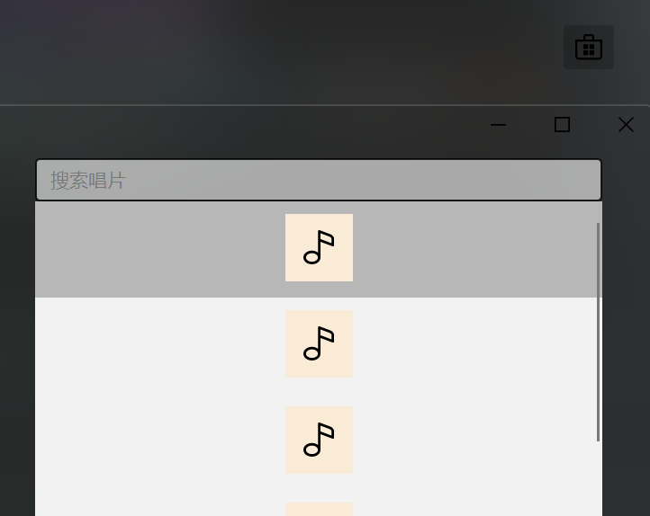
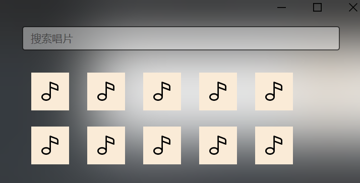

> 本项目跟随AvaloniaDocs中的示例程序，指在复习往欺知识

# 一、添加并排版控件

> 本章节的前提是使用默认MVVM模板创建了一个Avalonia项目

## 1. 添加控件

​	要添加控件，其实默认的`MainWindow.axaml`已经提供了一个默认的`TextBlock`，我们只需要照葫芦画瓢，添加`Button`
```xaml
<Button Content="Hello Button"></Button>
```

​	为了更好的控制按钮的位置，`示例是在左上角`，可以设置`Button.Margin`，但是为了更好的管理一个区域的控件，更好的做法是创建一个`Panel`，并在内部添加控件`Append`
```xaml
<Panel Margin="40">
        <Button
		   Content="Hello Button"
            HorizontalAlignment="Right" 
            VerticalAlignment="Top">
        </Button>
                <!--水平Right 垂直Top-->
</Panel>
```

## 2.设置图标

> AvaloniaUI提供了众多[Icons](https://avaloniaui.github.io/icons.html)

​	为了资源能够使用，我们需要创建一个类目来存储资源，并进行引用。

- 在心仪的位置创建`Avalonia Styles`类，并给一个心仪的名称
- 编辑 `axaml` 文件，在`<!-- Add Styles Here -->`下创建`<Style>`对象，并设置其属性
- 其中 `x:Key`将会是将来引用需要使用的资源名称

```xaml
<!-- Add Styles Here -->
<Style>
	<Style.Resources>
	<StreamGeometry x:Key="store_microsoft_regular">M11.5 9.5V13H8V9.5H11.5Z M11.5 17.5V14H8V17.5H11.5Z M16 9.5V13H12.5V9.5H16Z M16 17.5V14H12.5V17.5H16Z M8 6V3.75C8 2.7835 8.7835 2 9.75 2H14.25C15.2165 2 16 2.7835 16 3.75V6H21.25C21.6642 6 22 6.33579 22 6.75V18.25C22 19.7688 20.7688 21 19.25 21H4.75C3.23122 21 2 19.7688 2 18.25V6.75C2 6.33579 2.33579 6 2.75 6H8ZM9.5 3.75V6H14.5V3.75C14.5 3.61193 14.3881 3.5 14.25 3.5H9.75C9.61193 3.5 9.5 3.61193 9.5 3.75ZM3.5 18.25C3.5 18.9404 4.05964 19.5 4.75 19.5H19.25C19.9404 19.5 20.5 18.9404 20.5 18.25V7.5H3.5V18.25Z</StreamGeometry>
	</Style.Resources>
</Style>
```

- 添加完成后，为`App.axaml`文件添加内容，完成后需要重新构建

```xaml
<Application.Styles>
    <FluentTheme />
    <StyleInclude Source="avares://Avalonia.MusicStore/Icons.axaml" />
</Application.Styles>
```

- 为按钮使用资源，`StaticResource`表示为静态资源，由于我们已经将其导入`App.axaml`，所以可以直接使用`x:Key`引用

```xaml
<Panel Margin="40">
        <Button
            HorizontalAlignment="Right"
            VerticalAlignment="Top">
            <PathIcon Data="{StaticResource store_microsoft_regular}" />
        </Button>
            <!--水平Right 垂直Top-->
</Panel>
```




# 二、为按钮添加行为

## 1. 添加`Command`

​	转到`MainWindowViewModel`，为其添加`ICommand`类型的属性，并在构造函数中赋值。由于使用`ReactiveUI`其赋值方式与`微软社区MVVM工具包`不同，需要使用`ReactiveCommand.Create` ，可以传入一个无参`Action`，然后我们在`MainWindow.axaml`中为按钮添加这个`Command`

```cs
public ICommand OpenStoreWindowCommand{get; set;}
public MainWindowViewModel()
{
    OpenStoreWindowCommand = ReactiveCommand.Create(OpenStoreWindow);
}
private void OpenStoreWindow()
{
    
}
```

```xaml
<Button
    Command="{Binding OpenStoreWindowCommand}"
    HorizontalAlignment="Right" 
    VerticalAlignment="Top">
    <PathIcon Data="{StaticResource store_microsoft_regular}" /> 
</Button>
```

​	之所以能引用到我们创建的`ICommand`属性，是因为其上面为这个`axaml`绑定了`MainWindowViewModel`对象

```xaml
<Design.DataContext>
    <!-- This only sets the DataContext for the previewer in an IDE,
         to set the actual DataContext for runtime, set the DataContext property in code (look at App.axaml.cs) -->
    <vm:MainWindowViewModel/>
</Design.DataContext>
```

​	现在按钮按下后，什么都不会发生，因为我们的方法没有内容，但是如果使用断点进行调试是可以命中的




## 2. 创建对话窗口

​	在`MVVM`中，每个视图都对应一个模型，先在`Views`中创建一个`Avalonia Window`，并在`ViewModels`中创建一个`Class`。

​	命名规范遵循`Avalonia Window`以`Window`结尾，`ViewModel`以`ViewModel`结尾，这是`ViewLocator`决定的。

​	在这个案例中，我们需要创建两个窗口，一个是`MusicStore`一个是`Album`，`MusicStore`中有许多`Album`，一个`Album`就是一个唱片

> 如果使用Visual Studio，可能需要修改名称空间。否则名称空间是在根的，或者使用此[插件](https://gitee.com/fanbal/avalonia-maid2022)
>
> 如果有多项目需求，可以将默认的权限修饰符`internal`更改为`public`




## 3. 创建交互属性

​	我们回到`MainWindowViewModel.cs`中，创建一个`ReactiveUI`下的`Interaction`类型属性，其泛型表示哪两个模型互操作[此类型文档](https://www.reactiveui.net/docs/handbook/interactions/)

> 强烈建议在继续之前，查看文档！

```cs
//商店中可能没有唱片
public Interaction<MusicStoreViewModel, AlbumViewModel?> ShowStoreInteraction { get; } = new();
private async Task OpenStoreWindow()
{
    //传一个MusicStoreViewModel给消息处理程序
	//其调用SetOutput后，这里就得到了一个Album
    var album = await ShowStoreInteraction.Handle(new MusicStoreViewModel());
}
```

​	现在还有任何实际作用，我们的`ShowStoreInteraction`未被任何处理程序绑定，运行只会报错`ReactiveUI.UnhandledInteractionException`

​	让我们把视角切换到`MainWindow.axaml.cs`，并让`MainWindow`继承`ReactiveWindow<MainWindowViewModel>`，这样会让`View`和`ViewModel`强绑定，这也是`ReactiveUI`期望的，随后在`MainWindow`中为`ShowStoreInteraction`(交互)注册处理程序

```cs
public partial class MainWindow : ReactiveWindow<MainWindowViewModel>
```

```cs
public MainWindow()
{
    this.WhenActivated(action =>
    {
        action.Invoke(this.ViewModel!.ShowStoreInteraction.RegisterHandler(HandleMethod));
    });
    InitializeComponent();
}
public async Task HandleMethod(IInteractionContext<MusicStoreViewModel, AlbumViewModel> context)
{
    //创建音乐商店窗口，并设置其内容为输入值，输入值为AlbumViewModel
    var musicStore = new MusicStoreWindow();
    musicStore.DataContext = context.Input;
    
    //显示这个商店窗口，父窗口就是MainWindow
    var r = await musicStore.ShowDialog<AlbumViewModel>(this);
    //设置输出
    context.SetOutput(r);
}
```

为了让弹出的窗口符合样式，我们可以设置`MusicStoreWindow`属性

```xaml
TransparencyLevelHint="AcrylicBlur"
Background="Transparent"
ExtendClientAreaToDecorationsHint="True"
WindowStartupLocation="CenterOwner" <!--基于父窗居中-->
Height="500"
Width="500"
```



让我们梳理执行逻辑

`MainWindow`按下 => 执行`MainWindowViewModel.OpenStoreWindowCommand` 此`Command`绑定`OpenStoreWindow` => 触发处理程序 等待返回值， 处理程序由`MainWindow`注册为`HandleMethod`=> 执行`HandleMethod` => `SetOutput`


# 三、添加对话内容

## 1. 页面布局

> 页面布局使用[panel](https://docs.avaloniaui.net/zh-Hans/docs/reference/controls/dockpanel) `边缘布局面板`

​	本次我们将创建新的`View => MusicStoreView` 并使用`DockPanel`创建页面布局，其内部使用`StackPanel`展示唱片列表。

​	在心仪的地方创建`Avalonia User Control` 命名为 `MusicStoreView` ，~~如果不在`Views`中创建的话，一会要改一下`ViewLocator`~~，主体输入如下内容

```xaml
<DockPanel>
    <StackPanel DockPanel.Dock="Top"> <!--设置控件位于DockPanel的哪个方位-->
        <TextBox Text="搜索唱片"/>
        <ProgressBar IsIndeterminate="True"/> <!--指示是否在搜索-->
    </StackPanel>
    <Button Content="购买"
            DockPanel.Dock="Bottom"
            HorizontalAlignment="Center"/>
    <ListBox/>
</DockPanel>
```

​	随后在窗口(`MusicStoreWindow.axaml`)中引用此控件

```xaml
xmlns:views="clr-namespace:AvaloniaMusic.Views"
```

​	创建一个`Panel`并在其内部创建此控件，如果无法引用`MusicStoreView`就去`MusicStoreView.axaml.cs`中查看使用引用名称空间`Avalonia.Controls` 或直接写全 `MusicStoreView : Avalonia.Controls.UserControl`

```xaml
<Panel Margin="40">
        <views:MusicStoreView/>
</Panel>
```




## 2. 数据绑定

> 这边使用的是`ReactiveUI`提供的MVVM支持，因此要进行数据绑定后的数据更新通知需要`ViewModel`从`ReactiveObject`继承，在默认模板中有一个`ViewModelBase`其就是从此类继承的，因此只需要直接继承就可以。
>
> 这样就有了一个`RaiseAndSetIfChanged`方法，注意这个是`IReactiveObject`的扩展方法

​	现在，让我们先前创建的`MusicStoreViewModel`继承`ViewModelBase` 这样此`ViewModel`就具备了通知的能力。让我们为此类创建两个属性。

- SearchText 搜索文本
- IsBusy 是否在搜索

```cs
private string? _searchText;
private bool _isBusy;
    
public string? SearchText  {get => _searchText; set => this.RaiseAndSetIfChanged(ref _searchText, value);}
public bool IsBusy { get=> _isBusy; set => this.RaiseAndSetIfChanged(ref _isBusy, value);}
```

​	随后我们将其绑定到对应的视图上面

- 找到`MusicStoreView`

- 为`UserControl`标签添加如下内容

  ```xaml
  xmlns:vm="clr-namespace:AvaloniaMusic.ViewModels"
  x:DataType="vm:MusicStoreViewModel"
  ```

- 对相应的控件进行数据绑定

  ```xaml
  <StackPanel DockPanel.Dock="Top"> <!--设置控件位于DockPanel的哪个方位-->
      <TextBox Text="{Binding SearchText}" Watermark="搜索唱片"/>
      <ProgressBar IsIndeterminate="True" IsVisible="{Binding IsBusy}"/> <!--指示是否在搜索-->
  </StackPanel>
  ```


## 3. 搜索选择

​	搜索页面要显示的内容我们使用`AlbumViewModel`，内容肯定不止一个，所以可以使用.NET框架提供的`ObservableCollection`，这是一个能够进行通知的集合。

​	将目标转到`MusicStoreViewModel.cs`，将如下代码添加到文件中，随后将 `Albums`绑定到`MusicStoreView`的空`ListBox`上

```cs
public ObservableCollection<AlbumViewModel> Albums { get; } = new();//搜索结果
private AlbumViewModel? _selectAlbum; //当前选择项目
public AlbumViewModel? SelectAlbum { get => _selectAlbum; set => this.RaiseAndSetIfChanged(ref _selectAlbum, value); }
```

```xaml
<ListBox ItemsSource="{Binding Albums}" SelectedItem="{Binding SelectAlbum}"/>
```

​	此时 `MusicStoreView`的全部内容为

```xaml
<UserControl xmlns="https://github.com/avaloniaui"
             xmlns:x="http://schemas.microsoft.com/winfx/2006/xaml"
             xmlns:d="http://schemas.microsoft.com/expression/blend/2008"
             xmlns:mc="http://schemas.openxmlformats.org/markup-compatibility/2006"
             mc:Ignorable="d" d:DesignWidth="800" d:DesignHeight="450"
             xmlns:vm="clr-namespace:AvaloniaMusic.ViewModels"
             x:DataType="vm:MusicStoreViewModel"
             x:Class="AvaloniaMusic.UserControl.MusicStoreView">
    <DockPanel>
        <StackPanel DockPanel.Dock="Top"> <!--设置控件位于DockPanel的哪个方位-->
            <TextBox Text="{Binding SearchText}" Watermark="搜索唱片"/>
            <ProgressBar IsIndeterminate="True" IsVisible="{Binding IsBusy}"/> <!--指示进度-->
        </StackPanel>
        <Button Content="购买"
                DockPanel.Dock="Bottom"
                HorizontalAlignment="Center"/>
        <ListBox ItemsSource="{Binding Albums}" SelectedItem="{Binding SelectAlbum}"/>
    </DockPanel>
</UserControl>
```

​	为了检验结果，我们在构造函数中，创建几个唱片对象并加入集合

```cs
public MusicStoreViewModel()
{
    for(int i = 0; i < 10; i++) {
        Albums.Add(new AlbumViewModel());
    }
}
```




# 四、为唱片进行展示

## 1. 创建唱片内容

> 唱片视图使用图标为[Icon](https://avaloniaui.github.io/icons.html)中的`music_regular`
> ```xaml
> <StreamGeometry x:Key="music_regular">M11.5,2.75 C11.5,2.22634895 12.0230228,1.86388952 12.5133347,2.04775015 L18.8913911,4.43943933 C20.1598961,4.91511241 21.0002742,6.1277638 21.0002742,7.48252202 L21.0002742,10.7513533 C21.0002742,11.2750044 20.4772513,11.6374638 19.9869395,11.4536032 L13,8.83332147 L13,17.5 C13,17.5545945 12.9941667,17.6078265 12.9830895,17.6591069 C12.9940859,17.7709636 13,17.884807 13,18 C13,20.2596863 10.7242052,22 8,22 C5.27579485,22 3,20.2596863 3,18 C3,15.7403137 5.27579485,14 8,14 C9.3521238,14 10.5937815,14.428727 11.5015337,15.1368931 L11.5,2.75 Z M8,15.5 C6.02978478,15.5 4.5,16.6698354 4.5,18 C4.5,19.3301646 6.02978478,20.5 8,20.5 C9.97021522,20.5 11.5,19.3301646 11.5,18 C11.5,16.6698354 9.97021522,15.5 8,15.5 Z M13,3.83223733 L13,7.23159672 L19.5002742,9.669116 L19.5002742,7.48252202 C19.5002742,6.75303682 19.0477629,6.10007069 18.3647217,5.84393903 L13,3.83223733 Z</StreamGeometry>
> ```

​	我们将Icon内容复制到`ButtonIcon`中

```xaml
<Style>
    <Style.Resources>
        <StreamGeometry x:Key="store_microsoft_regular">M11.5 9.5V13H8V9.5H11.5Z M11.5 17.5V14H8V17.5H11.5Z M16 9.5V13H12.5V9.5H16Z M16 17.5V14H12.5V17.5H16Z M8 6V3.75C8 2.7835 8.7835 2 9.75 2H14.25C15.2165 2 16 2.7835 16 3.75V6H21.25C21.6642 6 22 6.33579 22 6.75V18.25C22 19.7688 20.7688 21 19.25 21H4.75C3.23122 21 2 19.7688 2 18.25V6.75C2 6.33579 2.33579 6 2.75 6H8ZM9.5 3.75V6H14.5V3.75C14.5 3.61193 14.3881 3.5 14.25 3.5H9.75C9.61193 3.5 9.5 3.61193 9.5 3.75ZM3.5 18.25C3.5 18.9404 4.05964 19.5 4.75 19.5H19.25C19.9404 19.5 20.5 18.9404 20.5 18.25V7.5H3.5V18.25Z</StreamGeometry>
        <StreamGeometry x:Key="music_regular">M11.5,2.75 C11.5,2.22634895 12.0230228,1.86388952 12.5133347,2.04775015 L18.8913911,4.43943933 C20.1598961,4.91511241 21.0002742,6.1277638 21.0002742,7.48252202 L21.0002742,10.7513533 C21.0002742,11.2750044 20.4772513,11.6374638 19.9869395,11.4536032 L13,8.83332147 L13,17.5 C13,17.5545945 12.9941667,17.6078265 12.9830895,17.6591069 C12.9940859,17.7709636 13,17.884807 13,18 C13,20.2596863 10.7242052,22 8,22 C5.27579485,22 3,20.2596863 3,18 C3,15.7403137 5.27579485,14 8,14 C9.3521238,14 10.5937815,14.428727 11.5015337,15.1368931 L11.5,2.75 Z M8,15.5 C6.02978478,15.5 4.5,16.6698354 4.5,18 C4.5,19.3301646 6.02978478,20.5 8,20.5 C9.97021522,20.5 11.5,19.3301646 11.5,18 C11.5,16.6698354 9.97021522,15.5 8,15.5 Z M13,3.83223733 L13,7.23159672 L19.5002742,9.669116 L19.5002742,7.48252202 C19.5002742,6.75303682 19.0477629,6.10007069 18.3647217,5.84393903 L13,3.83223733 Z</StreamGeometry>
    </Style.Resources>
</Style>
```

​	随后我们创建一个使用此图标的`View`同时也是`AlbumViewModel`使用的`View`(`UserControl`)

```xaml
<!--Spacing 设置子控件的间距-->
<!--CornerRadius 圆角-->
<!--ClipToBounds 是否裁剪控件-->
<!--Uniform 调整大小 适应控件-->
<StackPanel Spacing="5" Width="50">
    <Border CornerRadius="0" ClipToBounds="True">
        <Panel Background="AntiqueWhite">
            <Image Width="50" Stretch="Uniform"></Image>
            <Panel Height="50">
                <PathIcon Height="25" Width="25" Data="{StaticResource music_regular}"></PathIcon>
            </Panel>
        </Panel>
    </Border>
</StackPanel>
```



## 	2. 定位视图

​	在`AvaloniaUI`中，每次对象派生自`ViewModelBase`时，就会尝试通过`ViewLocator.cs`寻找合适的`View`进行展示，由于此文件逻辑已经写好，我们需要进行额外处理。

> 注意: 请确保你的`AlbumViewModel`派生自`ViewModelBase`

```cs
//如过要寻找的ViewModel是给定的 那么进入
if (param.GetType() == typeof(AlbumViewModel))
{
    Debug.WriteLine("Yes!");
    //返回此ViewModel对应的View
    return (Control)Activator.CreateInstance(typeof(AlbumView))!;
}
```

```cs
public Control? Build(object? param)
{
    if (param is null)
        return null;
    if (param.GetType() == typeof(AlbumViewModel))
    {
        Debug.WriteLine("Yes!");
        return (Control)Activator.CreateInstance(typeof(AlbumView))!;
    }
    
    var name = param.GetType().FullName!.Replace("ViewModel", "View", StringComparison.Ordinal);
    var type = Type.GetType(name);
    if (type != null)
    {
        return (Control)Activator.CreateInstance(type)!;
    }
    return new TextBlock { Text = "Not Found: " + name };
}
```



​	我们为`ListBox`添加一些样式
```xaml
<ListBox x:Name="AlbumList" ItemsSource="{Binding Albums}" SelectedItem="{Binding SelectAlbum}" Margin="0 20" Background="Transparent">
    <ListBox.ItemsPanel>
        <ItemsPanelTemplate>
            <WrapPanel/> <!--从左往右排序-->
        </ItemsPanelTemplate>
    </ListBox.ItemsPanel>
</ListBox>
```

