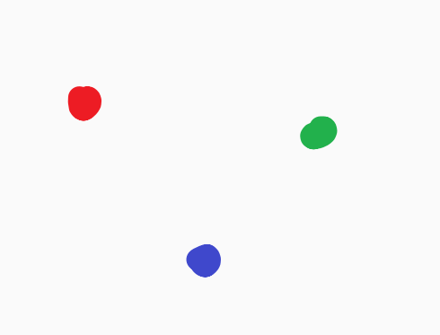
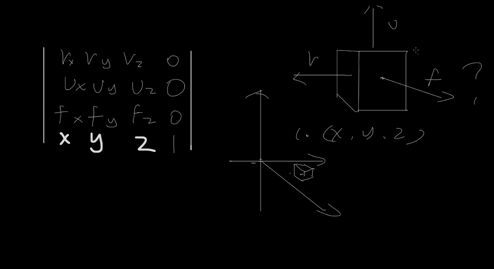

# HLSL

# 1 WHAT IS HLSL

在HLSL代码中，应该尽量追求速度，因此尽可能的不进行判断

在实时渲染中，速度更重要，不快就没有必要了

编写HLSL时最好编写大量的小型shader来完成特定的工作，小儿精巧比大而全面更重要


# 2 WHAT THE GRAPHICS PIPELINE

> #### 什么是渲染管线

​	软件 向OpenGL / Direct 发送指令 然后图形库接收来自应用的指令，将其从运行在CPU上的主进程运输到GPU上的图形进程，显卡将指令保存在 `GPU Front End` , 这是专门设计用于和CPU及其之上的主进程交互的区域。在这里，数据以顶点的形式被交给显卡，而顶点数据又继续交给可编程顶点程序处理。

> 程序 -> GPU Front End -> 顶点处理器

​	现在我们有3个顶点，这些顶点需要在处理程序中进行坐标转换



​	因为顶点在从程序交到GPU时，它们的坐标系是物体坐标系，也就是说它们的坐标是以其所属的物体根坐标为参照的。为了计算出他们在屏幕上的位置，需要先计算出它们相对于屏幕的坐标，这发生在可编程顶点处理器上。这时候顶点着色器就可以介入。

​	包括 移动顶点，改变顶点颜色，扭转法线

> 程序 -> GPU Front End -> 顶点处理器 -> 图元处理器

​	之后**进行图元生成 (基元)(Primitive Assembly)**，将各个顶点连接起来，图元生成器根据边面数据来生成三角面。独立的顶点在这里变成了面，图元生成器又会将三角面**交给光栅化/插值单元**，然后将各个三角面切为屏幕像素的大小，这时候三角面就不存在了，变为了继承其数据的像素集。

​	光栅化/插值单元 就是自动的把三角形转为像素，同时把顶点上的数据对应的转化给每个像素。

​	插值是什么？现在有一个蓝色和绿色的顶点，位于两个顶点之间的像素，就是要被染上绿蓝之间的某个颜色


图源https://www.youtube.com/watch?v=MKio4MNM3CI&list=PL78XDi0TS4lEMvytsE_MoWEpzBcukXv9b


如图，蓝色与绿色法线方向不同，其中间的像素就会拥有处于两个法线之间的法线方向


UV坐标的插值也是一样，比如蓝色顶点的UV坐标是0，而绿色顶点的UV坐标是1，那么三角形中的所有像素的UV坐标都将分布于0和1之间。

​	在**光栅化/插值**这一步中，所有顶点上的数据都已被插值并分配给每个像素。

> 程序 -> GPU Front End -> 顶点处理器 -> 图元处理器 -> 光栅化 -> 像素处理器

​	被插值后的像素数据会被送入可编程像素处理器，我们编写像素的HLSL就在这里被应用，数据从顶点着色器到像素着色器的过程 说的就是这个流程，像素着色器决定像素最终的颜色

> 程序 -> GPU Front End -> 顶点处理器 -> 图元处理器 -> 光栅化 -> 像素处理器 -> 最后光栅化 -> 帧缓冲区

​	帧缓冲区内容等待被显示器显示，编写HLSL需要编写两个方向，一个是顶点着色器，一个是像素着色器。可以单独使用。


# 数据类型

`int` `bool` `matrix`

| float3 | 适合存储颜色 ， RGB        |
| ------ | -------------------------- |
| float4 | 适合存储带有透明度的颜色 A |


# 结构体

就像为容器制作模具一样

```c
struct MySampleStruct
{
    float amtt;
    float2 adam;
    float3 color;
    float4 color2;
};

//定义结构体并初始化
MySampleStruct mssr;
mssr.color = float3(1, 1, 1);
mssr.colorA = float4(1, 1, 1, 0);
mssr.pos = coords;
mssr.add = 2f;
```


# 函数

```c
//COLOR0 语义 => 输出颜色到 Tex2D0色彩
float4 PixelShaderFunction() : COLOR0
{
    return float4(0.2, 0.5, 0.5, 0.2);
}

//SV_Target0 语义 => 直接将颜色输出到屏幕
float4 PixelShaderFunction2() : SV_Target0
{
    return float4(0.2, 0.5, 0.5, 0.2);
}
```


# 矩阵

M33一般用来描述2维，而M44一般用来描述3维

​	想要描述一个物体在世界空间中，对于这个物体会有几个向量标志基础内容，比如方向。

​	一个矩阵就表示一个物体在世界空间中的状态

[图一 来源](https://www.bilibili.com/video/BV1m8411Q7T9/?spm_id_from=333.337.search-card.all.click&vd_source=6cfabdd9118b8397a529eb6df87378b6)



​	转置 行矩阵变为列矩阵 , 转置就沿着主对角线，然后一对一扔过去


- 视图矩阵 => 就是摄像机

- 世界矩阵 => 模型在世界空间中的位置

图一 不仅可以描述视图矩阵 也可以描述世界矩阵


https://www.bilibili.com/video/BV1QqtDeZEqe

矩阵的意义就是将坐标系的基向量被改变，从而让坐标系内的物体跟着改变

矩阵乘法 => 

​	c11 => a11 * b11 + a11 * b12

​	c12 => a12 * b11 + a12 * b12
