# 图形学 线性代数基础

本篇内容均取自https://www.bilibili.com/video/BV1X7411F744

本篇为 1 - 3 集笔记

## 向量的点积

1. 如何求出单位向量 => 向量 / 向量的长度 = 单位向量

2. 在不给出说明的情况下，向量的默认的表示形式其实是竖着的

    ```
    $$ \vec{A} = \begin{pmatrix} x \ y \end{pmatrix} $$
    $$ A^T = (x,y)$$ $$ T是上标 转置了 $$
    ```

    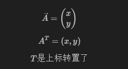

3. 向量的长度 = sqr(x² + y²)

4. 向量点乘得到的是一个数

    ```cs
    $$ \vec{a} · \vec{b} = \vec{||a||} ·\vec{||b||}· cos0 $$
    ```

    

    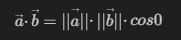

5. 取得两个向量的夹角 a 的单位向量 × b的

  ```cs
  $$ \cos{\theta} = \hat{a}·\hat{b} $$
  $$ \cos \theta = \frac{\vec{a} \cdot \vec{b}}{||\vec{a}|| \, ||\vec{b}||} $$
  $$ ||\vec{a}|| = 向量的长度$$
  $$ ||\vec{a}|| = \sqrt{x^2 + y^2} $$
  ```

  

  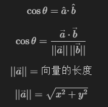

6. 向量的点成就是两个数相乘然后加起来

  ```cs
  $$ \begin{pmatrix} x_a \\ y_a \end{pmatrix} · \begin{pmatrix} x_b \\ y_b \end{pmatrix}  = x_ax_b + y_ay_b$$
  ```

  

  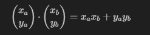

> 闲话 <br>
> 
> 向量b对于向量a的垂直 是 向量b(popu 垂直)<br>
> 
> 向量b(popu)的方向是向量a对应的方向<br>
> 
> 向量b(popu) = k * 向量a的单位向量<br>
> 
> 向量b(popu)的长度 = b的长度 * a与b的夹角余弦<br>
> 
> k= ||向量b(popu)|| = ||向量b|| cos0<br>
> 
> 向量a和b的点积就是夹角余弦<br>
> 
> 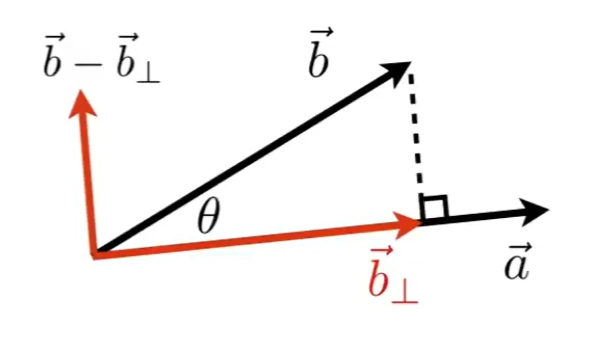
7. 如果向量同向 那么两个向量点乘会得到大于0的值<br>
   如果向量不同向 那么两个向量的点乘会得到小于0的值<br>
   点乘也会可以告诉我们两个向量有多接近，越接近1就越近，1 - 0 是垂直 0 - -1相反

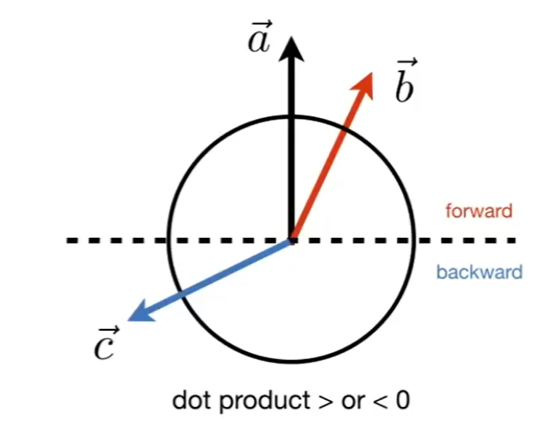


## 向量的叉积

1. 
   $$
   \mathbf{a} \times \mathbf{b} = -(\mathbf{b} \times \mathbf{a})
   $$

   $$
   || \mathbf{a} \times \mathbf{b} || = || \mathbf{a} || \cdot || \mathbf{b} || \cdot \sin(\theta)
   $$

   叉乘不满足交换律，`a x b 结果与 b x a相反，新向量与 a b 垂直`

   如果`x 叉乘  y 得到 z `那就说他是右手坐标系

   一个向量叉乘自己 = 0 `长度为0的向量`

2. #### 用于判断左和右，上和下

   向量`a` 叉乘 `b` 得到的结果`z轴`是正的，那么说明`b在a的左侧`

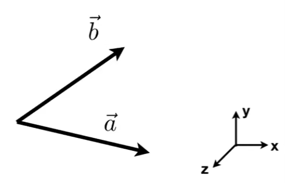

3. #### 判断某点是否在三角形内部（光栅化基础）

   `AB`叉乘`AP` 得到左侧

   `BC`叉乘 `BP`得到 P点在`BC`的左侧

   `CA`叉乘`CP `得到 P点在`CA`的左侧

   如果是顺时针 那么就在右侧，得到0自己决定

   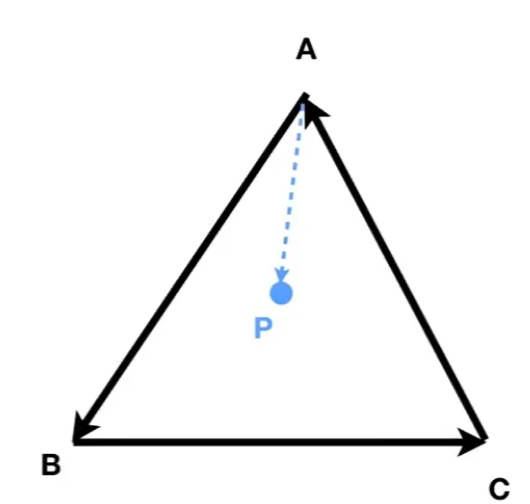

4. #### 标准正坐标系

   $$
   || \mathbf{u} || = || \mathbf{v} || = || \mathbf{w} || = 1
   $$

   $$
   \mathbf{u} \cdot \mathbf{v} = \mathbf{v} \cdot \mathbf{w} = \mathbf{u} \cdot \mathbf{w} = 0
   $$

$$
\mathbf{w} = \mathbf{u} \cdot \mathbf{v} \quad (\text{右手坐标系})
$$

$$
投影公式：

\mathbf{p} = (\mathbf{p} \cdot \mathbf{u}) \mathbf{u} + (\mathbf{p} \cdot \mathbf{v}) \mathbf{v} + (\mathbf{p} \cdot \mathbf{w}) \mathbf{w}
$$

## 矩阵

1. #### 乘以一个数就是将矩阵内的每个数都乘以这个数

2. #### `(M x N)(N x P) = (M x P) `只有 N N相等才有意义

   第一个矩阵的列数必须等于第二个矩阵的行数

   如下面，上面的矩阵乘以下面的矩阵 等于第三个矩阵

   比如结果的第二行四列，我们找到第一个矩阵的第二行，第二个矩阵的第四列 然后乘起来相加

   (5,2) * (4,3) = (20,6) = 26

$$
\begin{pmatrix}
1 & 3 \\
5 & 2 \\
0 & 4
\end{pmatrix}
\begin{pmatrix}
3 & 6 & 9 & 4 \\
2 & 7 & 8 & 3
\end{pmatrix}
=
\begin{pmatrix}
09 & ? & 33 & 13 \\
19 & 44 & 61 & 26 \\
08 & 28 & 32 & ?
\end{pmatrix}
$$


```cs
//第一个 ? 是第一行第二列 找到 第一行 1 3 第二列  6 7
//(1,3)*(6,7) = 6 + 21 = 27

//第二个 ? 是第三行第四列 找到 第三行 0 4 第四列  4 3
//(0,4)*(4,3) = 0 + 12 = 12
```

3. #### 矩阵的乘积不满足任何交换率，但满足结合律和分配律

   $$
   (\mathbf{AB})\mathbf{C} = \mathbf{A}(\mathbf{BC})
   $$

   $$
   \mathbf{A}(\mathbf{B} + \mathbf{C}) = \mathbf{AB} + \mathbf{AC}
   $$

   $$
   (\mathbf{A} + \mathbf{B})\mathbf{C} = \mathbf{AC} + \mathbf{BC}
   $$

   

4. #### 矩阵与向量相乘，向量是竖着的`列向量m×1`，这样就有意义了，左边的矩阵只要是 (n,m)就能乘

5. #### 转置

   `(ij -> ji)` 对角线为分割线，然后两边值位置互换，对角线下去只有两列，最终结果就是两行
   $$
   \begin{pmatrix}
   1 & 2 \\
   3 & 4 \\
   5 & 6
   \end{pmatrix} 
   ->
   \begin{pmatrix}
   1 & 3 & 5 \\
   2 & 4 & 6
   \end{pmatrix}
   $$
   
   
   
   $$
   乘积的转置\\
   (\mathbf{AB})^T = \mathbf{B}^T \mathbf{A}^T
   $$
   
6. #### 单位矩阵 他是一个对角阵

   $$
   单位矩阵\\
   \mathbf{I}_{3\times3}
   \begin{pmatrix}
   1 & 0 & 0\\
   0 & 1 & 0\\
   0 & 0 & 1
   \end{pmatrix}
   $$

   $$
   AA^{-1} = A^{-1} = I\\\\
   矩阵的逆:\\
   (AB)^{-1}=B^{-1} A^{-1}
   $$

   

7. #### 点乘向量的矩阵形式

   
   $$
   \begin{pmatrix}
   x_a & y_a & z_a
   \end{pmatrix}
   \begin{pmatrix}
   x_b\\
   y_b\\
   z_b
   \end{pmatrix}
   =
   (x_{a}x_{b} + y_{a}y_{b} + z_{a}z_{b} )
   $$
   
8. #### 向量的叉积矩阵形式

   
   $$
   叉积矩阵形式 A^{*}是矩阵\\
   a \times b = A^{*}b =
   \begin{pmatrix}
   0 && -z_{a} && y_{a}\\
   z_{a} &&0 && -x_{a}\\
   -y_{a} && x_{a} && 0
   \end{pmatrix}
   \begin{pmatrix}
   x_{b}\\
   y_{b}\\
   z_{b}
   \end{pmatrix}
   $$
   

# 图形学 变换

1. #### 缩放矩阵 `图像大小缩放s倍 xy的s单独设置可以单独缩放`

   $$
   左矩阵\\
   \begin{pmatrix}
   s & 0\\
   0 & s
   \end{pmatrix}
   $$

   $$
   \begin{pmatrix}
   x'\\
   y'
   \end{pmatrix}
   =
   \begin{pmatrix}
   s & 0\\
   0 & s
   \end{pmatrix}
   \begin{pmatrix}
   x\\
   y
   \end{pmatrix}
   $$
   
   
   
   
   
2. ### 反转`(x,y) => (-x,y)`

   $$
   \begin{pmatrix}
   x'\\
   y'
   \end{pmatrix}
   =>
   \begin{pmatrix}
   -x\\
   y
   \end{pmatrix}
   $$

   
   $$
   \begin{pmatrix}
   -1 & 0\\
   0 & 1
   \end{pmatrix}
   \times
   \begin{pmatrix}
   x\\
   y
   \end{pmatrix}
   $$
   
   
   
   
   
3. ### 切变 

   $$
   \begin{pmatrix}
   x'\\
   y'
   \end{pmatrix}
   =
   \begin{pmatrix}
   1 & a\\
   0 & 1
   \end{pmatrix}
   
   \begin{pmatrix}
   x\\
   y
   \end{pmatrix}
   $$

   

   

4. ### 旋转(2维)

   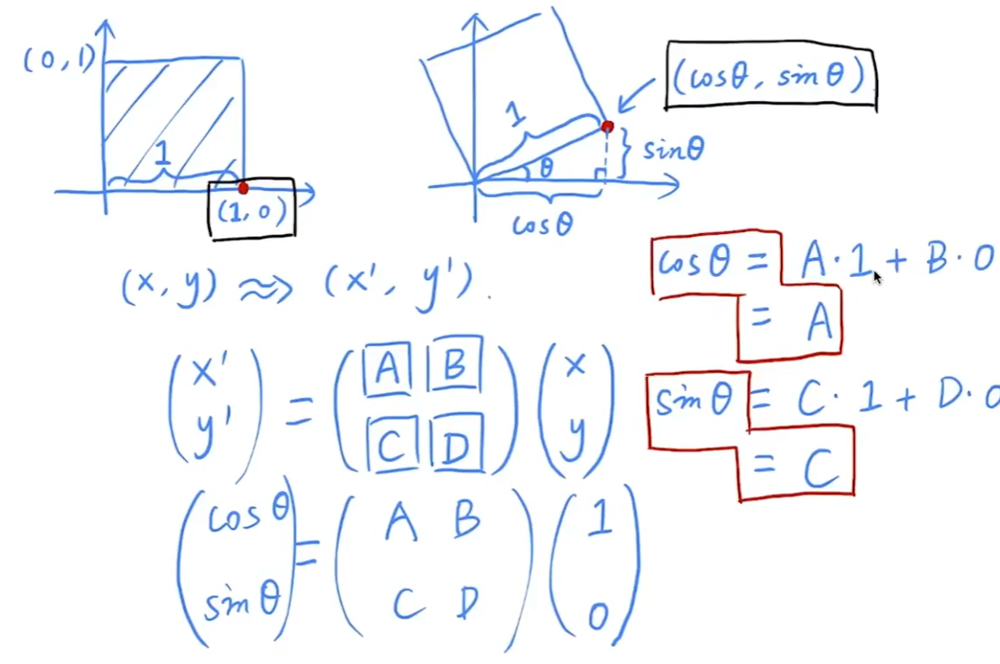

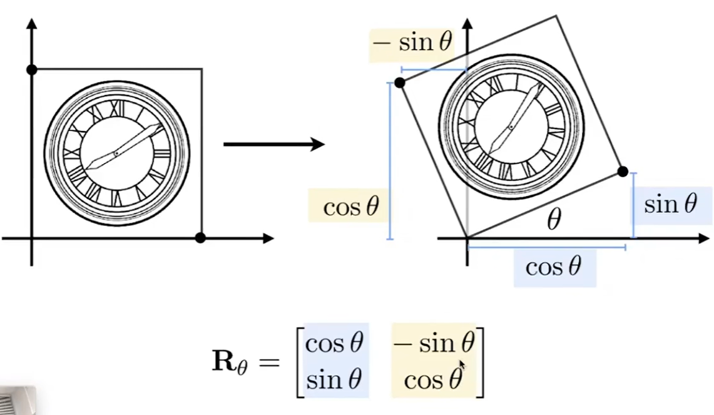

5. ### 共性`x'=Mx`

   要使用相同维度的矩阵乘以向量
   $$
   x' = a_x + b_y\\
   y' = c_x + d_y
   $$

   $$
   \begin{pmatrix}
   a & b\\
   c & d
   \end{pmatrix} ✖
   \begin{pmatrix}
   x\\
   y
   \end{pmatrix}
   $$

   

   

# 其次坐标

   平移变换

   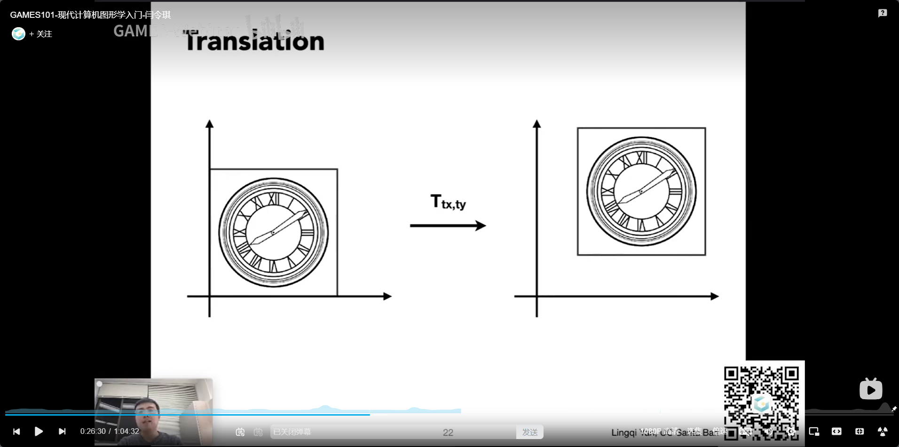

$$
x'=x+t_x\\
x'=y+t_y
$$

> ##### 平移使用矩阵的形式表示，不属于线性变换
> ##### 线性变换必须表示为 一个向量等于一个矩阵乘以另一个向量

$$ {平移的矩阵表示}
abcd是单位矩阵10,01\\
\begin{pmatrix}
x'\\
y'
\end{pmatrix}
=
\begin{pmatrix}
a & b\\
c & d
\end{pmatrix}
\begin{pmatrix}
x\\
y
\end{pmatrix}
+
\begin{pmatrix}
t_x\\
t_y
\end{pmatrix}
$$

> 为了不将平移排除在基础变换之外，“懒”的科学家们发明了新的东西，引入了新的形式来表示物体的坐标，为二维的坐标增加一个维度
>
> 如果是表示一个点，那么为1，如果为了表示一个向量那么值为0

$$
2D Point = (x,y,1)^T\\
2D Vector= (x,y,0)^T
$$

> 增加了一个维度后会发现有了更好的性质
>
> 引入其次坐标最大的目的就是为了通过增加一个维度的方式，将平移变换也写成矩阵x向量的形式

$$
xy1是二维的一个点\\
\begin{pmatrix}
x'\\
y'\\
w'
\end{pmatrix}
=
\begin{pmatrix}
1 & 0 & t_x\\
0 & 1 & t_y\\
0 & 0 & 1
\end{pmatrix}
·
\begin{pmatrix}
x\\
y\\
1
\end{pmatrix}
=
\begin{pmatrix}
x + t_x\\
y + t_y\\
1
\end{pmatrix}
$$

​	向量表示方向性，向量具有平移不变性，为了保护向量，所以将向量的z设置为0，保证他不变
$$
vector + vector = vector\\
(x_1,y_1,0) + (x_2,y_2,0)=(x_1+x_2,y_1+y_2,0)\\\\

point - point = vector \\
(x_1,y_1,1)-(x_2,y_2,1) = (x_1-x_2,y_1-y_2,0)\\\\

point - vector = point\\
(x_1,y_1,1)-(x_2,y_2,0) = (x_1-x_2,y_1-y_2,1)\\\\
point + point = ??\\
(x_1,y_1,1)+(x_2,y_2,1) = (x_1-x_2,y_1-y_2,2)
$$

> 在齐次坐标中，任何的 x / y / w 作为一个二维的点，表示的点是 `x除以w`,`y除以w` , 1

$$
\begin{pmatrix}
x\\
y\\
w
\end{pmatrix}is~the~2D~point~
\begin{pmatrix}
x/w\\
y/w\\
1
\end{pmatrix},
w ≠ 0
$$

> 在w不等于0的情况下，可以把xyw都除以w，第三个维度就1了，表示的就是一个点了
>
> xyw表示的一个点就是 `x/w, y/w` (二维的点)
>
> 在上面的公式中

$$
point + point = ??
$$

> 如果把z变为1呢 ，这边的w是2，因为上面算过了

$$
point + point = 这两个点的中点\\
\begin{pmatrix}
((x_1+x_2)/w)\\
((y_1+y_2)/w)\\
w/w
\end{pmatrix}
$$


# 仿射变换

> ##### 仿射变换就行线性变换和平移变换的组合

$$
\begin{pmatrix}
x'\\
y'\\
\end{pmatrix} =
\begin{pmatrix}
a & b\\
c & d\\
\end{pmatrix}·
\begin{pmatrix}
x\\
y\\
\end{pmatrix}
+
\begin{pmatrix}
t_x\\
t_y\\
\end{pmatrix}
$$


> 如果使用其次坐标表示2维的仿射变换
>
> - 最后一行永远是`0，0，1`
> - 平移永远写在最后一列的头两位数
> - abcd是原来线性变换的一部分

$$
仿射变换的齐次坐标形式\\
\begin{pmatrix}
x'\\
y'\\
1
\end{pmatrix} =
\begin{pmatrix}
a & b & t_x\\
c & d & t_y\\
0 & 0 & 1
\end{pmatrix}·
\begin{pmatrix}
x\\
y\\
1
\end{pmatrix}
$$


# 线性变换的其次坐标形式

> #### 缩放

$$
S(s_x,s_y) = \begin{pmatrix}
s_x & 0 & 0\\
0 & s_y & 0\\
0 & 0 & 1
\end{pmatrix}
$$


> #### 旋转

$$
R(\alpha) = \begin{pmatrix}
cos~\alpha & -sin~\alpha & 0\\
sin~\alpha & cos~\alpha & 0\\
0 & 0 & 1
\end{pmatrix}
$$


> #### 平移
>
> 因为没有进行线性变换 所以是 10 01

$$
T(t_x,t_y)=
\begin{pmatrix}
1 & 0 & t_x\\
0 & 1 & t_y\\
0 & 0 & 1
\end{pmatrix}
$$


# 变换的分解

> ##### 连续变换的应用是从右往左的

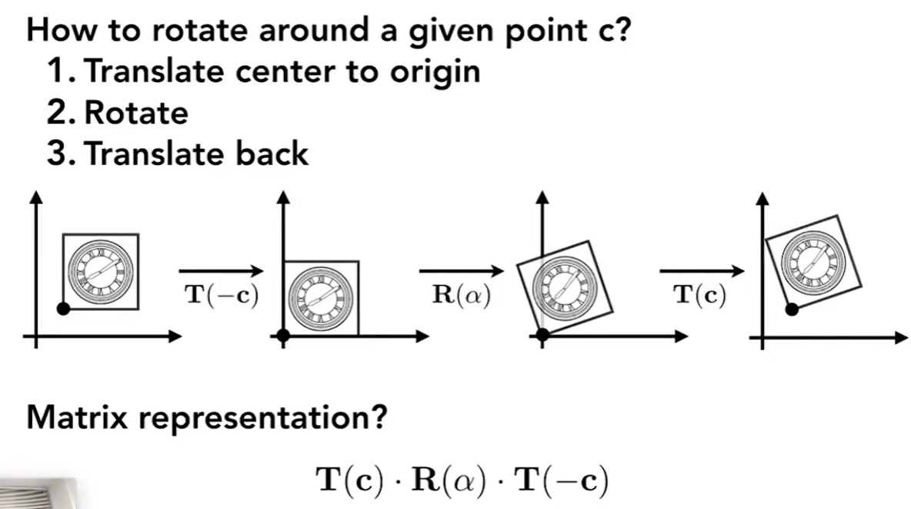

# 逆变换

​	逆变换就是将变换的操作反过来

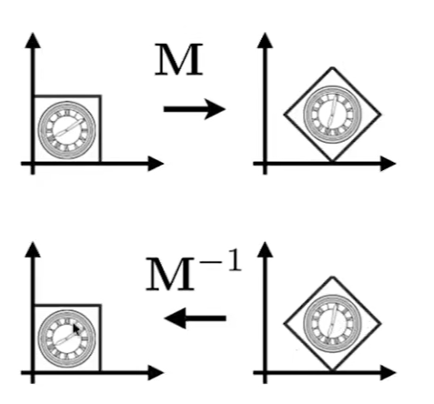

> 一个矩阵乘以他自己的逆矩阵一定等于单位矩阵
> 做了一遍操作，再做一遍反的操作，就相当于什么都没做


# 3维变换

> ##### 与二维基本一致，先应用线性变换再平移

$$
\begin{pmatrix}
x'\\
y'\\
z'\\
1
\end{pmatrix} =
\begin{pmatrix}
a & b & c & t_x\\
d & e & f & t_y\\
g & h & i & t_z\\
0 & 0 & 0 & 1
\end{pmatrix}·
\begin{pmatrix}
x\\
y\\
z\\
1
\end{pmatrix}
$$

