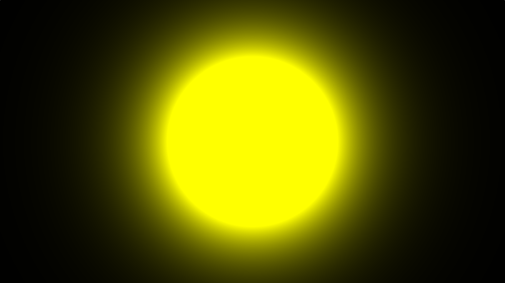
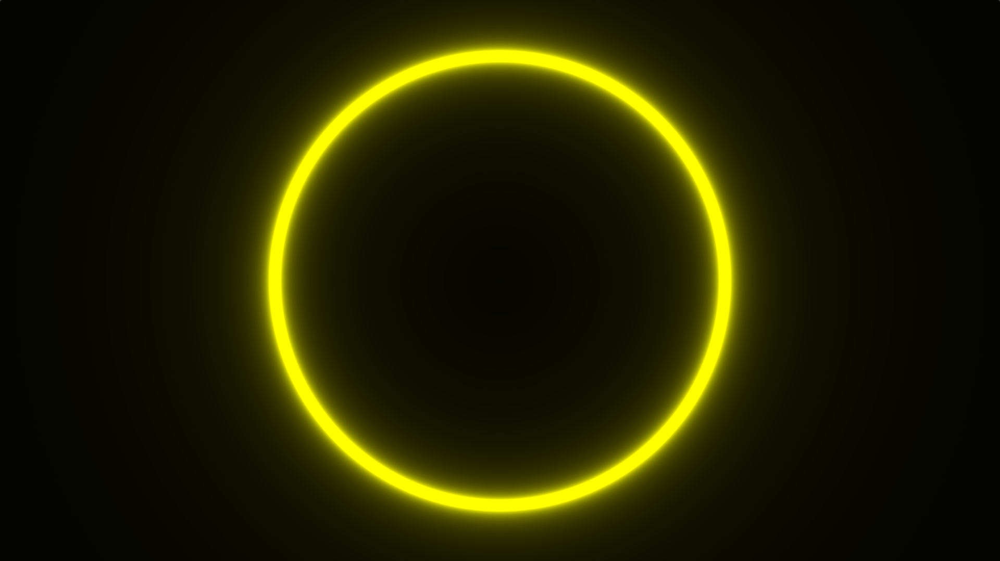

圆SDF

圈内负数值，圈外正数值，刚好在点上就是0。


圆辉光

我们在得到圆的`sdf`值后，使用`step`函数是否应该渲染
```glsl
void main(out vec4 fragColor, in vec2 fragCoord)
{
    float color = Color(fragCoord);
    fragColor = vec4(color);// 上色可以直接乘 * vec4(1.,1.,0.,1.);
}

float Color(vec2 fragCoord)
{
    //fragCoord是当前渲染到的位置
    //返回的值中，范围内为负数，外面为正数，刚好在上面就是0
    float sdf = sdCircle(fragCoord, 0.3); 

    //判断当前渲染的像素点距离给定点的距离
    //如果小于0返回0 大于0返回1
    //也就是说只渲染圈内的值 因为圈内为负数 但是我们使用了-sdf所以返回正数
    //如果直接返回这个值 就会看到圈内是黑的圈外是白的
    float color = step(0., -sdf);
	
    //计算亮度大小，越接近边界越亮
    //exp随着值变大 值快速变大，值变小快速趋于0
    float glow = exp(-abs(sdf) * 8.0);

    //最后将color + glow返回后直接输出
    //最终颜色深度直接与glow大小挂钩，因为glow越大颜色越黑
    return color + glow;
}

```

我们可以看到，其实这里的辉光强度是由距离给定位置的距离决定的，因此如果我们要进行镂空辉光，只需要`sdf = abs(sdf - .1);`即可。

```glsl
//宗旨: 随着与物体距离的增加而产生亮度衰变
//分母越小时产生的亮度越大

vec2 UV(vec2 pos);
//发光值爆炸的Color
float GetColorBoom(vec2 fragCoord);
float GetColorNoBoom(vec2 fragCoord);
float HollowOutCircle(vec2 fragCoord);
//圆sdf   sdf就是距离
//圈内负数值，圈外正数值，刚好在点上就是0
float CircleSDF(vec2 p, float r)
{
    float circle = length(p) - r;
    return circle;
}

void mainImage( out vec4 fragColor, in vec2 fragCoord)
{

    //float color = GetColorBoom(fragCoord);
    //float color = GetColorNoBoom(fragCoord);
    
    float color = GetColorNoBoom(fragCoord);
    fragColor = vec4(color) * vec4(1.,1.,0.,1.);
}

vec2 UV(vec2 pos)
{
    //归一化
    vec2 uv = pos / iResolution.xy;
    uv -= 0.5; //居中
    uv.x *= iResolution.x / iResolution.y;
    return uv;
}

//发光值爆炸的Color
float GetColorBoom(vec2 fragCoord)
{
    vec2 uv = UV(fragCoord);
    float sdf = CircleSDF(uv, 0.3);
    
    //距离圆心越远 光越暗
    //sdf > 0 ? 1 : 0
    //step => 大于0.返回1 小于0.返回 0.   当sdf无限接近0时 1/dist dist小数点每多一个0 最终结果的整数就多一个0
    float color = step(0., -sdf);  
    float glow = 0.01 / sdf;
    color += glow;
    return color;
}

//发光值爆炸的Color
float GetColorNoBoom(vec2 fragCoord)
{
    vec2 uv = UV(fragCoord);
    float sdf = CircleSDF(uv, 0.3);
    
    //距离圆心越远 光越暗
    //sdf > 0 ? 1 : 0
    //step => 大于0.返回1 小于0.返回 0.   
    //当sdf无限接近0时 1/dist dist小数点每多一个0 最终结果的整数就多一个0
    float color = step(0., -sdf);  
    //float glow = 0.01 / sdf;
    float glow = exp(-abs(sdf) * 8.0);
    
    color += glow;
    return color;
}

float HollowOutCircle(vec2 fragCoord)
{
    vec2 uv = UV(fragCoord);
    float sdf = CircleSDF(uv, 0.3);
    sdf = abs(sdf - .1); //保留正数 并且保留0.1的宽度
    //这个color其实是为了确定那些不渲染哪些渲染
    //因为为0的值不会被渲染
    float color = step(0., -sdf); 
    float glow = 0.01 / sdf;
    glow = clamp(glow, 0., 1.);
    return color + glow;
}
```

学习链接[辉光效果小百科爱来自glsl（￣︶￣）↗　写在开头 之前写的两篇glsl其实都用到了辉光效果，但是当我自己准备自定义一个 - 掘金](https://juejin.cn/post/7519435371634311220) 

后面看了其他视频 实际辉光并不是这样做的



