# 数列极限

## [两个简单极限](https://www.bilibili.com/video/BV1husGzwEtZ?t=764.0&p=13)

$$
\lim_{n\to\infty} \frac{k}{n} = 0 \quad (k\text{为常数})
$$
$$
\lim_{n\to 0} \frac{k}{n} = \infty \quad (k\text{为常数且}k\neq 0)
$$

## [数列极限](https://www.bilibili.com/video/BV1husGzwEtZ?t=180.3&p=13)

> 数列是一个定义域为正整数的函数f(n)的输出列表。
>
> 其中，定义域是数列的索引n，而索引代表的值则是f(n)的一个计算结果。


## [数列的收敛和发散](https://www.bilibili.com/video/BV1husGzwEtZ?t=1056.0&p=13)


## [不存在的两种情况](https://www.bilibili.com/video/BV1husGzwEtZ?t=1247.3&p=13)

> 极限结果为无穷

$$
判断数列 \{2^n\} 是否收敛 \\
\lim_{n\to\infty} 2^n = \infty \quad \text{因此}\quad \{2^n\} \text{发散}
$$

> 极限值在某个范围内波动


$$
判断数列 \{(-1)^n\} 是否收敛\\
\lim_{n\to\infty} (-1)^n = \begin{cases} 1 & n\text{为偶数} \\ -1 & n\text{为奇数} \end{cases} \quad \text{因此}\quad \{(-1)^n\} \text{发散}
$$


## 习题

### [题目一](https://www.bilibili.com/video/BV1husGzwEtZ?t=1780.0&p=13)

$$
\lim_{n\to\infty} \left(2 + \frac{1}{n^2}\right) = 2
$$

### [题目二](https://www.bilibili.com/video/BV1husGzwEtZ?t=1884.7&p=13)

$$
\lim_{n\to\infty} \frac{n-1}{n+1} = 1
$$

### [题目三](https://www.bilibili.com/video/BV1husGzwEtZ?t=2038.9&p=13)

$$
\begin{aligned}
\lim_{n\to\infty} \left( \frac{1}{1\times2} + \frac{1}{2\times3} + \cdots + \frac{1}{n(n+1)} \right)
&= \lim_{n\to\infty} \left( 1 - \frac12 + \frac12 - \frac13 + \cdots + \frac1n - \frac1{n+1} \right) \\
&= \lim_{n\to\infty} \left(1 - \frac{1}{n+1}\right) \\
&= 1
\end{aligned}
$$

### [题目四](https://www.bilibili.com/video/BV1husGzwEtZ?t=2315.8&p=13)

$$
\begin{aligned}
\lim_{n\to\infty} \left(\sqrt{n+2} - \sqrt{n}\right)
&= \lim_{n\to\infty} \frac{(\sqrt{n+2}-\sqrt{n})(\sqrt{n+2}+\sqrt{n})}{\sqrt{n+2}+\sqrt{n}} \\
&= \lim_{n\to\infty} \frac{n+2-n}{\sqrt{n+2}+\sqrt{n}} \\
&= \lim_{n\to\infty} \frac{2}{\sqrt{n+2}+\sqrt{n}} \\
&= 0
\end{aligned}
$$


# 针对性

$$
\begin{aligned}
& \frac{\infty}{\infty} 抓大头 \\
& \frac{0}{0} 第一个重要极限, 非零因子带入(小细节) \\
& 1^\infty 第二个重要极限，万能方法(CTRL+F直接搜)
\end{aligned}
$$


# 背诵性

## 广义化等价无穷小


# 函数极限

> 极限的计算非常简单，直接当趋向的值带入到函数的x中。

## [定义](https://www.bilibili.com/video/BV1husGzwEtZ?t=42.7&p=14)


## [趋近于无穷](https://www.bilibili.com/video/BV1husGzwEtZ?t=372.6&p=14)

> 一个函数要存在极限，那么他的正负无穷需要为同一个值

函数在无穷处极限存在的充要条件:
$$
\lim_{x\to\infty}f(x) = A \iff \lim_{x\to+\infty}f(x) = \lim_{x\to-\infty}f(x) = A
$$
$$
\text{若 } \lim_{x\to-\infty}f(x) \neq \lim_{x\to+\infty}f(x) \text{，则 } \lim_{x\to\infty}f(x) \text{ 不存在}
$$


## [*两个重要函数的极限](https://www.bilibili.com/video/BV1husGzwEtZ?t=991.4&p=14)

> 非常重要

$$
\lim_{x\to\infty}\arctan x
$$


$$
\lim_{x\to\infty} e^x
$$


## [趋近于常数](https://www.bilibili.com/video/BV1husGzwEtZ?t=1298.4&p=14)

函数在一个点处，极限存在的充要条件: 左右极限存在且相等。
$$
\lim_{x\to x_{0}}f(x) = A \iff \lim_{x\to x_{0}^-}f(x) = \lim_{x\to x_{0}^+}f(x) = A
$$


## [习题](https://www.bilibili.com/video/BV1husGzwEtZ?t=1998.9&p=14)

### [第一题](https://www.bilibili.com/video/BV1husGzwEtZ?t=2010.3&p=14)
$$
\lim_{x\to 0} e^{1 / x}
$$
答案: 不存在


### [第二题](https://www.bilibili.com/video/BV1husGzwEtZ?t=2290.2&p=14)
$$
\lim_{x\to 0} \arctan \frac{1}{x}
$$
答案: 不存在


### [第三题](https://www.bilibili.com/video/BV1husGzwEtZ?t=2989.1&p=14)
$$
\lim_{x\to 0} \frac{|x|}{x}
$$
答案: 不存在


### [第四题-2](https://www.bilibili.com/video/BV1husGzwEtZ?t=3247.1&p=14)

$$
\lim_{x\to 1} \frac{x-1}{|1-x|}
$$

答案: 不存在


## [回顾](https://www.bilibili.com/video/BV1husGzwEtZ?t=3506.0&p=14)


# 极限的四则运算

> 极限运算的双方必须存在。其余便是将双方极限值进行四则运算


## [未定式](https://www.bilibili.com/video/BV1husGzwEtZ?t=376.9&p=15)

## [极限的解题步骤](https://www.bilibili.com/video/BV1husGzwEtZ?t=896.8&p=15)

> 先定型，再化简，用公式

## [小试牛刀](https://www.bilibili.com/video/BV1husGzwEtZ?t=1017.5&p=15)

### [第一题](https://www.bilibili.com/video/BV1husGzwEtZ?t=1024.1&p=15)
$$
\lim_{x \to 2} \frac{3x^2 - 2x}{4 + 2x}
$$
答案: 1

### [第二题](https://www.bilibili.com/video/BV1husGzwEtZ?t=1094.5&p=15)
$$
\lim_{x \to 0} \frac{3x}{x-2}
$$
答案: 0

### [第三题-未](https://www.bilibili.com/video/BV1husGzwEtZ?t=1118.4&p=15)
$$
\lim_{x \to 2} \frac{x^2-4}{x-2}
$$
答案: 4

### [第四题-未](https://www.bilibili.com/video/BV1husGzwEtZ?t=1256.0&p=15)
$$
\lim_{x \to 1} \frac{x^2+2x-3}{x-1}
$$
答案: 4

### [第五题](https://www.bilibili.com/video/BV1husGzwEtZ?t=1318.6&p=15)
$$
\lim_{x \to \infty} \frac{1+\frac{1}{x}}{2-\frac{1}{x^2}}
$$
答案: 1

### [第六题-未](https://www.bilibili.com/video/BV1husGzwEtZ?t=1388.5&p=15)
$$
\lim_{x \to 0} \frac{\sqrt{x+1} - 1}{x}
$$
答案: 二分之一

### [第七题-未](https://www.bilibili.com/video/BV1husGzwEtZ?t=1547.8&p=15)

$$
立方差公式: a^3 - b^3 = (a-b)(a^2+ab+b^2)
$$


$$
\lim_{x \to 1} \left( \frac{1}{1-x} - \frac{3}{1-x^3} \right)
$$

答案: -1


### [第八题](https://www.bilibili.com/video/BV1husGzwEtZ?t=1960.4&p=15)

$$
等比数列的前n项和公式   \\
S_n = \frac{a_1(1-q^n)}{1-q} \\
a_1为第一项值，q 为后一项除以前一项
$$


题目:
$$
\lim_{n \to \infty} \left( \frac{1}{2} + \frac{1}{4} + \dots + \frac{1}{2^n} \right)
$$
答案: 1


# 抓大头

> 针对无穷比无穷

口角: 上大无穷，下大为0，相同则为系数比。

如果是大题，那么分子分母同时除以共有的最高次方 详见第一题

含根号秒杀技巧，详见第三题


## 习题

### [第一题](https://www.bilibili.com/video/BV1husGzwEtZ?t=388.7&p=16)
$$
\lim_{x \to +\infty} \frac{x^2+2x-1}{2x^2+1}
$$
答案: 1/2，上系数1 下系数2，n为2 m为2。
$$
\frac{2x^2 + 1}{x^2} = \frac{2x^2}{x^2} + \frac{1}{x^2} = 2 + \frac{1}{x^2}
$$


### [第二题](https://www.bilibili.com/video/BV1husGzwEtZ?t=718.1&p=16)
$$
\lim_{x \to \infty} \frac{7x^2 + 4x + 2}{3x^3 + 5x^2 - 2}
$$
答案: 0


### [第三题](https://www.bilibili.com/video/BV1husGzwEtZ?t=1040.1&p=16)

> 如果极限类型为无穷比无穷，且分子分母中含有根号，或者括号。
>
> 只保留根号或者括号中，最高次方即可。仅选择 填空题可用。

$$
\lim_{x \to \infty} \frac{\sqrt{4x^2 - x + 1}}{\sqrt[3]{x^2 + 6}}
$$
答案: 2


### [第四题](https://www.bilibili.com/video/BV1husGzwEtZ?t=1588.3&p=16)

> 等差数列的前n项和  

$$
S_n = \frac{(1 + n)n}{2} =
(\frac{(\text{首项} + \text{末项}) \times \text{项数}}{2})
$$

题目:
$$
\lim_{n \to \infty} \frac{1 + 2 + \dots + n}{n^2}
$$
答案: 1/2


### [第五题](https://www.bilibili.com/video/BV1husGzwEtZ?t=1888.7&p=16)

> 根式有理化

$$
\lim_{n \to \infty} \left( n - \sqrt{n^2 - n} \right)
$$


答案: 1/2

### 第六题

$$
\begin{aligned}
\lim_{n \to \infty} \frac{(n-2)^{10} (2n+3)^{10}}{(2n^2)^{10}}
&= \lim_{n \to \infty} \frac{n^{10} \cdot (2n)^{10}}{(2n^2)^{10}} \\
&= \lim_{n \to \infty} \frac{n^{10} \cdot 2^{10} \cdot n^{10}}{2^{10} \cdot n^{20}} \\
&= \lim_{n \to \infty} \frac{2^{10} \cdot n^{20}}{2^{10} \cdot n^{20}} \\
&= 1
\end{aligned}
$$


## [指数形式的抓大头](https://www.bilibili.com/video/BV1husGzwEtZ?t=2506.4&p=16)

> 若分子分母均是指数函数形式。也可以使用抓大头
>
> 不过必须抓分子分母的`最大底数`，再使用口决。
>
> 要保证指数位相同

## 习题

### 第一题

$$
\begin{aligned}
\lim_{x \to \infty} \frac{8^x}{8^x + 5^x}
&= \frac{8}{8} \\
&= 1
\end{aligned}
$$

### 第二题

> 疑问

$$
\begin{aligned}
\lim_{x \to +\infty} \frac{3^{x+1}}{3^x + 2^x}
&= \lim_{x \to +\infty} \frac{3 \cdot 3^x}{3^x + 2^x} \\
&= 3
\end{aligned}
$$

### 第三题

$$
\begin{aligned}
&\text{判断 } \lim_{x \to 0} \frac{1 + e^\frac{1}{x}}{2 + e^\frac{2}{x}} \text{ 极限是否存在} \\
&\text{左: } \lim_{x \to 0^-} \frac{1 + e^\frac{1}{x}}{2 + e^\frac{2}{x}} = \frac{1}{2} \\
&\text{右: } \lim_{x \to 0^+} \frac{1 + e^{1/x}}{2 + (e^2)^{1/x}} \\
&= \frac{e}{e^2} \\
&= \text{上大无穷，下大0，因此为 } 0
\end{aligned}
$$


# 两个重要极限

## 第一个重要极限

$$
设当 x \to 0 时，\varphi(x) \to 0，且 \varphi(x) \sim x (等价) \\
则极限 \lim_{x\to0}\frac{\varphi(x)}{x}=1 为 \frac{0}{0} 型。
$$


> 人话: 不管x趋于多少，只要分子和分母的形式一致，并且极限等于0，最终结果一定为1。


$$
第一重要极限\frac{0}{0}: \lim_{x \to 0}\frac{\sin{x}}{x}=1
$$
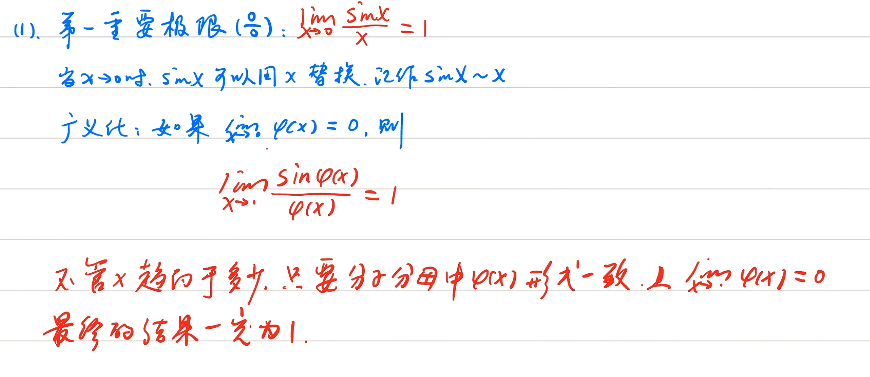


### 小习题

### 第一题

https://www.bilibili.com/video/BV1husGzwEtZ?t=384.2&p=17
$$
\begin{aligned}
&\lim_{x \to 0} \frac{\sin{3x}}{x} \\
&= \frac{\sin{3x} * 3}{x * 3} \\
&= \frac{\sin{3x}} {3x} * 3 \\
&= 1 * 3 \\
&= 3
\end{aligned}
$$
答案: 3

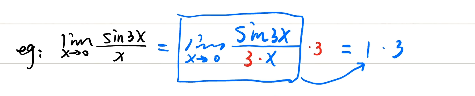

### 第二题

https://www.bilibili.com/video/BV1husGzwEtZ?t=554.0&p=17

> 使用广义后的公式


$$
\begin{aligned}
& \lim_{x\to\infty} x \sin\left(\frac{3}{x}\right) \\
&= \lim_{x\to\infty} \frac{\sin\left(\frac{3}{x}\right)}{\frac{1}{x}} \\
&= \lim_{x\to\infty} \frac{\sin\left(\frac{3}{x}\right)}{\frac{3}{x}} \cdot 3 \\
&= \left( \lim_{x\to\infty} \frac{\sin\left(\frac{3}{x}\right)}{\frac{3}{x}} \right) \cdot 3 \\
&= 1 \cdot 3 \\ &= 3
\end{aligned}
$$

答案: 3

> 除了将 乘以x换为`除以 1/x 外`也可以同时乘以 (3/x)/(3/x)

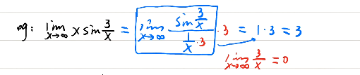


### *第三题

https://www.bilibili.com/video/BV1husGzwEtZ?t=790.7&p=17

> 使用倍角公式和降幂公式

$$
\begin{aligned}
& \lim_{x \to 0} \frac{1-\cos{x}}{x^2} \\
& \Rightarrow \lim_{x \to 0} \frac{2\sin{^2 \frac{x}{2}}}{x^2} \\
& \Rightarrow 2\lim_{x \to 0}(\frac{\sin{\frac{x}{2}}}{x})^2 \\
& \Rightarrow 2 \lim_{x \to 0}(\frac{\sin{\frac{x}{2}}}{\frac{x}{2}} \cdot \frac{1}{2}) ^ 2 \\
& \Rightarrow \frac{1}{2}\lim_{x \to 0} (\frac{\sin{\frac{x}{2}}}{\frac{x}{2}}) ^ 2 \\
& \Rightarrow \frac{1}{2} \cdot 1^2
\end{aligned}
$$


倍角公式
$$
\sin{2x} = 2\sin{x} \cdot \cos{x} \\
\cos{2x} = 2\cos{^2x}-1 = 1- \sin{^2x} \\
=\cos{^2x} - \sin{^2x}
$$
降幂公式
$$
\cos{^2x} = 1+ \frac {\cos{2x}} {2} \\
\sin{^2x} = 1- \frac {\cos{2x}} {2} \\
$$

---

> 在三角函数中，x只是一个角度

---

$$
2sin{^2x} = 1-\cos{2x} \\
\text{将角度同时缩小到原来的一半} \Rightarrow \\
2 \sin{^2\frac{x}{2}} = 1-\cos{x}
$$


## *第二个重要极限

23min 11s

> 针对于 1的无穷次方型

$$
\lim_{x \to 0}(1+x)^\frac{1}{x} = e\\
\lim_{x \to \infty}(1 + \frac{1}{x})^x=e
$$

广义化 
$$
\lim_{x \to \cdot}(1 + f(x))^\frac{1}{f(x)} = e \\
\lim_{x \to \cdot}(1 + \frac{ 1}{f(x)})^\frac{1}{f(x)} = e
$$
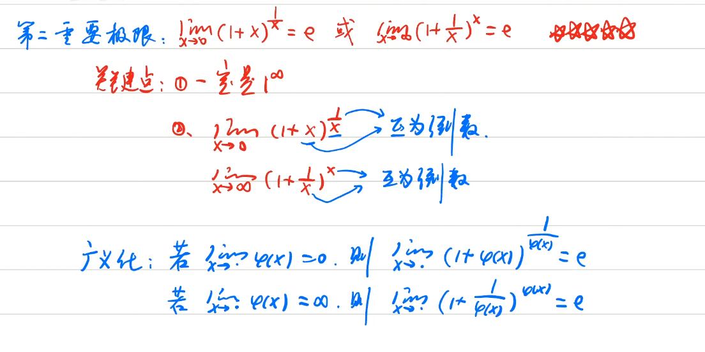

### 第一题

30min 21s
$$
\lim_{x \to 0} (1+x)\frac{2}{x} \\
\lim_{x \to 0}(1 + x) ^ {\frac{1}{x} \cdot 2 } = e ^2
$$


### 第二题

32min 40s
$$
\lim_{x \to 0}(1-2x)^{\frac{1}{x}}
$$

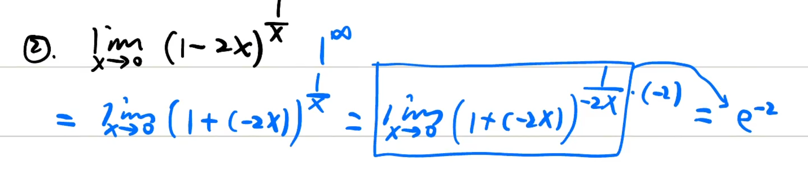

### *第三题

34min 56s

> 结合抓大头

$$
\lim_{x \to \infty}(1 + \frac{1}{2x})^{4x+3}
$$

答案: e^2

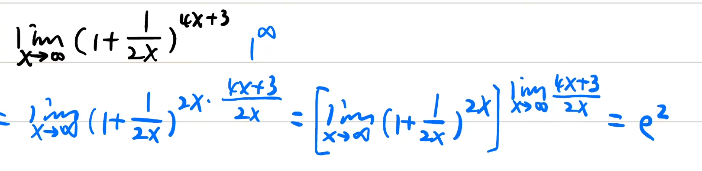

### *第四题

38min 15s

> 抓大头

$$
\lim_{x \to \infty}(\frac{x+2}{x+1})^{2x}
$$

答案: e^2

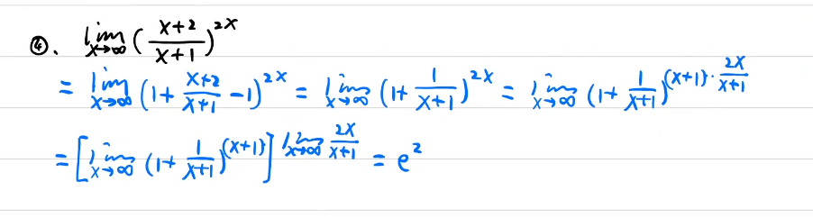


### 万能方法

46min 20s

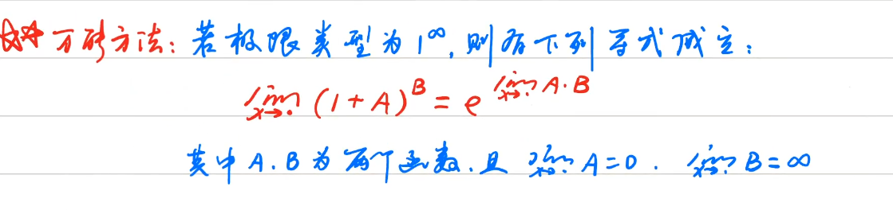

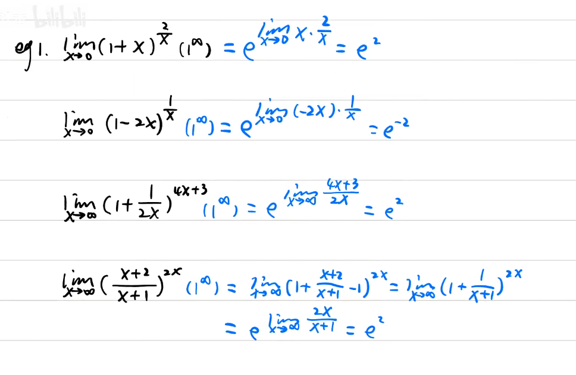


# 无穷大小

p18

## 定义

函数在某种情况下趋近于0，则说这个函数是 x趋近于某个数时的无穷小量。0自己也是一个特殊的无穷小量，是无穷小量中的唯一常数。

函数在某种情况下趋近于无穷，则说这个函数是 x趋近于某个数时的无穷大量。


## 小的性质

> 无穷大量的倒数为无穷小量
>
> 无穷小量的倒数不为无穷大量，因为0是特殊的无穷小

10min 38s

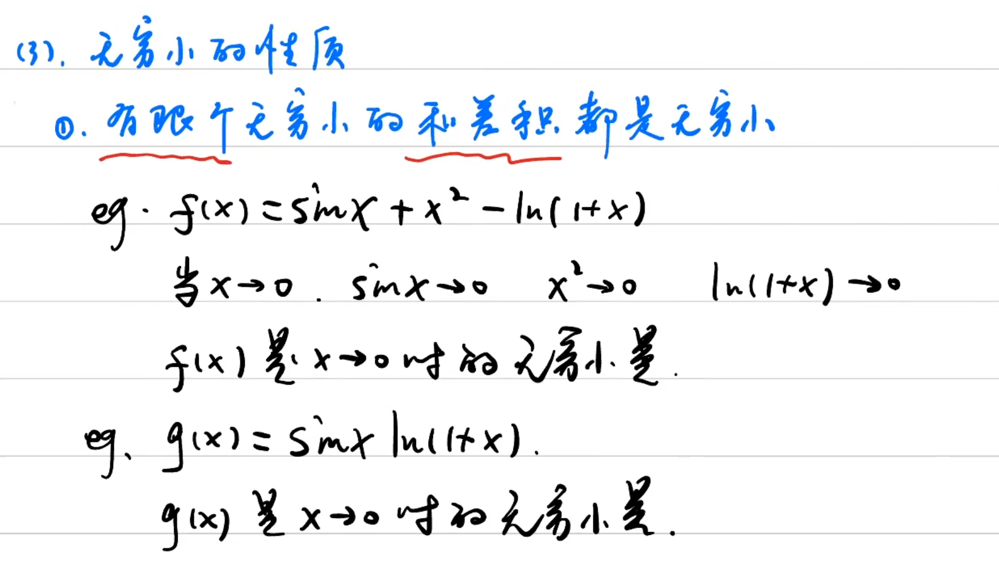

*15min 6s

有界函数
$$
\sin{x}, \ \cos{x}, \ \arctan{x}, \ \arcsin{x}, \ \arccos{x}, \ \frac{1}{1+x^2}
$$


## 题目

### 第二题

20min 10s
$$
\lim_{x \to 0} x \sin{\frac{1}{x}}
$$
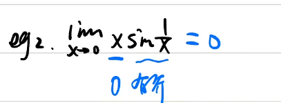

答案: 0

### 第三题

$$
\lim_{x \to \infty} \frac{x \cos{x^2}}{x^2+1}
$$

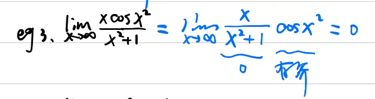

答案: 0

### 第四题

$$
\lim_{x \to +\infty} \frac{\arctan{x}}{x}
$$

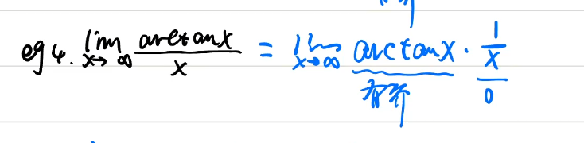

答案: 0

# 无穷小比阶

p19

> 比的是函数趋于0的速度
>
> 8min 34s 解释等价无穷小
>
> 10min 24s 解释本质

$$
\lim{\frac{f(x)}{g(x)}}
$$


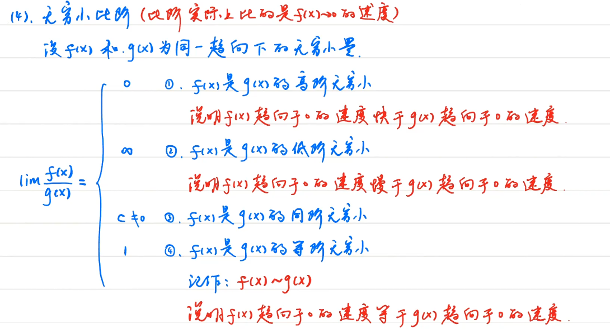

## 小题目

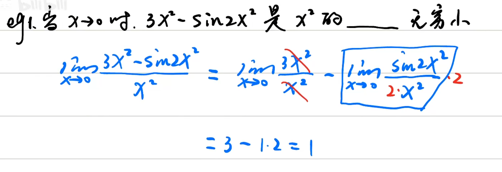

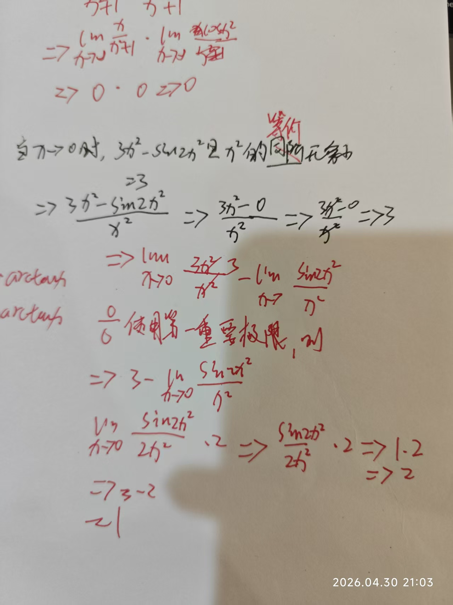


## 拆极限

15min 35s

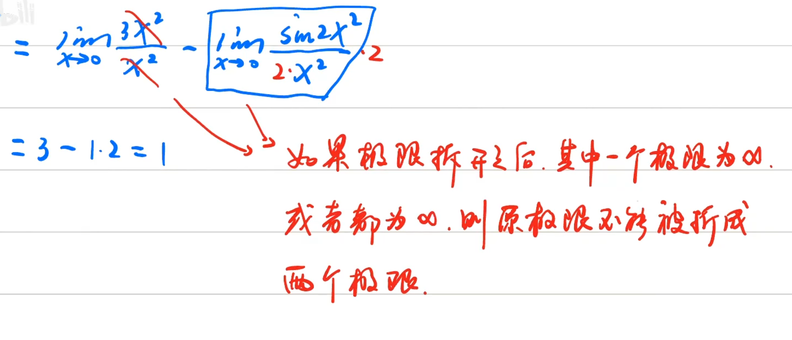


# 等价无穷小

p20

## 引入

49s

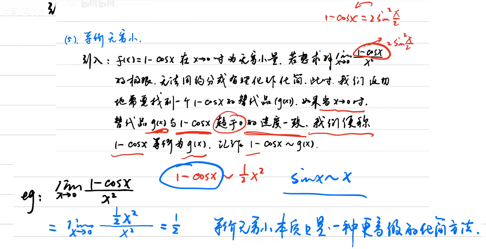

## 常见替换

https://www.bilibili.com/video/BV1husGzwEtZ?t=325.7&p=20

> 前提条件: 
>
> 1. x->0
>
> 2. 等价整体要和其他因式构成乘积（不能是加减）关系

什么是等价整体？如 `(1 - cosx) * x`，那么`1-cosx`就是一个整体。

**前面10个一定要记**

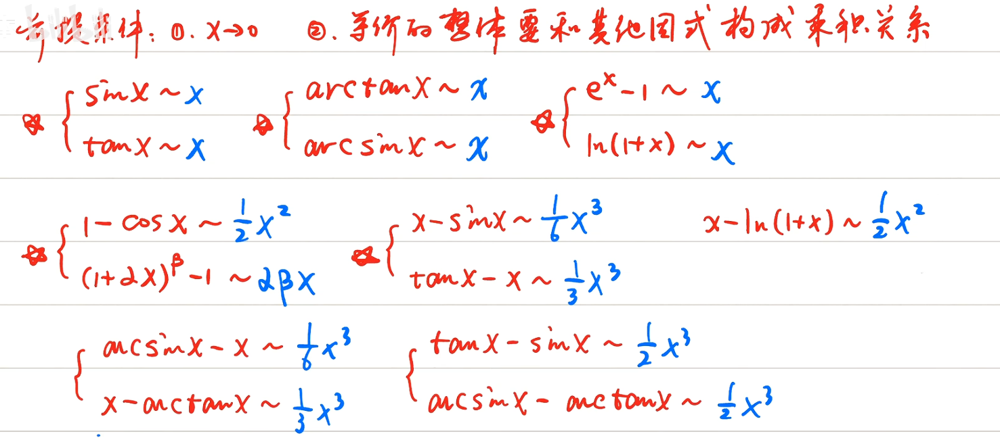


## 广义化常见替换

https://www.bilibili.com/video/BV1husGzwEtZ?t=980.0&p=20

> 将等价x替换为整体 即一个f(x)，但f(x)必须趋近于0。

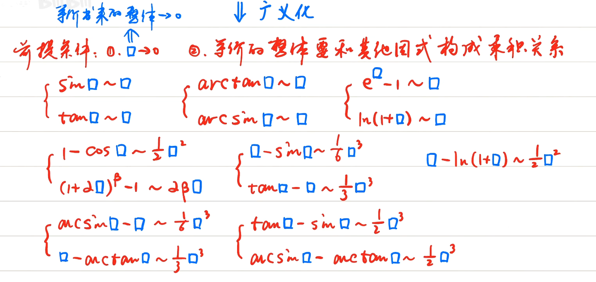


## 小试牛刀

### 第一题

https://www.bilibili.com/video/BV1husGzwEtZ?t=707.8&p=20
$$
\lim_{x \to 0} \frac{1 - \cos{x}}{x\sin{x}}
$$

答案: 1/2

### 第二题

https://www.bilibili.com/video/BV1husGzwEtZ?t=782.6&p=20
$$
\lim_{x \to 0} \frac{3次根\sqrt{1 + x^2}-1}{\cos{x-1}}
$$

答案: -2/3

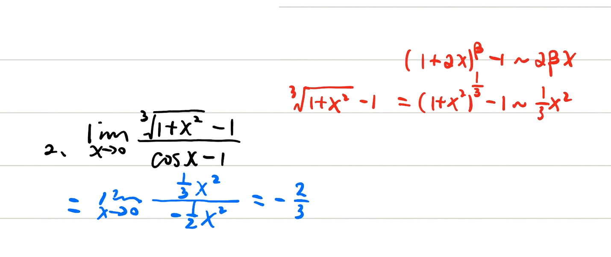


### 第三题

https://www.bilibili.com/video/BV1husGzwEtZ?t=1124.4&p=20
$$
\lim_{x \to \infty} \frac{2x^2}{x+1}\sin{\frac{1}{x}}
$$

答案: 2 (也可以把1/x的x约了 结果也是2)

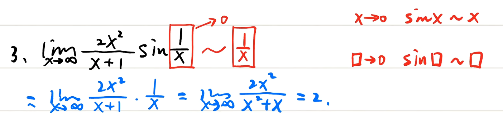


### 第四题

https://www.bilibili.com/video/BV1husGzwEtZ?t=1346.7&p=20
$$
\lim_{x \to 0} \frac{\sqrt{1 + \sin{x}} -1 }{x}
$$
答案: 无解(正负不一致)

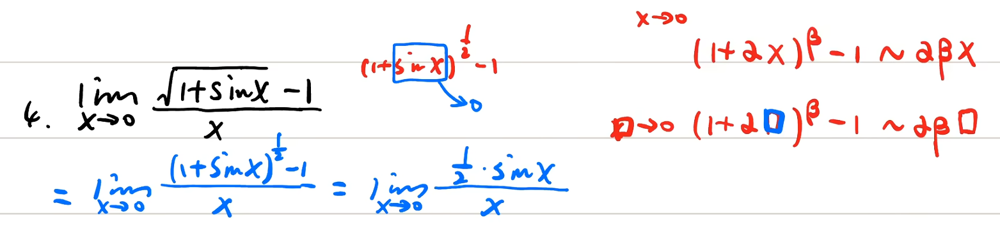


### *第五题

https://www.bilibili.com/video/BV1husGzwEtZ?t=1533.2&p=20

> 真题.  使用 口 - sin口

$$
\lim_{x \to 0} \frac{[\sin{x}-\sin{(\sin{x})}]\sin{x}}{x^4}
$$

答案: 1/6

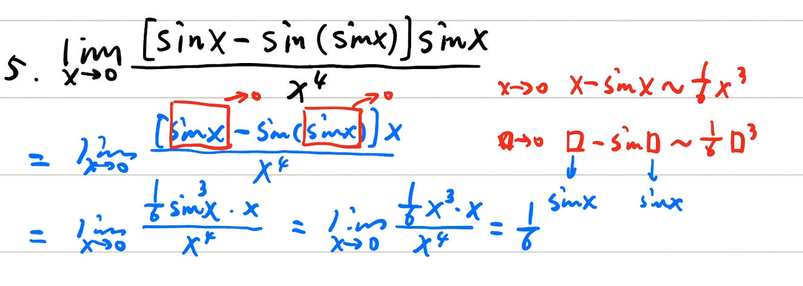

### 第六题

https://www.bilibili.com/video/BV1husGzwEtZ?t=1818.0&p=20
$$
\lim_{x \to 0} \frac{\tan{x} - \sin{x}}{x^2 \ln{1+x}}
$$
答案: 1 / 2

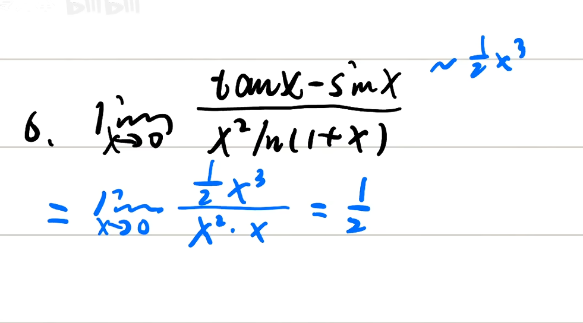


### *第七题

https://www.bilibili.com/video/BV1husGzwEtZ?t=1888.0&p=20

> 真题. 

$$
\lim_{x \to 0} [\frac{1}{x} - \frac{1}{x^2} \ln{(1+x)}]
$$

答案: 1 / 2

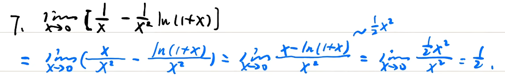


### 第八题

https://www.bilibili.com/video/BV1husGzwEtZ?t=2042.8&p=20
$$
\lim_{x \to \infty} (x - x^2 \ln{(1 + \frac{1}{x})} 
$$
答案: 1 /  2

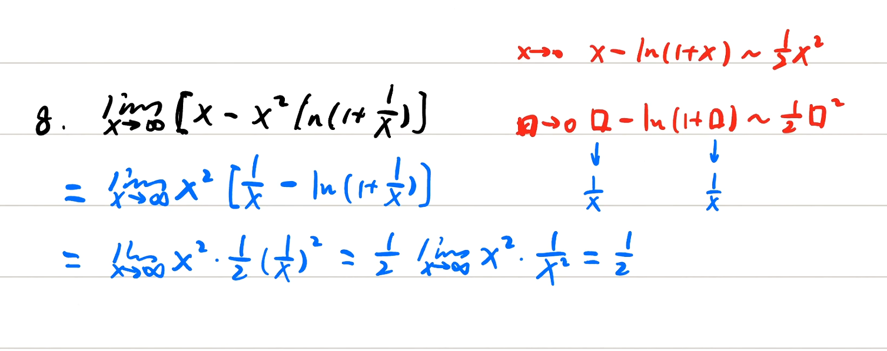


# 等价无穷小的误区

P20

## 误区1

并不是x趋于0才能使用等价，而是看在当前的x趋向下，f(x)中被等价的整体是否趋于0。

## 误区1习题

### 第一题

05min17s

> lna - lnb = ln a/b
>
> lna + lnb = ln ab

使用广义化的 ln(1+x) => x
$$
\lim_{x \to \infty} x[\ln{(1+x)}-\ln{x}]
$$
答案: 1


### 第二题

07min35s

> 因式分解 + sin[] 等价

$$
\begin{aligned}
& \lim_{x \to 2} \frac{\sin{x^2-4}}{x^2+x-6} \\ \\
& => \frac{x^2-4}{x^2+x-6} \\ \\ 
& => \frac{(x+2)(x-2)}{(x+3)(x-2)} \\ \\
& => \frac{x+2}{x+3} \\ \\
& \text{带入} => \frac{4}{5}
\end{aligned}
$$

答案: 4/5

## 误区2

误认为在任何情况下都可以使用等价

```text
在专升本学习阶段，想对某个因式作等价，只有中这个因式与其他因式构成乘除关系才能使用。即 乘除运算中。
与其他因式构成加减关系时不能使用。
```


## 误区2习题

### 习题1

10min 35s

> 使用 tanx - sinx => 1/2x^3 而不是 tanx => x, sinx => x

$$
\lim_{x \to 0} \frac{\tan{x} - \sin{x}} {x^3}
$$

答案: 1/2


### 第二题

12min 45s

> e^x - 1 不能等价为x

$$
\lim_{x \to 0} \frac{e^x-1-x}{x^2}
$$

答案: 洛必达后揭晓


# 非零因子带入

P21

> 极限计算中的小细节 ，用于0比0极限

当某个因式为非零因式，并且和其他零因式构成乘积关系，则可以先将其计算结果计算出来，带入原始继续计算。

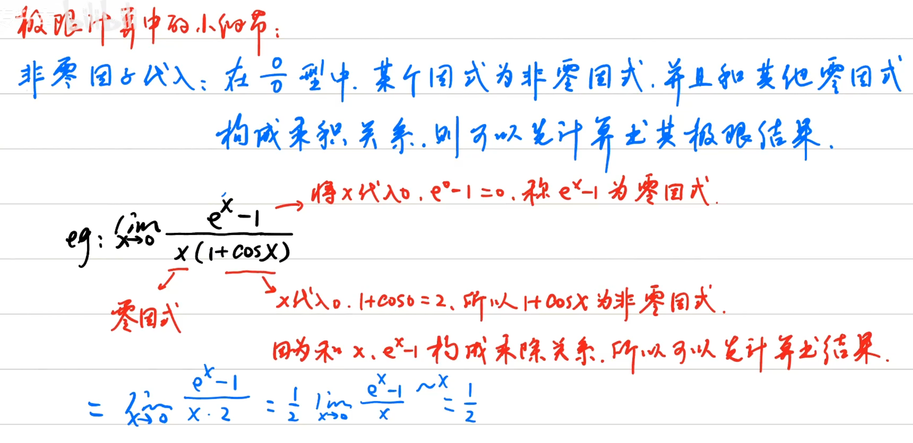


## 稊米

### 题目2

06min07s
$$
\lim_{x \to 0} \frac{e^x - e^{\sin{x}}}{(e^{x^2}-1)x}
$$
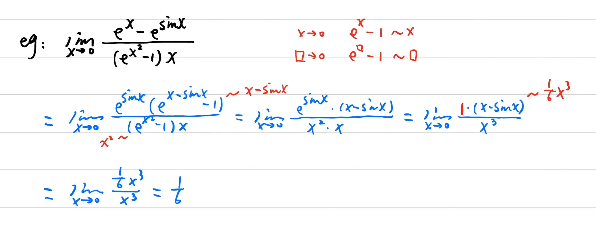

### 题目3

13min59s

> 根式有理化 使用平方差公式乘以两个根式相反运算(+则-，-则+)
>
> (原式)(原式逆运算)

使用1+(a+x)^b-1 => abx 和 tanx - sinx = 1/2 x^3
$$
\lim_{x \to 0} \frac{\sqrt{1+\tan x} - \sqrt{1+\sin x}} {(\sqrt{1+x^2}-1)x}
$$


答案: 1/2

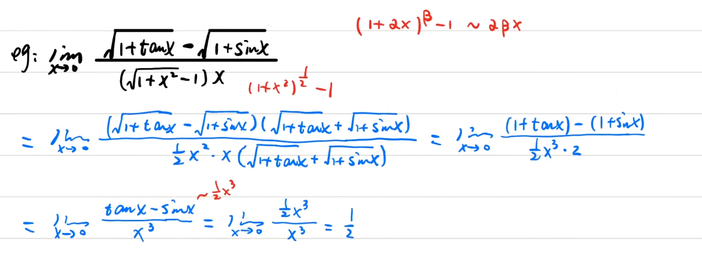


# 等价无穷小习题

P22

```text
极限的求解步骤:
	1. 先定型(如果不是七种未定式直接代入得结果)
	2. 再化简(分子分母约分，非零因子代入，根式有理化，等价无穷小等)
	3. 用公式(洛必达，泰勒公式)
```

## 第一题

3min41s

> 使用 ln(1+x) = x

$$
\begin{aligned}
& \lim_{x \to \infty} x \ln{\frac{x+3}{x}} \\
& => x\ln{(1 + \frac{3}{x})}
& => x \frac{3}{x} \\
& => 3
\end{aligned}
$$

答案: 3


## 第二题

6min53s

> 使用sinx - x = (1/3) x ^ 3


$$
\begin{aligned}
& \lim_{x \to 0} \frac{x - \tan x}{(e^{x^2} - 1) \sin x} \\
& 使用\tan x - x = \frac{1}{3}x^3
& => -(\tan x - x) = -\frac{1}{3} x^3 \\
& =>  \lim_{x \to 0} \frac{-\frac{1}{3} x^3}{(e^{x^2} - 1) \sin x} \\
& 使用e^口 - 1 = 口 \\ & 得 x^2\sin x \\
& => \lim_{x \to 0} \frac{-\frac{1}{3}x^3}{x^3} \\
& => -\frac{1}{3}
\end{aligned}
$$


## 第三题

9min01s

> 一般考试 结果不会为无穷，而是非零常数

$$
\begin{aligned}
& \lim_{x \to 0} \frac{\sqrt{x + x\sin x} -1}{x^2\ln{1+x}} \\
& 使用(1+a口)^b-1 等价 ab口，得 \\
& => \lim_{x \to 0} \frac{\frac{1}{2}x\sin x}{x^2\ln{1+x}} \\
& 使用\ln{1+口} 等价 口，得 \\
& => \lim_{x \to 0} \frac{\frac{1}{2}x\sin x}{x^3} \\
& => \infty
\end{aligned}
$$


## 第四题

12min31s
$$
\begin{aligned}
& \lim_{x \to 0} \frac{x\sin 5x}{e^{\sin^2 x}-1} \\
& 使用\sin 口 => 5x^2 \\
& 使用e^口-1 => \sin^2x \\
& => \frac{5x^2}{\sin^2x} => \frac{5x^2}{x^2} \\
& => 5
\end{aligned}
$$


## 第五题

14min22s

> 此题的x^2是未知的常数，一般不考这种，如果有 则只考虑一个

$$
\begin{aligned}
& \lim_{x \to \infty} \frac{nx^2}{2}\tan{ \frac{2 \pi}{n} } \\
& => \lim_{x \to \infty} \frac{nx^2}{2} \frac{2\pi}{n} \\
& => \pi x^2
\end{aligned}
$$


## *第六题

17min 37s

> 1的无穷次方使用万能方法

等价无穷小 + 非零因子代入 + 万能方法
$$
\begin{aligned}
& \lim_{x \to 0} (\frac{1+x}{1+\sin x}) ^ {\frac{1}{x^3}} \\
& 定型: 1^\infty 使用万能方法 (1+A)^B = e^{\lim{AB}} \\
& => (1 + \frac{1+x}{1+\sin x} - 1) ^ {\frac{1}{x^3}} \\
& => (1 + \frac{1+x}{1+\sin x} - \frac{1 + \sin x}{1 + \sin x}) ^ {\frac{1} {x^3}} \\
& => (1 + \frac{(1+x) - (1+\sin x) => 1+x-1-\sin x}{1+\sin x}) ^ {\frac{1} {x^3}} \\
& => (\frac{x-\sin x}{1+\sin x})^ {\frac{1} {x^3}} \\
& => e^{\lim_{x \to 0} \frac{x - \sin x}{ (1 + \sin x)x^3 }} \\
& 使用非零因子代入 \\
& => \frac{x-\sin x}{x^3} \\
& 使用x - \sin x => \frac{1}{6} x^3 \\
& => e^{\frac{1}{6}}
\end{aligned}
$$


## 第七题

24min 35s
$$
\lim_{x \to 0} [\frac{x}{\ln(1+x)}] ^ \frac{1}{\sin 2x}
$$


# #

