# 数列极限

## [两个简单极限](https://www.bilibili.com/video/BV1husGzwEtZ?t=764.0&p=13)

$$
\lim_{n\to\infty} \frac{k}{n} = 0 \quad (k\text{为常数})
$$
$$
\lim_{n\to 0} \frac{k}{n} = \infty \quad (k\text{为常数且}k\neq 0)
$$

## [数列极限](https://www.bilibili.com/video/BV1husGzwEtZ?t=180.3&p=13)

> 数列是一个定义域为正整数的函数f(n)的输出列表。
>
> 其中，定义域是数列的索引n，而索引代表的值则是f(n)的一个计算结果。

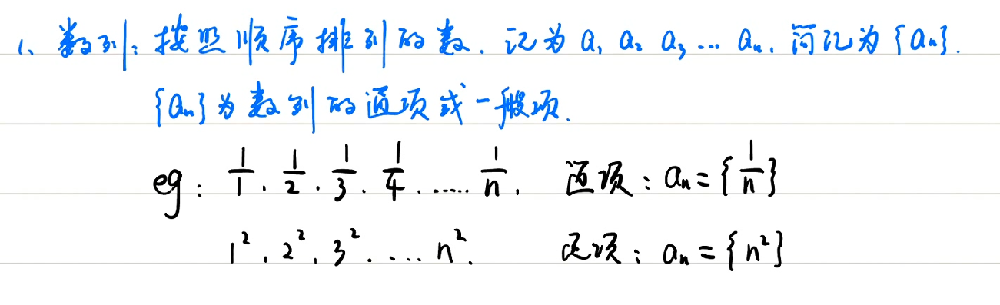

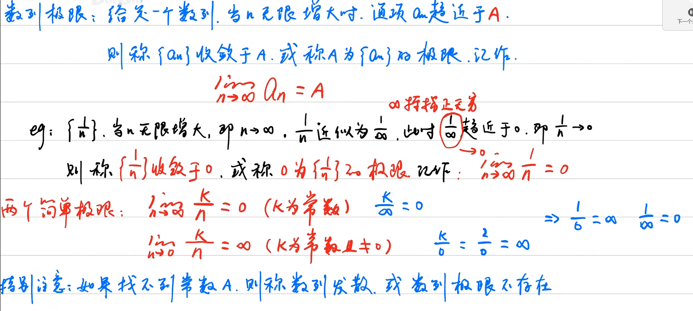

## [数列的收敛和发散](https://www.bilibili.com/video/BV1husGzwEtZ?t=1056.0&p=13)

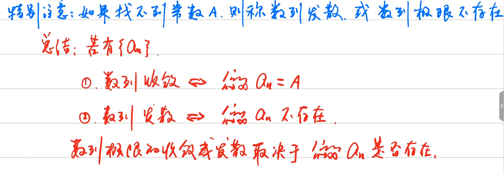

## [不存在的两种情况](https://www.bilibili.com/video/BV1husGzwEtZ?t=1247.3&p=13)

> 极限结果为无穷

$$
判断数列 \{2^n\} 是否收敛 \\
\lim_{n\to\infty} 2^n = \infty \quad \text{因此}\quad \{2^n\} \text{发散}
$$

> 极限值在某个范围内波动

$$
判断数列 \{(-1)^n\} 是否收敛\\
\lim_{n\to\infty} (-1)^n = \begin{cases} 1 & n\text{为偶数} \\ -1 & n\text{为奇数} \end{cases} \quad \text{因此}\quad \{(-1)^n\} \text{发散}
$$

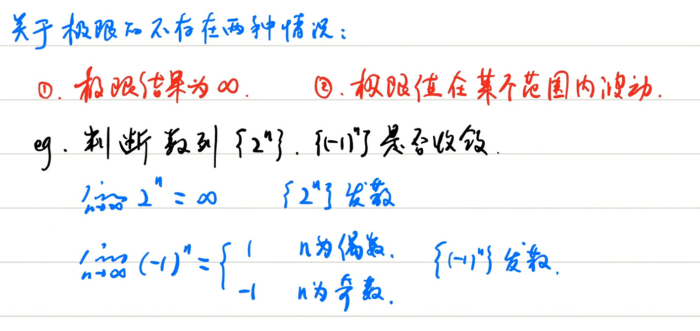

## 习题

### [题目一](https://www.bilibili.com/video/BV1husGzwEtZ?t=1780.0&p=13)

$$
\lim_{n\to\infty} \left(2 + \frac{1}{n^2}\right) = 2
$$

### [题目二](https://www.bilibili.com/video/BV1husGzwEtZ?t=1884.7&p=13)

$$
\lim_{n\to\infty} \frac{n-1}{n+1} = 1
$$

### [题目三](https://www.bilibili.com/video/BV1husGzwEtZ?t=2038.9&p=13)

$$
\begin{aligned}
\lim_{n\to\infty} \left( \frac{1}{1\times2} + \frac{1}{2\times3} + \cdots + \frac{1}{n(n+1)} \right)
&= \lim_{n\to\infty} \left( 1 - \frac12 + \frac12 - \frac13 + \cdots + \frac1n - \frac1{n+1} \right) \\
&= \lim_{n\to\infty} \left(1 - \frac{1}{n+1}\right) \\
&= 1
\end{aligned}
$$

### [题目四](https://www.bilibili.com/video/BV1husGzwEtZ?t=2315.8&p=13)

$$
\begin{aligned}
\lim_{n\to\infty} \left(\sqrt{n+2} - \sqrt{n}\right)
&= \lim_{n\to\infty} \frac{(\sqrt{n+2}-\sqrt{n})(\sqrt{n+2}+\sqrt{n})}{\sqrt{n+2}+\sqrt{n}} \\
&= \lim_{n\to\infty} \frac{n+2-n}{\sqrt{n+2}+\sqrt{n}} \\
&= \lim_{n\to\infty} \frac{2}{\sqrt{n+2}+\sqrt{n}} \\
&= 0
\end{aligned}
$$

# 函数极限

> 极限的计算非常简单，直接当趋向的值带入到函数的x中。

## [定义](https://www.bilibili.com/video/BV1husGzwEtZ?t=42.7&p=14)

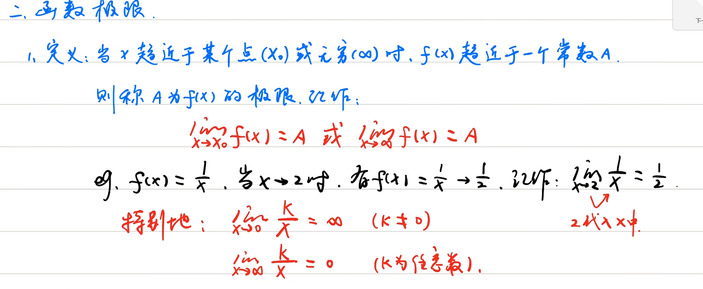

## [趋近于无穷](https://www.bilibili.com/video/BV1husGzwEtZ?t=372.6&p=14)

> 一个函数要存在极限，那么他的正负无穷需要为同一个值

函数在无穷处极限存在的充要条件:
$$
\lim_{x\to\infty}f(x) = A \iff \lim_{x\to+\infty}f(x) = \lim_{x\to-\infty}f(x) = A
$$
$$
\text{若 } \lim_{x\to-\infty}f(x) \neq \lim_{x\to+\infty}f(x) \text{，则 } \lim_{x\to\infty}f(x) \text{ 不存在}
$$

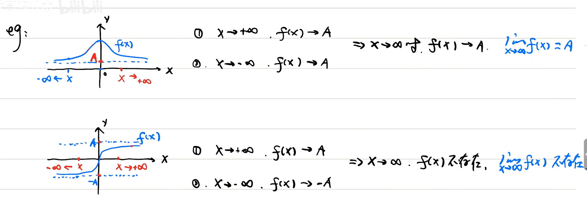

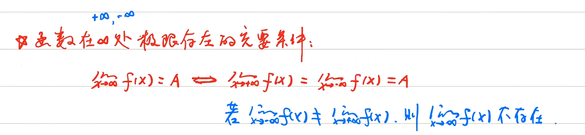

## [*两个重要函数的极限](https://www.bilibili.com/video/BV1husGzwEtZ?t=991.4&p=14)

> 非常重要

$$
\lim_{x\to\infty}\arctan x
$$

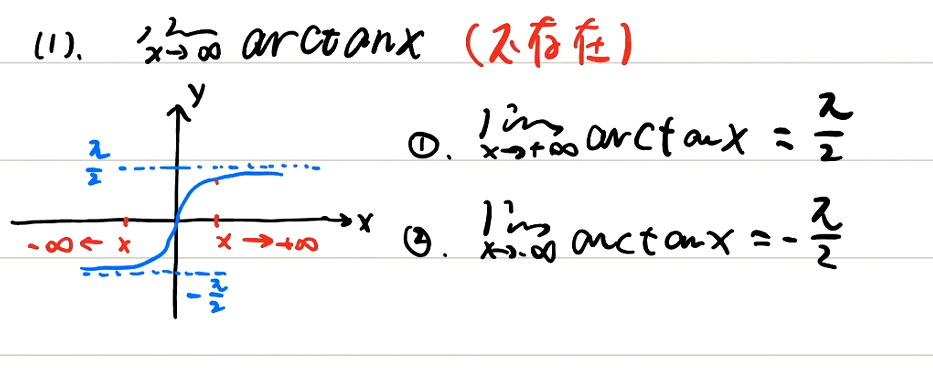

$$
\lim_{x\to\infty} e^x
$$
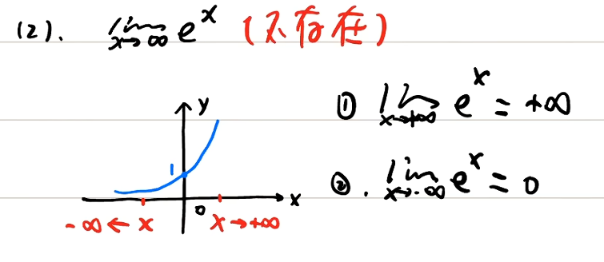

## [趋近于常数](https://www.bilibili.com/video/BV1husGzwEtZ?t=1298.4&p=14)

函数在一个点处，极限存在的充要条件: 左右极限存在且相等。
$$
\lim_{x\to x_{0}}f(x) = A \iff \lim_{x\to x_{0}^-}f(x) = \lim_{x\to x_{0}^+}f(x) = A
$$
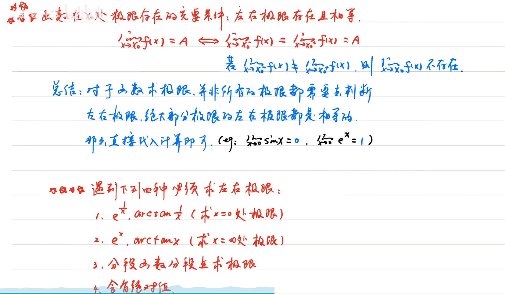

## [习题](https://www.bilibili.com/video/BV1husGzwEtZ?t=1998.9&p=14)

### [第一题](https://www.bilibili.com/video/BV1husGzwEtZ?t=2010.3&p=14)
$$
\lim_{x\to 0} e^{1 / x}
$$
答案: 不存在

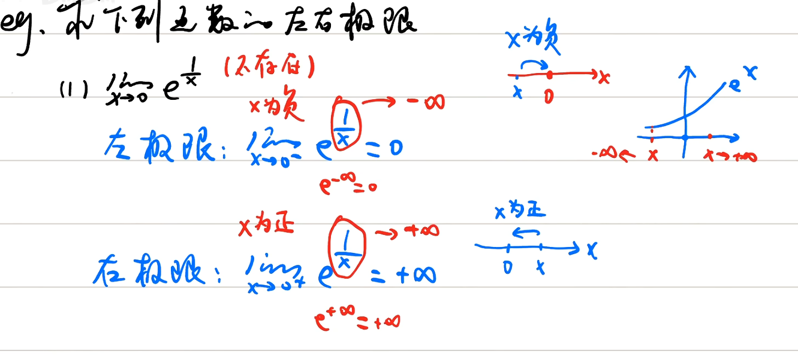

### [第二题](https://www.bilibili.com/video/BV1husGzwEtZ?t=2290.2&p=14)
$$
\lim_{x\to 0} \arctan \frac{1}{x}
$$
答案: 不存在

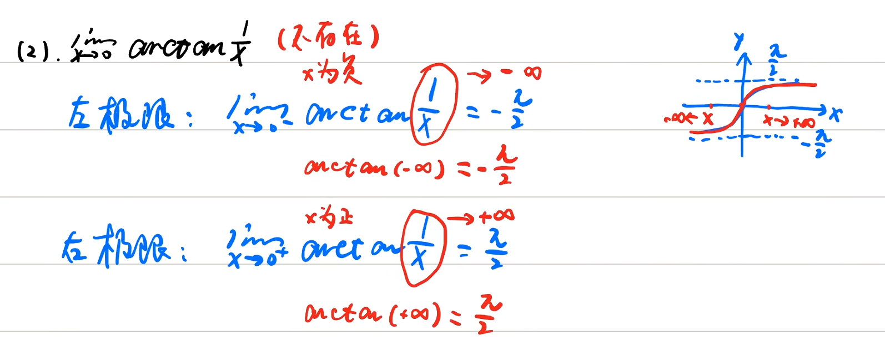

### [第三题](https://www.bilibili.com/video/BV1husGzwEtZ?t=2989.1&p=14)
$$
\lim_{x\to 0} \frac{|x|}{x}
$$
答案: 不存在

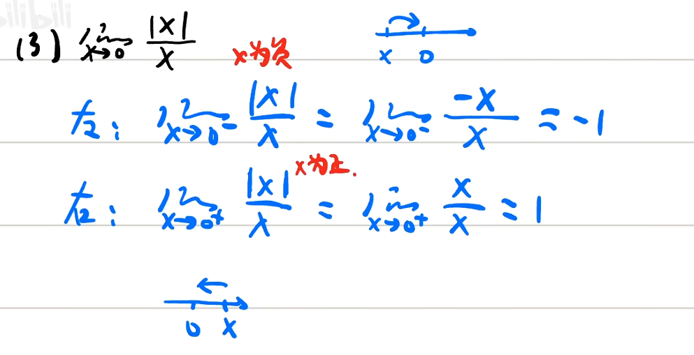

### [第四题-2](https://www.bilibili.com/video/BV1husGzwEtZ?t=3247.1&p=14)

$$
\lim_{x\to 1} \frac{x-1}{|1-x|}
$$

答案: 不存在

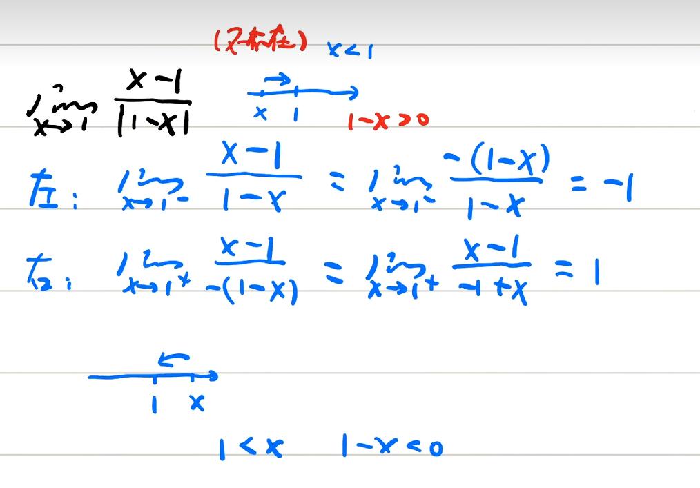

## [回顾](https://www.bilibili.com/video/BV1husGzwEtZ?t=3506.0&p=14)

# 极限的四则运算

> 极限运算的双方必须存在。其余便是将双方极限值进行四则运算

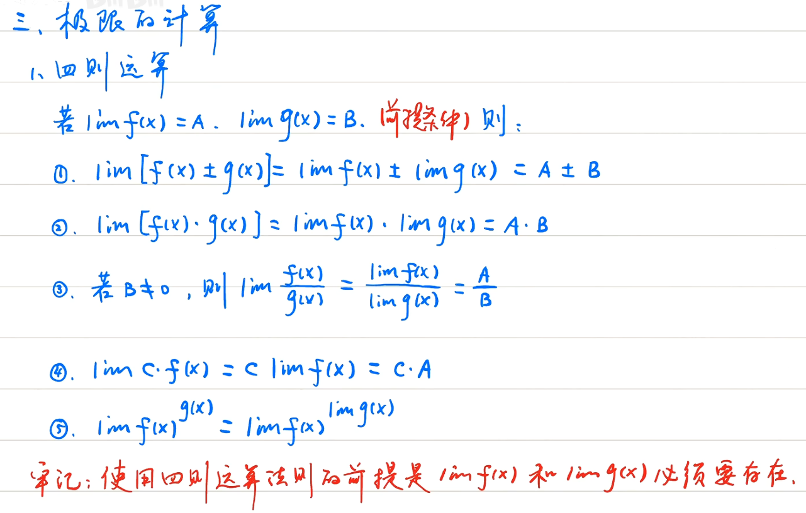

## [未定式](https://www.bilibili.com/video/BV1husGzwEtZ?t=376.9&p=15)

## [极限的解题步骤](https://www.bilibili.com/video/BV1husGzwEtZ?t=896.8&p=15)

> 先定型，再化简，用公式

## [小试牛刀](https://www.bilibili.com/video/BV1husGzwEtZ?t=1017.5&p=15)

### [第一题](https://www.bilibili.com/video/BV1husGzwEtZ?t=1024.1&p=15)
$$
\lim_{x \to 2} \frac{3x^2 - 2x}{4 + 2x}
$$
答案: 1

### [第二题](https://www.bilibili.com/video/BV1husGzwEtZ?t=1094.5&p=15)
$$
\lim_{x \to 0} \frac{3x}{x-2}
$$
答案: 0

### [第三题-未](https://www.bilibili.com/video/BV1husGzwEtZ?t=1118.4&p=15)
$$
\lim_{x \to 2} \frac{x^2-4}{x-2}
$$
答案: 4

### [第四题-未](https://www.bilibili.com/video/BV1husGzwEtZ?t=1256.0&p=15)
$$
\lim_{x \to 1} \frac{x^2+2x-3}{x-1}
$$
答案: 4

### [第五题](https://www.bilibili.com/video/BV1husGzwEtZ?t=1318.6&p=15)
$$
\lim_{x \to \infty} \frac{1+\frac{1}{x}}{2-\frac{1}{x^2}}
$$
答案: 1

### [第六题-未](https://www.bilibili.com/video/BV1husGzwEtZ?t=1388.5&p=15)
$$
\lim_{x \to 0} \frac{\sqrt{x+1} - 1}{x}
$$
答案: 二分之一

### [第七题-未](https://www.bilibili.com/video/BV1husGzwEtZ?t=1547.8&p=15)

$$
立方差公式: a^3 - b^3 = (a-b)(a^2+ab+b^2)
$$

 
$$
\lim_{x \to 1} \left( \frac{1}{1-x} - \frac{3}{1-x^3} \right)
$$

答案: -1

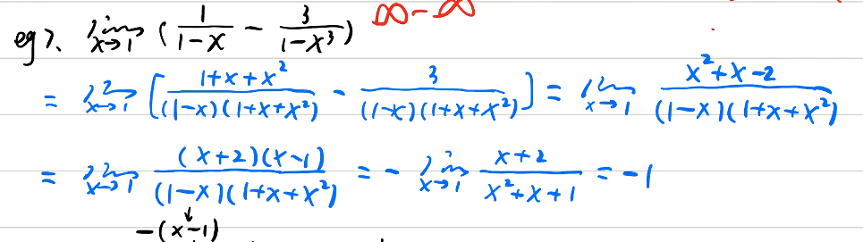

### [第八题](https://www.bilibili.com/video/BV1husGzwEtZ?t=1960.4&p=15)

$$
等比数列的前n项和公式   \\
S_n = \frac{a_1(1-q^n)}{1-q} \\
a_1为第一项值，q 为后一项除以前一项
$$

题目:
$$
\lim_{n \to \infty} \left( \frac{1}{2} + \frac{1}{4} + \dots + \frac{1}{2^n} \right)
$$
答案: 1

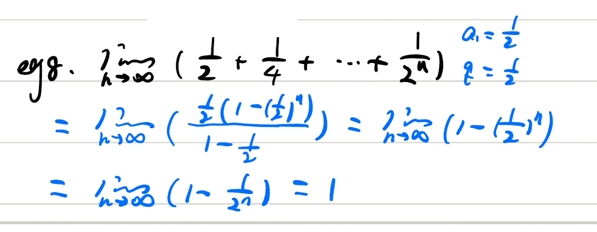

# 抓大头

> 针对无穷比无穷

口角: 上大无穷，下大为0，相同则为系数比。

如果是大题，那么分子分母同时除以共有的最高次方 详见第一题

含根号秒杀技巧，详见第三题

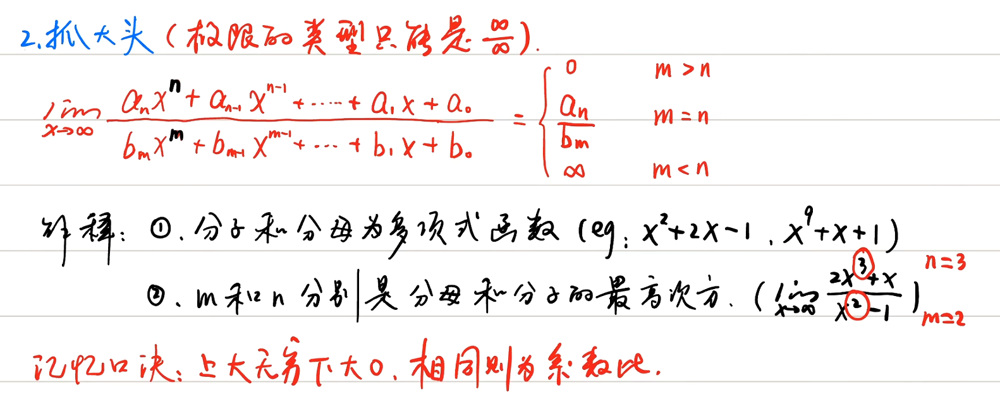

## 习题

### [第一题](https://www.bilibili.com/video/BV1husGzwEtZ?t=388.7&p=16)
$$
\lim_{x \to +\infty} \frac{x^2+2x-1}{2x^2+1}
$$
答案: 1/2，上系数1 下系数2，n为2 m为2。
$$
\frac{2x^2 + 1}{x^2} = \frac{2x^2}{x^2} + \frac{1}{x^2} = 2 + \frac{1}{x^2}
$$

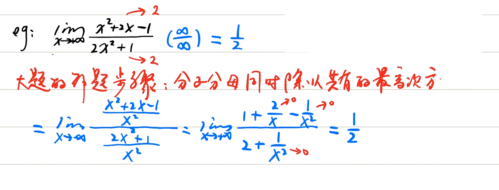

### [第二题](https://www.bilibili.com/video/BV1husGzwEtZ?t=718.1&p=16)
$$
\lim_{x \to \infty} \frac{7x^2 + 4x + 2}{3x^3 + 5x^2 - 2}
$$
答案: 0

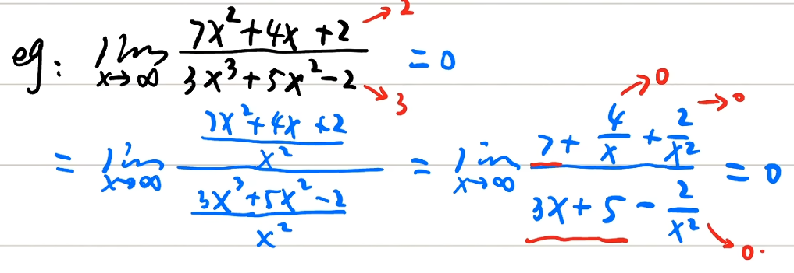

### [第三题](https://www.bilibili.com/video/BV1husGzwEtZ?t=1040.1&p=16)

> 如果极限类型为无穷比无穷，且分子分母中含有根号，或者括号。
>
> 只保留根号或者括号中，最高次方即可。仅选择 填空题可用。

$$
\lim_{x \to \infty} \frac{\sqrt{4x^2 - x + 1}}{\sqrt[3]{x^2 + 6}}
$$
答案: 2

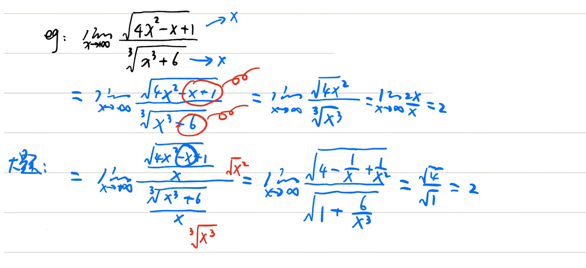

### [第四题](https://www.bilibili.com/video/BV1husGzwEtZ?t=1588.3&p=16)

> 等差数列的前n项和  

$$
S_n = \frac{(1 + n)n}{2} =
(\frac{(\text{首项} + \text{末项}) \times \text{项数}}{2})
$$

题目:
$$
\lim_{n \to \infty} \frac{1 + 2 + \dots + n}{n^2}
$$
答案: 1/2

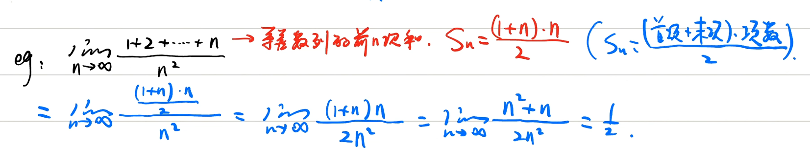

### [第五题](https://www.bilibili.com/video/BV1husGzwEtZ?t=1888.7&p=16)

> 根式有理化

$$
\lim_{n \to \infty} \left( n - \sqrt{n^2 - n} \right)
$$

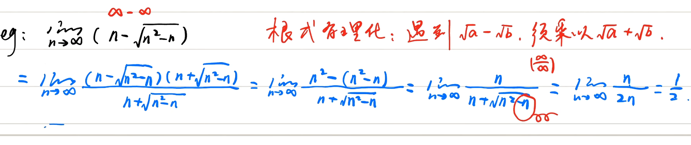

答案: 1/2

### 第六题

$$
\begin{aligned}
\lim_{n \to \infty} \frac{(n-2)^{10} (2n+3)^{10}}{(2n^2)^{10}}
&= \lim_{n \to \infty} \frac{n^{10} \cdot (2n)^{10}}{(2n^2)^{10}} \\
&= \lim_{n \to \infty} \frac{n^{10} \cdot 2^{10} \cdot n^{10}}{2^{10} \cdot n^{20}} \\
&= \lim_{n \to \infty} \frac{2^{10} \cdot n^{20}}{2^{10} \cdot n^{20}} \\
&= 1
\end{aligned}
$$

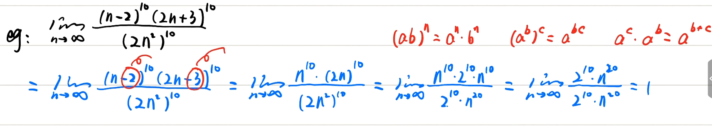

## [指数形式的抓大头](https://www.bilibili.com/video/BV1husGzwEtZ?t=2506.4&p=16)

> 若分子分母均是指数函数形式。也可以使用抓大头
>
> 不过必须抓分子分母的`最大底数`，再使用口决。
>
> 要保证指数位相同

## 习题

### 第一题

$$
\begin{aligned}
\lim_{x \to \infty} \frac{8^x}{8^x + 5^x}
&= \frac{8}{8} \\
&= 1
\end{aligned}
$$

### 第二题

> 疑问

$$
\begin{aligned}
\lim_{x \to +\infty} \frac{3^{x+1}}{3^x + 2^x}
&= \lim_{x \to +\infty} \frac{3 \cdot 3^x}{3^x + 2^x} \\
&= 3
\end{aligned}
$$

### 第三题

$$
\begin{aligned}
&\text{判断 } \lim_{x \to 0} \frac{1 + e^{1/x}}{2 + e^{2/x}} \text{ 极限是否存在} \\
&\text{左: } \lim_{x \to 0^-} \frac{1 + e^{1/x}}{2 + e^{2/x}} = \frac{1}{2} \\
&\text{右: } \lim_{x \to 0^+} \frac{1 + e^{1/x}}{2 + (e^2)^{1/x}} \\
&= \frac{e}{e^2} \\
&= \text{上大无穷，下大0，因此为 } 0
\end{aligned}
$$

# #
