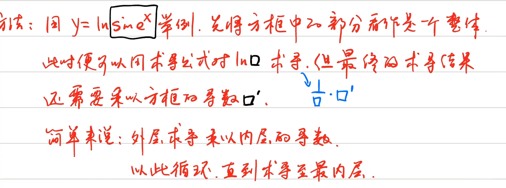

# [导数](https://www.bilibili.com/video/BV1husGzwEtZ?p=31)

# 要背诵定义式

> 是个抽象的内容，取一段数段，然后拿右点趋向左点作为极限的趋向
>
> [3b1b 中配](https://www.bilibili.com/video/BV1ob411y7L9?p=2)

核心: 取t趋向t(0)的极限，便是瞬时速度。(关于某一点的最佳直线近似)

平均变化率（平均速率）：
$$
V = \frac{S(t) - S(t_0)}{t - t_0}
$$

瞬时变化率（瞬时速率 / 变化率的最佳近似）：
$$
v_{\text{瞬时}} = \lim_{t \to t_0} \frac{S(t) - S(t_0)}{t - t_0}
$$


# 导数的定义

> 记不住概念 直接记这个

$$
f'(x_0) = \lim_{\Delta x \to 0} \frac{\Delta y}{\Delta x} = \lim_{\Delta x \to 0} \frac{f(x_0 + \Delta x) - f(x_0)}{\Delta x}
$$


## 简单例子

- 例1

15min57s
$$
求 f(x) = x^2 在 x = 2 处的导数。 \\
$$
直接使用定义带入，x0就等于2。

答案: 4


- 例2

21min28s
$$
\text{求 } f(x) = e^x \text{ 在 } x = 0 \text{ 处的导数。}
$$
答案: 1，使用等价e^x-1=x，先算e^0=1。


# 导数定义式1

25min00s
$$
f'(x_0) = \lim_{\Delta x \to 0} \frac{\Delta y}{\Delta x} = \lim_{\Delta x \to 0} \frac{f(x_0 + \Delta x) - f(x_0)}{\Delta x}
$$

$$
& 1. \Delta x可以是任何字母。& \\
& 2. 分子与分母的 \Delta x 要保证决对相同, 且\to0。& \\
& 3. 如果相同，不管为任何形式，其结果依旧是f'(x_0) &
$$


## 例题

### 例一

20min36s
$$
\text{已知 } f(1) = 2 \text{，求 } \frac{f(1-x) - f(1)}{3x}
$$
答案: -2/3


### 例二

33min05s
$$
\text{已求 } f'(a) = 3, \text{ 求 } \lim_{x\to0} [f(a+\frac{2}{n}) - f(a)]
$$
答案: f'(a) * 2 = 3 * 2 = 6


例三

39min05s
$$
\text{已知 } f(a) = 4 \text{，} f(a) = 2 \text{，求 } \lim_{n \to \infty} \left[ \frac{f(a + \frac{1}{n})}{f(a)} \right]^n \\
答案: e^{f'(a) \sdot \frac{1}{f(a)}} = e^{4 \sdot \frac{1}{2}} = e^2 \\
使用1^\infty 的万能方法 (1+A)^B = A \sdot B
$$


# [导数定义式2](https://www.bilibili.com/video/BV1husGzwEtZ?p=32)

> 由定义式1推导而来

$$
f'(x) = \lim_{x \to x_0} \frac{f(x) - f(x_0)}{x - x_0}\\ \text{说明:} \ x_0 \text{在题目中为常数} \\
推导过程: f'(x_0) = \lim_{\Delta x \to 0} \frac{f(x_0 + \Delta x) - f(x_0)}{\Delta x} \\
令 x = x_0 + \Delta x，则\Delta x = x - x_0，当 \Delta x \to 0时，x \to x_0. \\
即: f'(x) = \lim_{x \to x_0} \frac{f(x) - f(x_0)}{x - x_0}
$$


## 例题

### 题一

05min33s
$$
\text{利用导函数定义式2求 } y = x^2 + 1 \text{ 在 } x = 1 \text{ 的导数。}
$$
答案: 2


### *题二

09:33
$$
\text{求函数 } y = (e^x - 1) e^x (e^{x}+1) (e^{x}+2) \cdots (e^{x}+2026) \text{ 在 } x = 0 \text{ 处的导数。}
$$
答案: 2027!，使用e^x - 1的等价无穷小


### *题三

14:27
$$
\lim_{x \to x_0} \frac{x_0 f(x) - x f(x_0)}{x - x_0} \\
A. x_0 f'(x_0) - f(x_0) \\  
B. f(x_0) - x_0 f'(x_0)  \\
C. f'(x_0) - x_0 f(x_0)  \\
D. x_0 f(x_0) - f'(x_0) \\
$$

答案: A


# 导数推广式

22:02
$$
\text{推广式：} \quad \lim_{\Delta \to 0} \frac{f(x_0 + a \Delta x) - f(x_0 + b \Delta x)}{c \cdot \Delta x} = \frac{a - b}{c} f'(x_0)
$$


### 题一

29:38
$$
\text{若 } f'(2) = 2 \text{，求 } \lim_{x \to 0} \frac{f(2+3\Delta x) - f(2-5\Delta x)}{-2\Delta x}
$$
答案: -8，直接使用推广式


### 题二

31:21
$$
\text{若 } f'(x_0) = 1 \text{，求 } \lim_{x \to 0} \frac{x}{f(x_0 - 2x) - f(x_0 + x)}
$$
答案: -1/3 ，将分子分母颠倒，最终结果为颠倒后的结果的倒数。 Delta_x可以为任意字母，这里为x，因此2x中 不妨碍a = -2。计算后为3。


# [P33可导的充要条件](https://www.bilibili.com/video/BV1husGzwEtZ?p=33)

## 左右导数

00:30


## *充要条件

03:33
$$
\text{导数存在 } \Leftrightarrow \text{ 左右导数存在且相等} \\
f'_-(x_0) = f_+'(x_0)
$$

$$
分段函数，y=e^\frac{1}{x}，y=\arctan{\frac{1}{x}}才有必要求左右导 \\
其余函数不考虑左右导，因为左右导一定相同
$$


### 题一

08:53
$$
\text{讨论 } f(x) = \begin{cases} 
\ln(1-x^2) & x \leq 0 \\ 
x^2 \sin \frac{1}{x} & x > 0 
\end{cases} \text{ 在 } x=0 \text{ 处的可导性。}
$$
答案: f(x)在x=0处可导，并且f'(0) = 0


### 题二

14:55
$$
\text{讨论 } f(x) = 
\begin{cases} 
x \sin \frac{1}{x} & x \neq 0 \\ 
0 & x = 0 
\end{cases} 
\text{ 在 } x = 0 \text{ 处是否可导。} \\
\text{分析：虽为分段函数，但 } x > 0 \text{ 和 } x < 0 \text{ 部分都是 } x \sin \frac{1}{x} \text{。} \\

\text{所以直接讨论 } x = 0 \text{ 处的导数即可。}
$$

答案: f(x)在x=0处不可导，因为导数不存在。


### 题三

17:04
$$
\text{求 } f(x) = \begin{cases} 
\ln(1+x) & x \leq 0 \\ 
\frac{1-\cos x}{x} & x > 0 
\end{cases} 
\text{ 在 } x=0 \text{ 处的导数。}
$$
答案: f(x)在x=0处，不可导，左右导数不同。

需要使用到等价无穷小（1-cosx = 1/2 x^2 以及 ln(1+x) = x）


## 可导和连续的关系

25:58

> 可导是连续的 `充分` 条件，连续是可导 `必要` 条件。
>
> 可导一定连续，连续不一定可导，不连续一定不可导。
>
> 因为可求导本就是为了取连续空间中的瞬间速度（最直观）。

### 题一

28:13
$$
f(x) = 
\begin{cases} 
x \cdot \arctan \frac{1}{x}, & x \neq 0 \\
0, & x = 0
\end{cases}
\text{ 在 } x=0 \text{ 处的连续性和可导性。}
$$
不需要考虑左右极限（一般还是建议，看到ractan就求一下），并且 0 * 有界=0，f(0) = 0，因此连续。

答案: 连续，不可导，左导-pi/2 右导pi/2


### *题二

35:18
$$
\text{设 } f(x) = 
\begin{cases} 
ax^2 + b, & x \geq 1 \\ 
x \cos\left(\frac{\pi}{2}x\right), & x < 1 
\end{cases} 
\text{，问 } a, b \text{ 为何值时，} f(x) \text{ 在 } x=1 \text{ 处可导。}
$$

$$
\text{分析：遇到求导数的问题，先考虑连续，再考虑可导。} \\ \text {使用逐项之差条件可求上述部分导数，再用可导的元要求条件去另外的导数。}
$$

- 先求连续，再求可导
- 要使用洛必达

答案: a = -4/pi，b=pi/4


# [P34导数的几何意义](https://www.bilibili.com/video/BV1husGzwEtZ?p=33)

导数的值就是函数在该点处的切线和斜率

## 点斜式

$$
\begin{aligned}
&\text{若已知(知道)切点 }(x_0, f(x_0))\text{ 和该切点处的导数 }f'(x_0) \\ & \text{则可以用点斜式表示上述切线方程：} \\
&y - f(x_0) = f'(x_0)(x - x_0) \\ \\
&\text{因为该方程斜率和切线方程斜率相乘等于-1。（切线和法线垂直关系）} \\
&\text{所以法线方程斜率 }k_\text{法} = -\frac{1}{f'(x_0)} \\
&\text{即法线方程为：} y - f(x_0) = -\frac{1}{f'(x_0)}(x - x_0)
\end{aligned}
$$

## 特例0和无穷

07:19

> 斜率公式: y = kx + b，b是y轴点的值

$$
\begin{array}{|c|c|c|}
\hline
\text{条件} & \text{切线方程} & \text{法线方程} \\
\hline
\text{切线平行于 } x \text{ 轴：} f'(x_0)=0 & y = f(x_0) & x = x_0 \\
\hline
\text{切线垂直于 } x \text{ 轴：} f'(x_0)=\infty & x = x_0 & y = f(x_0) \\
\hline
\end{array}
$$


## 题目

### 题一

10:37

> 这竟然是最简单的题目吗

$$
\text{求函数 } y = x^2 + 2x - 1 \text{ 在 } (0, -1) \text{ 处切线方程和法线方程。}
$$

答案: 
$$
k_法: -\frac{1}{2} => y=-\frac{1}{2}x-1 \\
切线: y=2x-1
$$
解释: 

1. 先对原方程求一次导，得到导数方程。
2. 将x_0带入到导数方程，求出其导数。
3. 将导数带入到点斜式方程，或特例。得到切线方程。
   1. 利用 切线方程值 * 法线方程值 = -1，得到k_法 = - 1/2
4. 将导数值带入到法线方程。


### 题二

14:42
$$
\text{设 } f(x) \text{ 可导，且 } \lim_{x \to 0} \frac{f(1) - f(1-2x)}{x} = 2 \\ \text{求曲线 } y = f(x) \text{ 在点 } (1, 2) \text{ 处的切线方程。}
$$
答案: y=x+1

解释: 

1. 先将极限方程化为导数定义式（这里是1）
   1. 取负号
   2. 变分母
2. 求结果2f'(1) = 2 => f'(1) = 1
3. 带入切线方程


### 题三

22:00
$$
\text{曲线 } y = f(x) \text{ 与 } y = \sin x \text{ 在 } (0,0) \text{ 处相切。} \\ \text{ 求曲线 } y = f(x) \text{ 在 } (0,0) \text{ 处切线的方程以及 } \lim_{n \to \infty}n f\left(\frac{2}{n}\right)
$$
答案: y=x，极限: 2

分析:

1. 两曲线相切 必定共有一条切线
2. 因为y = sinx在(0, 0)处，因此f(0) = 0
3. sin0的导数是cos0，因此f'(0) = 1
4. 带入切线方程，f'(0)=1
5. 无穷 乘 0 取倒数，算无穷，将n移到分母变为其倒数，凑出导数定义式
   1. 对分子配一个-f(0)
   2. 对分母配成分子的 Delta x


# 	[P35微分](https://www.bilibili.com/video/BV1husGzwEtZ?p=35)

> 根本没听见去？只知道可微是连续的必要条件。可导是连续的充要条件

dy是什么? => dy是导数值 * dx 不能忘记dx

所以微分结果就是 f'(x) * dx


# [*P36导数的公式](https://www.bilibili.com/video/BV1husGzwEtZ?p=36)

## 幂函数

$$
(x^a)' = ax^{a-1}
$$


## 指数函数

11:02
$$
(a^x)'=a^x\ln{a} \\
(e^x)' = e^x \sdot \ln{e} = e^x \sdot 1 = e^x
$$


## 对数函数

16:50
$$
(\log_{a}x)' = \frac{1}{x \ln{a}} \\
(\ln{x})' = \frac{1}{ x\ln{e} } = \frac{1}{x}
$$


## 三角函数

23:25
$$
(\sin x)' = \cos x \quad (\cos x)' = -\sin x \\
(\tan x)' = \sec^2 x \quad (\cot x)' = -\csc^2 x \\
(\sec x)' = \sec x \tan x \quad (\csc x)' = -\csc x \cot x
$$


## 反三角函数

29:59
$$
(\arcsin x)' = \frac{1}{\sqrt{1-x^2}} \quad (\arccos x)' = -\frac{1}{\sqrt{1-x^2}} \\
(\arctan x)' = \frac{1}{1+x^2} \quad (\operatorname{arccot} x)' = -\frac{1}{1+x^2} \\
\\
\text{补充: } \ln(x + \sqrt{1+x^2}) = \frac{1}{\sqrt{1+x^2}}
$$


# [P36导数的计算](https://www.bilibili.com/video/BV1husGzwEtZ?p=36)

38:09
$$
(uv)' = u'v + uv' \quad (\text{前导后不导+后导前不导}) \\
\left(\frac{u}{v}\right)' = \frac{u'v - uv'}{v^2} \quad (\text{分子:上导下不导-下导上不导})
$$


## 小题目

$$
\begin{aligned}
y &= e^x \sin x \\
y' &= (e^x)' \sin x + e^x (\sin x)' \quad \text{(乘积法则: } u'v + uv' \text{)} \\
&= e^x \sin x + e^x \cos x
\end{aligned}
$$


$$
\begin{aligned}
y &= \frac{x}{\ln x} \\
\text{令 } u &= x, \quad v = \ln x = \log_e x \\
\text{使用商法则：} \quad y' &= \frac{u'v - uv'}{v^2} \\
&= \frac{1 \cdot \ln x - x \cdot (\log_e x)'}{(\ln x)^2} \\
\text{因为 } (\log_a x)' &= \frac{1}{x \ln a} \text{，取 } a = e \text{ 得：} \\
(\log_e x)' &= \frac{1}{x \ln e} \\
\text{而 } \ln e &= 1 \text{，所以 } (\log_e x)' = \frac{1}{x} \\
&= \frac{\ln x - x \cdot \frac{1}{x}}{(\ln x)^2} \\
&= \frac{\ln x - 1}{\ln^2 x}
\end{aligned}
$$


# [*P37复合函数求导](https://www.bilibili.com/video/BV1husGzwEtZ?p=37)

## 求解方法

```text
1. 将复合函数由外向内逐步拆开。（中间层一般用u.v.w表示）
2. 各自求导后再相乘。
3. 替换中间变量（u.v.w）
```

## 小试牛刀

03:21

### 第一题

$$
\begin{aligned}
y &= \ln \sin e^x \\
\text{拆：} \quad y &= \ln u, \quad u = \sin v, \quad v = e^x \\
\text{导：} \quad y' &= \frac{1}{u}, \quad u' = \cos v, \quad v' = e^x \\
\text{乘：} \quad y' &= \frac{1}{u} \cdot \cos v \cdot e^x \\
\text{替：} \quad y' &= \frac{1}{\sin e^x} \cdot \cos e^x \cdot e^x \\
&= \frac{e^x \cos e^x}{\sin e^x}
\end{aligned}
$$


### 第二题

08:21
$$
y = f[g(x)]
$$


## 方法论

12:08




### 第一题

15:12
$$
y=\ln{\sin{e^x}} \\
=> \frac{1}{\sin{e^x}} \sdot \cos{e^x} \sdot e^x
$$


### 第二题

19:06
$$
\begin{aligned}
y &= \sin \sqrt{x^2 + 1} \\
\text{链式法则：} \quad y' &= \cos \sqrt{x^2 + 1} \cdot \frac{1}{2\sqrt{x^2 + 1}} \cdot 2x \\
&= \frac{x \cos \sqrt{x^2 + 1}}{\sqrt{x^2 + 1}}
\end{aligned}
$$


### *第三题

24:02

要使用 `lna - lnb` 、`(u + v)' = u' + v'`的公式 
$$
y = \ln{\frac{x + \sqrt{1 + x^{2}}}{x}} \\
=> \frac{1}{\sqrt{1 + x^{2}}} - \frac{1}{x}
$$


### *第四题

31:50
$$
y = \sqrt{\sin{x} \sqrt{x+e^x}} \\
\frac{1}{2\sqrt{\sin{x}\sqrt{x+e^x}}}(\cos{x} \sdot \sqrt{x + e^x} + \frac{\sin{x}(1+e^x)}{2\sqrt{x+e^x}})
$$


### *第五题

37:42

要使用根式有理化、完全平方根式	
$$
\text{求: } \frac{\sqrt{x+1} - \sqrt{x+2}}{\sqrt{x+1} +\sqrt{x+2}} \\
\text{答: } -2+\frac{2x + 3}{\sqrt{x^2 + 3x + 2}}
$$


# *P38高阶导数

> 就是求n次导


## 第一题

04:44

> 选题题概率高

$$
\begin{aligned}
y &= x e^x \\
\text{一阶导：} \quad y' &= e^x + x e^x = (1 + x)e^x \\
\text{二阶导：} \quad y'' &= e^x + (1 + x)e^x = (2 + x)e^x \\
\text{三阶导：} \quad y''' &= e^x + (2 + x)e^x = (3 + x)e^x \\
& \vdots \\
\text{归纳可得：} \quad y^{(n)} &= (n + x)e^x
\end{aligned}
$$


## [第二题](https://www.bilibili.com/video/BV1husGzwEtZ?t=519.0&p=38)

y=ln(1+x)

复合函数求导 + 幂 + 对数

答案: 
$$
(-1)^{ n-1 } (n-1)! (1+x) ^{-n} \\
\frac{(-1)^{n - 1}(n-1)}{(1+x)^n}
$$


## [第三题](https://www.bilibili.com/video/BV1husGzwEtZ?t=1151.0&p=38)

f(x) = ln(2x+1)
$$
\begin{array}{c|c|c}
\text{步骤} & \text{表达式} & \text{说明} \\
\hline
1.\text{ 一阶导数} & y' = (2x + 1)^{-1} \cdot 2 & \text{已知一阶导形式} \\
2.\text{ 二阶导数（乘法法则）} & y'' = \big[(2x+1)^{-1}\big]' \cdot 2 + (2x+1)^{-1} \cdot 0 & \text{对一阶导求导，常数2的导数为0，第二项为0} \\
3.\text{ 求导计算} & y'' = (-1)(2x+1)^{-2} \cdot 2 \cdot 2 & \text{链式法则：外层导数乘以内层导数2，再乘系数2} \\
4.\text{ 化简} & y'' = (-1) \cdot 2^2 \cdot (2x+1)^{-2} & \text{即 } -4(2x+1)^{-2} \\
5.\; n\text{ 阶导数公式} & y^{(n)} = (-1)^{n-1} \cdot (2x+1)^{-n} \cdot 2^{n} & \text{归纳得出一般形式}
\end{array}
$$
注: 求二阶时应该完全展开计算，才不会对二阶时是 2^2 感到疑惑


## [*第四题](https://www.bilibili.com/video/BV1husGzwEtZ?t=1358.5&p=38)

f(x)=x^4, 求4，5阶


## [第五题](https://www.bilibili.com/video/BV1husGzwEtZ?t=1732.6&p=38)

1/(2x+3)
$$
(-1)^{n} \sdot n! \sdot (2x+3)^{-(n+1)} \sdot 2^{n} \\
\frac{(-1)^{n}\sdot n! \sdot n^{2}}{(2x+4)^{n+1}}
$$


## [第六题](https://www.bilibili.com/video/BV1husGzwEtZ?t=2021.2&p=38)

y=cos2x
$$
-2^{2025} \sin{2x}
$$


# [**P39隐函数求导](https://www.bilibili.com/video/BV1husGzwEtZ?p=39)

> 左边不能写y就是隐函数，就是左边是一个函数 右边也是一个函数

## [公式法](https://www.bilibili.com/video/BV1husGzwEtZ?t=219.1&p=39)

1. 移项是把等式右边边的项移动到左边
2. 对某个值进行求导时，其他未知数均看作常数
3. 

### [公式法题一](https://www.bilibili.com/video/BV1husGzwEtZ?t=495.6&p=39)

$$
e^{x + 2y} + \cos{xy} = 2
$$


### [公式法题二](https://www.bilibili.com/video/BV1husGzwEtZ?t=1090.9&p=39)

$$
\arctan{\frac{x}{y}} = \ln{\sqrt{x^{2} + y^{2}}}
$$


## [直接求导法](https://www.bilibili.com/video/BV1husGzwEtZ?t=1833.0&p=39)

> 两边同时求导，y看作复合函数求导，标记为y'

### [第一题](https://www.bilibili.com/video/BV1husGzwEtZ?t=1892.6&p=39)

$$
e^{x + 2y} + \cos(xy) = 2
$$

对两边同时对x求导

### [第二题](https://www.bilibili.com/video/BV1husGzwEtZ?t=2243.8&p=39)


## [导数的几何意义](https://www.bilibili.com/video/BV1husGzwEtZ?t=2813.4&p=39)

### 隐函数求切导数

$$
\sin{xy} + \ln(y-x) = x \text{所确定的隐函数}y=f(x)\\
\text{在}x=0 \text{处的切线方程}
$$


# [*P40参数方程求导](https://www.bilibili.com/video/BV1husGzwEtZ?p=40&)


# #