# 专升本数学

# 标记

// todo 重看

重要题目

# 先前

## 因式分解

https://www.bilibili.com/video/BV1husGzwEtZ?t=1101.6&p=2

小于取中间，大于取相反

# 第一章

## 1.1 函数的定义和定义域

函数: 与编程不一样的是，我们在面对数学函数时，关注的是他的输出。我们在编写方法时关注的是他的过程。而计算函数内容的过程，便是对数学函数的逆向过程。

### 一、函数三要素

1. x: 自变量 -> 定义域 -> x的取值范围，

   因为输入的内容为x，因此当x为某值时，导致此函数无意义，那么此值便不在x的取值范围内。

2. y: 因变量 -> 值域 -> y的取值范围

   因为输入内容而变化的值，当x的输入导致函数有意义时，y可能的范围。

3. f: 对应法则(一个程序上的方法定义) -> 映射关系 -> x和y的关系

   输入x输出y，参考.NET LINQ Select，我们需要计算的便是Select中给定的委托内容执行后，会输出什么。

   对于Select中的输入的`<TIn>`，便是x的定义域，将其限制在`<TIn>`的类型，因为其他类型都是无意义的，Select中的委托也无法处理这之外的内容。

   对于Select中的输出的`<TOut>`，便是y的值域，将其限制在`<TOut>`，因为你给我`<TIn>`我只能给你`<TOut>`。这也是 `In`和`Out`的关系。


### 二、常见函数的定义域

| 函数                   | 定义域  | 说明                                                         |
| ---------------------- | ------- | ------------------------------------------------------------ |
| y = 1 / x              | x ≠ 0   | 分式中不能不能为0                                            |
| y = 2n次根 x           | x ≥ 0   | 偶次根次，根号下的`根式`(函数)要≥0<br>奇数根次下 x∈R<br>任何数的非0数的0次方都为1 |
| y = ㏒aX （a>0, a ≠1） | x > 0   | 对数函数中，真数要大于0                                      |
| arctan                 | R       |                                                              |
| arcsin                 | [-1, 1] |                                                              |
| arccos                 | [-1, 1] |                                                              |
| sin                    | R       | 值域 [-1, 1]                                                 |
| cos                    | R       | 值域 [-1, 1]                                                 |

log是什么，其底数是指数，真数是幂次，幂次就是计算完成后的结果。如2²=4，²是指数，4是幂次。

在看到`以10为底，20的对数`时，那么就是求`谁的10次方=20`。

| 简写 | 表示                  |
| ---- | --------------------- |
| lg   | 以10为底的对数，log10 |
| ln   | 以e为底的对数，loge   |

### 1. 集合与区间表示法

- 条件 `x = 3`：  
  集合表示：{3} 或 {x | x = 3}  
  区间表示：[3, 3]

- 条件 `2 ≤ x ≤ 4`：  
  集合表示：{x | 2 ≤ x ≤ 4}  
  区间表示：[2, 4]

- 条件 `x > 0`：  
  集合表示：{x | x > 0}  
  区间表示：(0, +∞)

---

### 2. 常见函数的自然定义域

**自然对数函数**  
函数形式：ln(f(x))  
定义域条件：f(x) > 0  
定义域：解不等式 f(x) > 0

**平方根函数**  
函数形式：√(f(x))  
定义域条件：f(x) ≥ 0  
定义域：解不等式 f(x) ≥ 0

**反正弦 / 反余弦函数**  
函数形式：arcsin(f(x)) 或 arccos(f(x))  
定义域条件：-1 ≤ f(x) ≤ 1  
定义域：解不等式组 -1 ≤ f(x) ≤ 1

**分式函数**  
函数形式：1 / f(x)  
定义域条件：f(x) ≠ 0  
定义域：解方程 f(x) ≠ 0

**示例**：求 arcsin(x-3) 的定义域  
由 -1 ≤ x-3 ≤ 1，解得 2 ≤ x ≤ 4  
因此定义域为 [2, 4]

---

### 3. 从给定定义域反推函数（构造法）

已知目标定义域为闭区间 [a, b]，可以构造以下函数，使其自然定义域恰好等于 [a, b]：

- **平方根法**  
  $$
  y = \sqrt{(x-a)(b-x)}
  $$
  约束条件：(x-a)(b-x) ≥ 0 → a ≤ x ≤ b

- **反正弦法**  
  $$
  y = \arcsin\left(\frac{2x-(a+b)}{b-a}\right)
  $$
  约束条件：  
  $$
  -1 \le \frac{2x-(a+b)}{b-a} \le 1 \;\rightarrow\; a \le x \le b
  $$
  举例：a=2, b=4 时，函数为 y = arcsin(x-3)

- **根号和法**  
  $$
  y = \sqrt{x-a} + \sqrt{b-x}
  $$
  约束条件同平方根法，定义域为 [a, b]

---

### 4. 二次不等式的求解步骤

1. 将不等式化为标准形式 ax² + bx + c ≥ 0（或 ≤, >, <），使一边为 0。
2. 若 a < 0，两边同时乘以 -1，不等号方向反转。
3. 计算判别式 Δ = b² - 4ac：
   - 若 Δ < 0：二次式恒正（a>0）或恒负（a<0），直接判断解集为全体实数或空集。
   - 若 Δ = 0：解为 x = -b/(2a)（等号成立点）。
   - 若 Δ > 0：求出两根 x₁, x₂（x₁ < x₂），根据开口方向写出解集。

**示例**：解不等式 x - x² ≥ 2

步骤：  
$$
x - x^2 - 2 \ge 0
$$
$$
\Rightarrow -x^2 + x - 2 \ge 0
$$
$$
\Rightarrow x^2 - x + 2 \le 0 \quad (\text{乘以 }-1,\text{ 不等号反转})
$$

计算判别式：  
$$
\Delta = (-1)^2 - 4 \cdot 1 \cdot 2 = 1 - 8 = -7 < 0
$$
且 a = 1 > 0，所以 x² - x + 2 > 0 恒成立。  
因此 x² - x + 2 ≤ 0 无解。  
解集为空集：∅

---

### 5. 根号下表达式的化简与符号处理

关键等式：  
$$
6x - x^2 - 8 = -(x^2 - 6x + 8)
$$

不等号反转规则：若 A ≥ 0，则 -A ≤ 0。  
因此：  
$$
6x - x^2 - 8 \ge 0 \;\iff\; -(x^2 - 6x + 8) \ge 0 \;\iff\; x^2 - 6x + 8 \le 0
$$

注意：不能随意约去变量。例如，从 6x - x² ≥ 8 不能推出 x - x² ≥ 2，因为两边减去 5x 后右边会含有 x。

---

### 6. 一元二次不等式的因式分解法

对于形如 x² - 6x + 8 ≤ 0 的不等式：  
因式分解得  
$$
(x-2)(x-4) \le 0
$$
解集位于两根之间：2 ≤ x ≤ 4。

一般结论：若 p < q，则不等式  
$$
(x-p)(x-q) \le 0
$$
的解集为 p ≤ x ≤ q。

---

### 7. 平方根函数的值域与定义域

考虑函数  
$$
y = \sqrt{(x-2)(4-x)}
$$
- 定义域：由 (x-2)(4-x) ≥ 0 解得 2 ≤ x ≤ 4。  
- 值域：当 x = 3 时取最大值 1，最小值为 0，故值域为 [0, 1]。


## 1.2 定义域习题

### [第一题](https://www.bilibili.com/video/BV1husGzwEtZ?t=67&p=2)

$$
x^2 - 1 \le 0 \implies (x+1)(x-1) \le 0 \implies -1 \le x \le 1 \implies [1, -1]
$$
// 因式分解

---

### [第二题](https://www.bilibili.com/video/BV1husGzwEtZ?t=488&p=2)

$$
y = \sqrt{3-x} \cdot \arctan\frac{1}{x}
$$

arctan定义域是正负无穷

答案: (-∞, 0) ∪ (0, 3)

---

### [第三题](https://www.bilibili.com/video/BV1husGzwEtZ?t=670&p=2)

$$
y = \ln(4-x^2) + \arcsin x - \frac{1}{2}
$$

arcsin定义域 [1, -1]，ln定义域 (0, +∞)

答案: [-1, 2)

---

### [第四题](https://www.bilibili.com/video/BV1husGzwEtZ?t=1032&p=2)

$$
y = \sqrt{x^2 - x - 6} + \arcsin\frac{2x-1}{6}
$$

答案: [-5/2, -2] ∪ [3, 7/2]

---

### [因式分解](https://www.bilibili.com/video/BV1husGzwEtZ?t=1102&p=2)

---

### [第五题](https://www.bilibili.com/video/BV1husGzwEtZ?t=1617&p=2)

$$
y = \log_5 (16 - x^2)
$$

log定义域: 底数>1，真数 > 0

答案: (-4, 4)

---

### [第六题](https://www.bilibili.com/video/BV1husGzwEtZ?t=1737&p=2)

$$
\sqrt{1-2^{x}} + \frac{1}{\sqrt{x+3}}
$$

答案: (-3, 0]

---

### [对数和指数关系简单讲](https://www.bilibili.com/video/BV1husGzwEtZ?t=1868&p=2)

---

### [第七题](https://www.bilibili.com/video/BV1husGzwEtZ?t=2143&p=2)

$$
\sqrt{\log_2(x-1)}
$$

答案: [2, +∞)

---


## 1.3 抽象函数定义域和习题

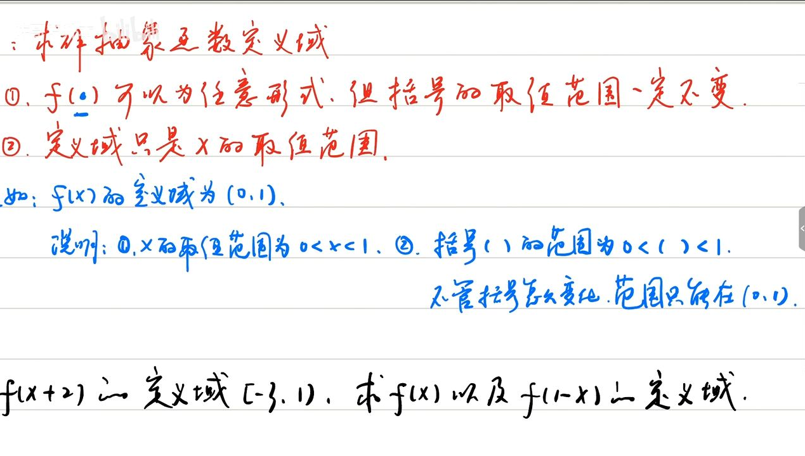

### [第一题](https://www.bilibili.com/video/BV1husGzwEtZ?t=253&p=2)

$$
若f(x+2)的定义域为[-3, 1]，求f(x)以及f(1-x)的定义域
$$

答案: f(1-x)的定义域为 (-2, 2]

---

### [第二题](https://www.bilibili.com/video/BV1husGzwEtZ?t=769&p=2)

$$
若f(x)的定义域为[0, 1]，求f(\ln x)的定义域
$$

$$
定义: \ln x\quad(x > 0)\ln x \text{ 就是 } \log_e x
$$
答案: f(lnx)的定义域为 [1, e]

---

### [第三题](https://www.bilibili.com/video/BV1husGzwEtZ?t=1234&p=2)

$$
已知f(2x-1)的定义域为[0, 1)，求f(1-3x)的定义域
$$

$$
-2 \leq -3x < 0 对于这个的步骤，老师直接乘以-\frac{1}{3}了
$$

$$
=> 2 \geq 3x > 0 \\
=> 0 < 3x \leq 2 \\
=> \frac{0}{3} < x \leq \frac{2}{3}
$$

答案：f(1-3x)的定义域为 (0, 2/3]

---

### [第四题](https://www.bilibili.com/video/BV1husGzwEtZ?t=1519&p=2)

$$
已知f(x-1)的定义域为[0, 1)，求f(2x-1) + f(x-1)的定义域
$$

答案: [0, 1/2]

---

## 番外 对数基础

$$
在遇到对数题目时，取对数，可以两边同时进行log \\
\log_a a = 1 \\
\log_a a^x = x \\
\log_x 1 = 0 \\
\\
例题 \\
\sqrt{1-2^x} \\
1-2^x \geq 0 \\
\Rightarrow 2^x \leq 1 \\
\Rightarrow \log_2 2^x \leq \log_2 1 \\
\Rightarrow x \leq 0
$$


$$
取指数 \\
a^{\log_a x} = x \\
\\例题 \\
\log_2 (x-1) \geq 0 \\ 
=> 2^{\log_2 (x-1)} \geq 2^0 \\
=> x-1 \geq 1
$$

## 1.4 判断是否为同一函数

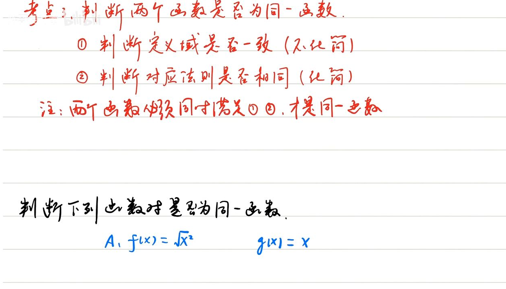
### [第一题](https://www.bilibili.com/video/BV1husGzwEtZ?t=167&p=4)
$$
\begin{array}{l|c|c}
& f(x)=\sqrt{x^2} & g(x)=x \\
\hline
\text{定义域:} & x\in\mathbb{R} & x\in\mathbb{R} \\
\hline
\text{对应法则:} & f(x)=|x| & g(x)=x
\end{array}
$$
答案：不是

### [第二题](https://www.bilibili.com/video/BV1husGzwEtZ?t=319&p=4)
$$
\begin{array}{l|c|c}
& f(x)=\ln(x^2) & g(x)=2\ln|x| \\
\hline
\text{定义域:} & x\neq 0 & x\neq 0 \\
\hline
\text{对应法则:} & f(x)=2\ln|x| & g(x)=2\ln|x|
\end{array}
$$
答案：是

### [第三题](https://www.bilibili.com/video/BV1husGzwEtZ?t=589&p=4)
$$
\begin{array}{l|c|c}
& f(x)=(\sqrt{x})^2 & g(x)=x \\
\hline
\text{定义域:} & x\ge 0 & x\in\mathbb{R} \\
\hline
\text{对应法则:} & f(x)=x\;(x\ge 0) & g(x)=x
\end{array}
$$
答案：不是

### [第四题](https://www.bilibili.com/video/BV1husGzwEtZ?t=730&p=4)
$$
\begin{array}{l|c|c}
& f(x)=e^{\ln x} & g(x)=x \\
\hline
\text{定义域:} & x>0 & x\in\mathbb{R} \\
\hline
\text{对应法则:} & f(x)=x\;(x>0) & g(x)=x
\end{array}
$$
答案：不是

### [第五题](https://www.bilibili.com/video/BV1husGzwEtZ?t=844&p=4)
$$
\begin{array}{l|c|c}
& f(x)=\dfrac{x^2-1}{x-1} & g(x)=x+1 \\
\hline
\text{定义域:} & x\neq 1 & x\in\mathbb{R} \\
\hline
\text{对应法则:} & f(x)=x+1\;(x\neq 1) & g(x)=x+1
\end{array}
$$
答案：不是

### [第六题](https://www.bilibili.com/video/BV1husGzwEtZ?t=953&p=4)
$$
\begin{array}{l|c|c}
& f(x)=\sqrt{1-\cos^2 x} & g(x)=\sin x \\
\hline
\text{定义域:} & x\in\mathbb{R} & x\in\mathbb{R} \\
\hline
\text{对应法则:} & f(x)=|\sin x| & g(x)=\sin x
\end{array}
$$
注：由 
$$
\cos^2 x+\sin^2 x=1得 \\ \sqrt{1-\cos^2 x}=\sqrt{\sin^2 x}=|\sin x|
$$


答案：不是

### [第七题](https://www.bilibili.com/video/BV1husGzwEtZ?t=1193&p=4)
$$
\begin{array}{l|c|c}
& f(x)=1 & g(x)=\sin^2 x+\cos^2 x \\
\hline
\text{定义域:} & x\in\mathbb{R} & x\in\mathbb{R} \\
\hline
\text{对应法则:} & f(x)=1 & g(x)=1
\end{array}
$$
答案：是


## 1.5 函数表达式求解

// todo 重看

核心: 在等式右边找到f(x)中的x

方法: 

- 配凑法， 在等式的两边配出相同的形式。

- 换元法。

### [第一题](https://www.bilibili.com/video/BV1husGzwEtZ?t=719&p=5)
$$
\begin{array}{l|l}
\text{已知} & f(e^x) = x + 1 \\
\hline
\text{求} & f(x) \\
\hline
\text{解（配凑法）} & f(e^x) = \ln e^x + 1 \\
\hline
\text{令} & e^x = t \\
\hline
\text{得} & f(t) = \ln t + 1 \\
\hline
\text{所以} & f(x) = \ln x + 1 \\
\hline
\text{解（换元法）} & \text{令 } e^x = t \\
\hline
& \text{取对数：} x = \ln t \\
\hline
\text{代入得} & f(t) = \ln t + 1 \\
\hline
\text{所以} & f(x) = \ln x + 1
\end{array}
$$

---

### [第二题](https://www.bilibili.com/video/BV1husGzwEtZ?t=1509&p=5)
$$
\begin{array}{l|l}
\text{已知} & f(\cos^2 x) = \tan^2 x \\
\hline
\text{求} & f(x) \\
\hline
\text{解} & f(\cos^2 x) = \dfrac{\sin^2 x}{\cos^2 x} = \dfrac{1 - \cos^2 x}{\cos^2 x} \\
\hline
\text{令} & \cos^2 x = t \\
\hline
\text{得} & f(t) = \dfrac{1 - t}{t} \\
\hline
\text{所以} & f(x) = \dfrac{1 - x}{x}
\end{array}
$$

---

### [第三题](https://www.bilibili.com/video/BV1husGzwEtZ?t=1646&p=5)
$$
\begin{array}{l|l}
\text{已知} & f\left(x - \dfrac{1}{x}\right) = x^2 + \dfrac{1}{x^2} \\
\hline
\text{求} & f(x) \\
\hline
\text{解（完全平方公式）} & x^2 + \dfrac{1}{x^2} = \left(x^2 - 2\cdot x \cdot \dfrac{1}{x} + \dfrac{1}{x^2}\right) + 2 = \left(x - \dfrac{1}{x}\right)^2 + 2 \\
\hline
\text{令} & x - \dfrac{1}{x} = t \\
\hline
\text{得} & f(t) = t^2 + 2 \\
\hline
\text{所以} & f(x) = x^2 + 2
\end{array}
$$

---

### [第四题](https://www.bilibili.com/video/BV1husGzwEtZ?t=1982&p=5)
$$
\begin{array}{l|l}
\text{已知} & f\left(x + \dfrac{1}{x}\right) = x^2 + \dfrac{1}{x^2} \\
\hline
\text{求} & f(x) \\
\hline
\text{解（完全平方公式）} & x^2 + \dfrac{1}{x^2} = \left(x^2 + 2\cdot x \cdot \dfrac{1}{x} + \dfrac{1}{x^2}\right) - 2 = \left(x + \dfrac{1}{x}\right)^2 - 2 \\
\hline
\text{令} & x + \dfrac{1}{x} = t \\
\hline
\text{得} & f(t) = t^2 - 2 \\
\hline
\text{所以} & f(x) = x^2 - 2
\end{array}
$$


## [扩展: 取对数和指数](https://www.bilibili.com/video/BV1husGzwEtZ?t=46.5&p=5)

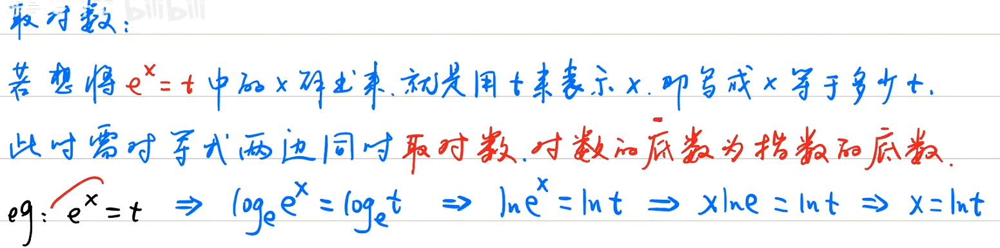

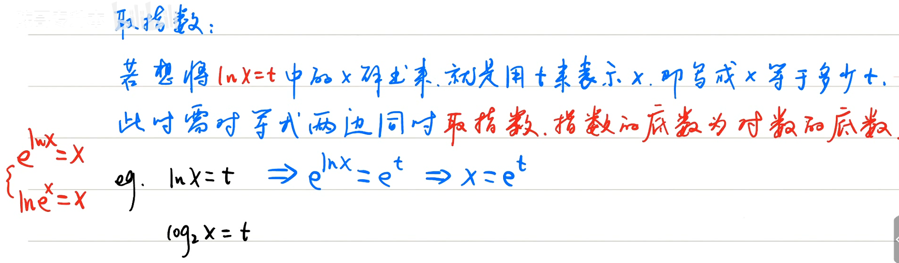

## 对数的相关运算

$$
\begin{array}{l|c|c}
\text{序号} & \text{公式} & \text{说明} \\
\hline
\text{公式1} & \log_e x = \ln x & \\
\text{公式2} & \log_{10} x = \lg x & \\
\text{公式3} & \ln a + \ln b = \ln(ab) & \\
\text{公式4} & \ln a - \ln b = \ln\left(\dfrac{a}{b}\right) & \\
\text{公式5} & \ln(a^b) = b \ln a & \\
\text{公式6} & e^{\ln a} = a & \\
\text{公式7} & \log_a a = 1 & \text{底数和真数相同时，值为1} \\
\text{公式8} & \log_a 1 = 0 & \text{真数为1时，对数值为0} \\
\end{array}
$$
## 三角函数公式

$$
\begin{array}{l|c|c}
\text{序号} & \text{公式} & \text{说明} \\
\hline
\text{公式1} & \sin^2 x + \cos^2 x = 1 & \text{同角平方关系} \\
\hline
\text{公式2} & \tan x = \dfrac{\sin x}{\cos x} & \text{正切定义} \\
\hline
\text{公式3} & 1 + \tan^2 x = \sec^2 x & \text{由公式1导出} \\
\hline
\text{公式4} & 1 + \cot^2 x = \csc^2 x & \text{余切关系} \\
\hline
\text{公式5} & \sin(2x) = 2\sin x \cos x & \text{正弦倍角} \\
\hline
\text{公式6} & \cos(2x) = \cos^2 x - \sin^2 x & \text{余弦倍角} \\
\hline
\text{公式7} & \cos(2x) = 2\cos^2 x - 1 = 1 - 2\sin^2 x & \text{余弦倍角变形} \\
\hline
\text{公式8} & \tan(2x) = \dfrac{2\tan x}{1 - \tan^2 x} & \text{正切倍角} \\
\hline
\text{公式9} & \sin(x \pm y) = \sin x \cos y \pm \cos x \sin y & \text{正弦和差} \\
\hline
\text{公式10} & \cos(x \pm y) = \cos x \cos y \mp \sin x \sin y & \text{余弦和差} \\
\hline
\text{公式11} & \tan(x \pm y) = \dfrac{\tan x \pm \tan y}{1 \mp \tan x \tan y} & \text{正切和差} \\
\hline
\text{公式12} & \sin^2 x = \dfrac{1 - \cos(2x)}{2} & \text{降幂公式} \\
\hline
\text{公式13} & \cos^2 x = \dfrac{1 + \cos(2x)}{2} & \text{降幂公式} \\
\end{array}
$$

## 完全平方公式

$$
\begin{array}{l|c|c}
\text{序号} & \text{公式} & \text{说明} \\
\hline
\text{公式1} & (a + b)^2 = a^2 + 2ab + b^2 & \text{两数和的平方} \\
\hline
\text{公式2} & (a - b)^2 = a^2 - 2ab + b^2 & \text{两数差的平方} \\
\end{array}
$$

## 1.6 函数的表达形式

### 显函数

> 显函数: 等式左边只有y 等式右边是关于x的形式

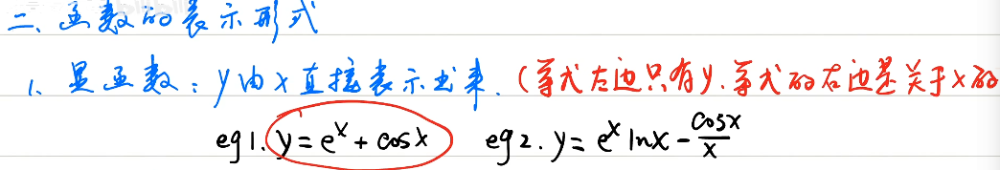

### [隐函数](https://www.bilibili.com/video/BV1husGzwEtZ?t=206&p=6)

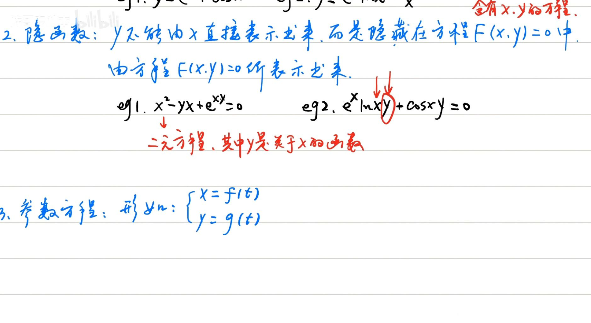

---

### [隐函数的显化](https://www.bilibili.com/video/BV1husGzwEtZ?t=480&p=6)
> 将隐函数化为显函数。

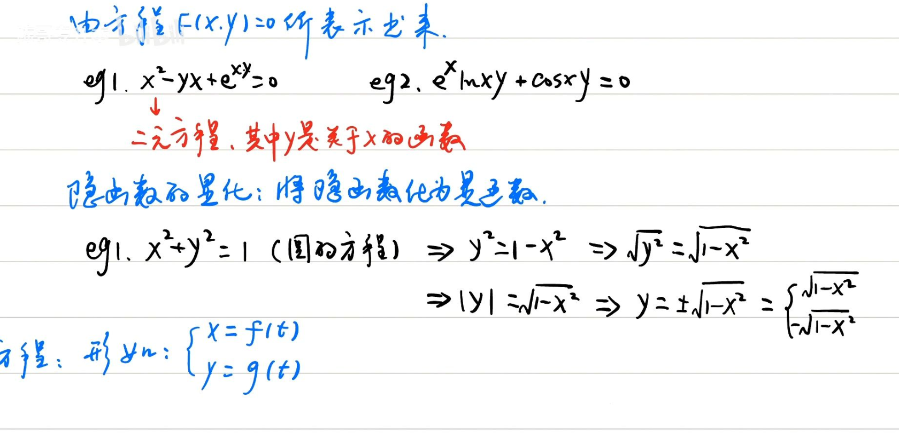

---

### [参数方程](https://www.bilibili.com/video/BV1husGzwEtZ?t=752&p=6)

> x和y没有直接联系，x和y通过中间变量t联系起来。

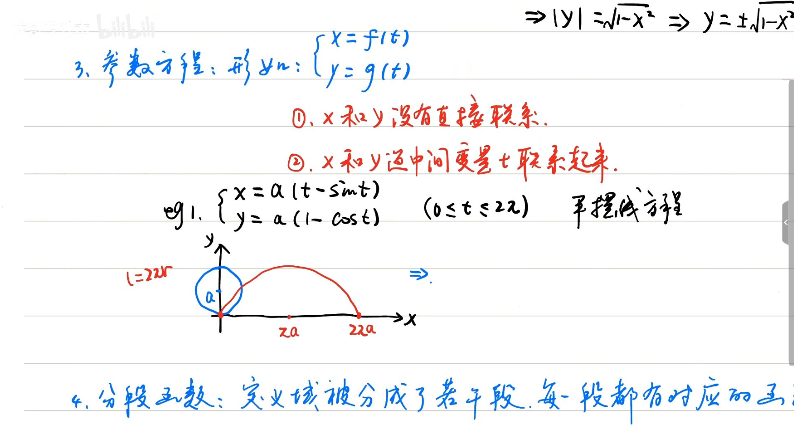

### [分段函数](https://www.bilibili.com/video/BV1husGzwEtZ?t=1357&p=6)
---

### [取整函数](https://www.bilibili.com/video/BV1husGzwEtZ?t=1599&p=6)
$$
f(x) = [x]
$$
表示不超过x的最大整数。

eg1. 
$$
[1.9] = 1,\quad [2.1] = 2,\quad [-0.5] = -1
$$

不等式关系:
$$
x-1 < [x] \leq x
$$

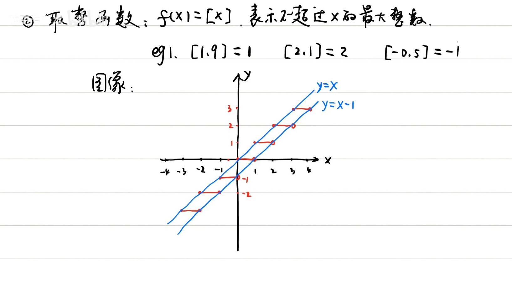

---

### [符号函数](https://www.bilibili.com/video/BV1husGzwEtZ?t=2122&p=6)

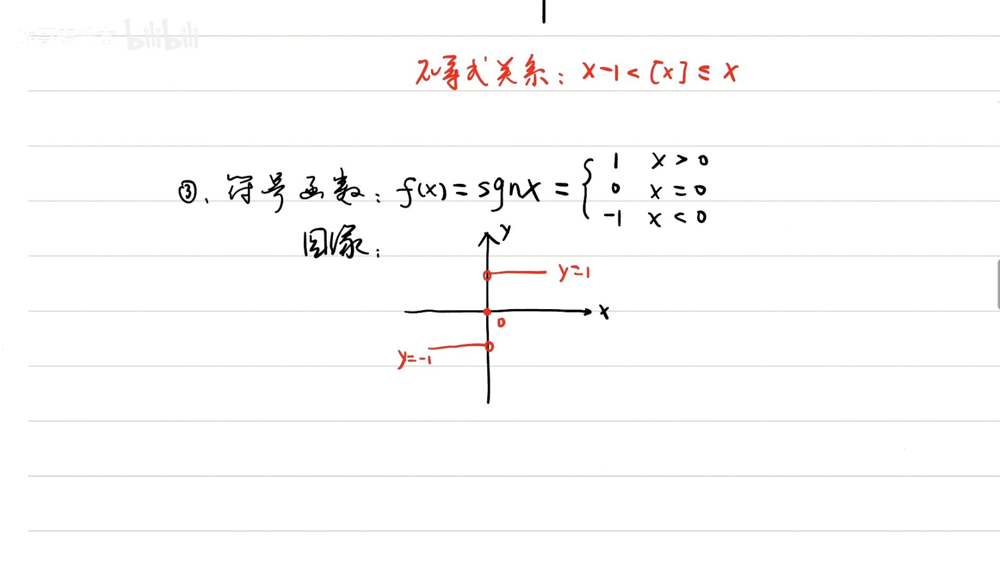


## 1.7 函数的单调性和有界性

### [单调性](https://www.bilibili.com/video/BV1husGzwEtZ?t=90&p=7)

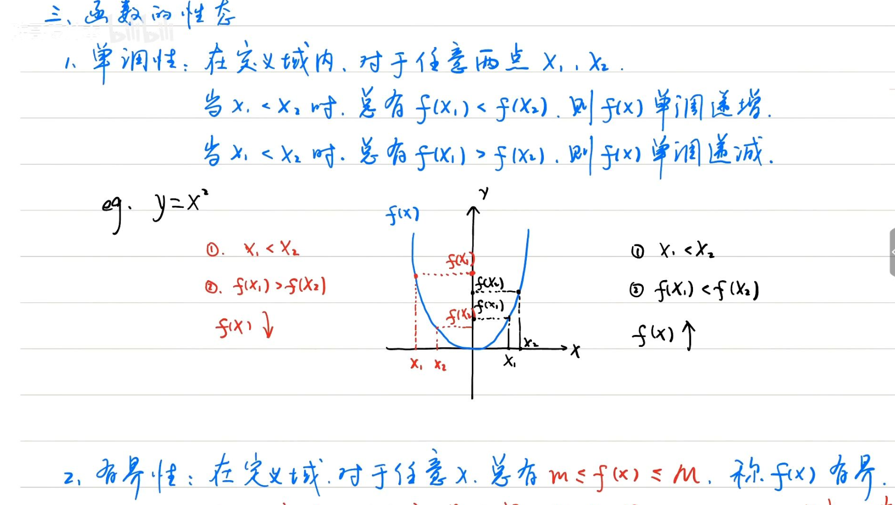

---

### [有界性](https://www.bilibili.com/video/BV1husGzwEtZ?t=429&p=7)
注: 取的是函数结果，而不是变量范围。

实际上有界就是指的是最小值和最大值为两个确定的常数，如果最小值或最大值有一个不存在，则称f(x)无界。

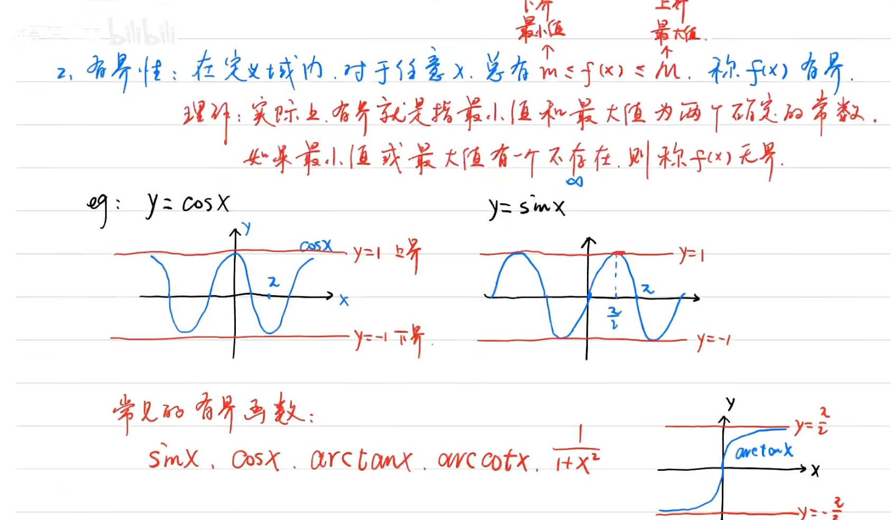

常见的有界函数(必记):
$$
\sin x,\ \cos x,\ \arctan x,\ \operatorname{arccot} x,\ \frac{1}{1+x^2}
$$

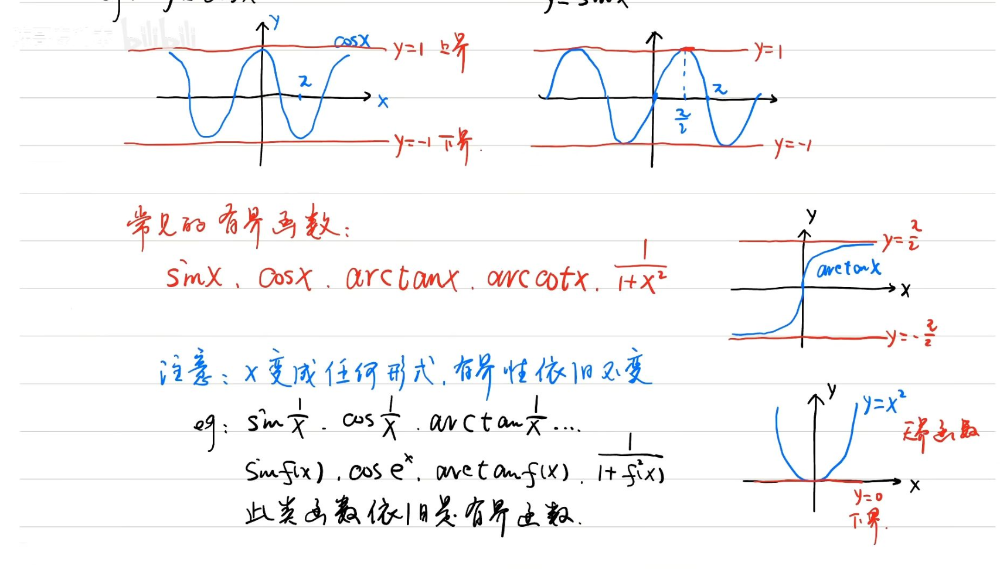

## 1.8 函数的奇偶性

### [奇偶性](https://www.bilibili.com/video/BV1husGzwEtZ?t=43&p=8)

前提条件: f(x)定义域关于原点对称，例如x∈[-1,1]。

$$
f(-x) = f(x) \quad \text{偶函数}
$$
$$
f(-x) = -f(x) \quad \text{奇函数}
$$

常见的偶函数:
$$
\cos x,\ |x|,\ x^{2n},\ \text{常数函数}\ y=a
$$

常见的奇函数:
$$
\sin x,\ \tan x,\ x^{2n-1},\ \ln(x + \sqrt{x^2 \pm a}),\ \arctan x,\ \arcsin x
$$

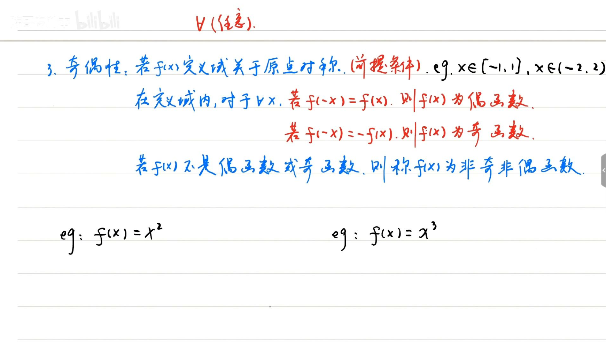

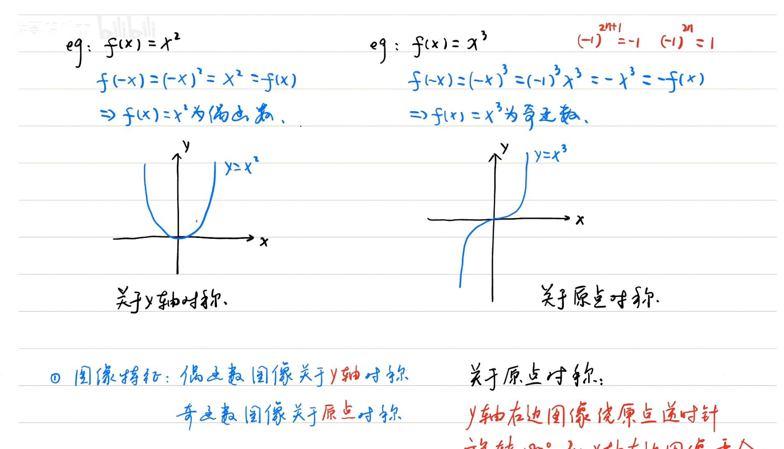

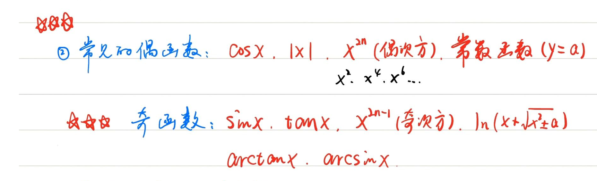

---

### [奇偶函数的四则运算](https://www.bilibili.com/video/BV1husGzwEtZ?t=702&p=8)

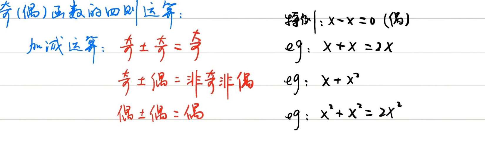

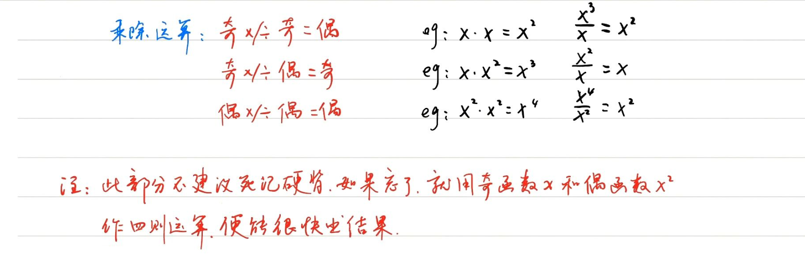

---

### [第一题](https://www.bilibili.com/video/BV1husGzwEtZ?t=1029&p=8)
$$
y = \tan x \cdot \cos x
$$
答案: 奇函数

---

### [第二题](https://www.bilibili.com/video/BV1husGzwEtZ?t=1069&p=8)
$$
y = x^{2} \arctan x
$$
答案: 奇函数

---

### [第三题](https://www.bilibili.com/video/BV1husGzwEtZ?t=1085&p=8)
$$
y = x \sin x
$$
答案: 偶函数

### [第四题](https://www.bilibili.com/video/BV1husGzwEtZ?t=1121&p=8)
$$
y = \frac{|x|}{1 + x^{2}}
$$
答案: 偶函数

## [1.8 复合函数的奇偶性判断](https://www.bilibili.com/video/BV1husGzwEtZ?t=1228&p=8)
---
如y=f(x)将x替换为g(x)即新函数，y=f(g(x))则叫复合函数/高等函数，一个函数要调用两次才能得到结果。

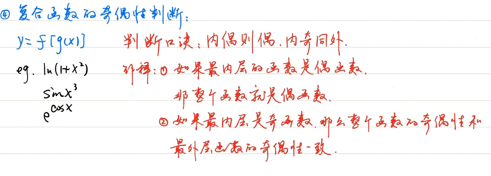

### [习题](https://www.bilibili.com/video/BV1husGzwEtZ?t=1594&p=8)

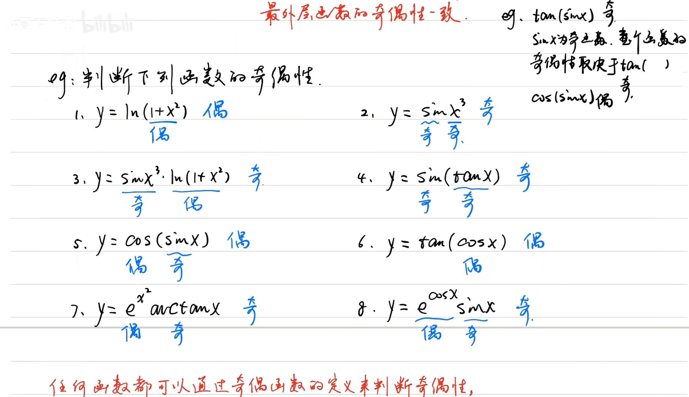

---

## [1.8 总结](https://www.bilibili.com/video/BV1husGzwEtZ?t=1940&p=8)

---

### [总结题一](https://www.bilibili.com/video/BV1husGzwEtZ?t=2025&p=8)

$$
f(x) = e^{x} - e^{-x}
$$
答案: 使用定义判断，奇函数  

---
### [*总结题二](https://www.bilibili.com/video/BV1husGzwEtZ?t=2161&p=8)

> 重要题目

$$
f(x) = \ln(x + \sqrt{x^{2}+1})
$$
答案: 奇函数

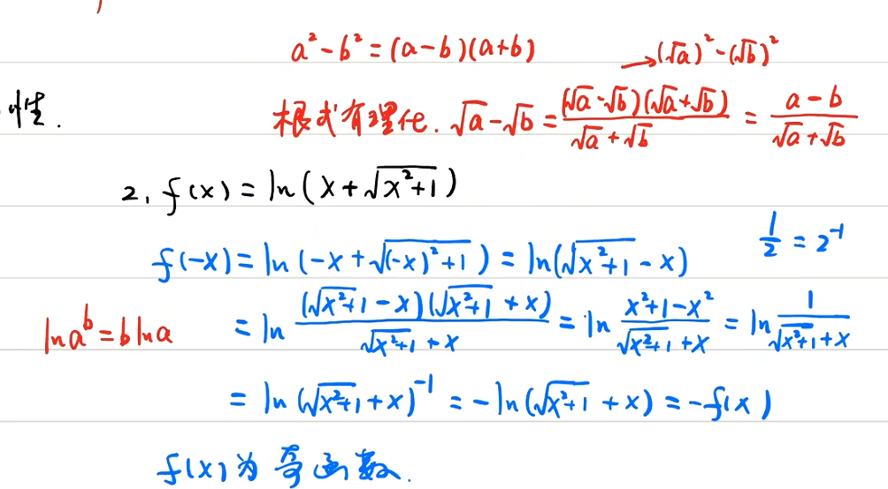

---

### [根式有理化](https://www.bilibili.com/video/BV1husGzwEtZ?t=2256&p=8)

---

### [总结题三](https://www.bilibili.com/video/BV1husGzwEtZ?t=2576&p=8)

> 重要题目

$$
f(x) = \ln \left| \frac{1-x}{1+x} \right|
$$
我想得是，既然f(x)变为f(-x)将分式内颠倒了，那我乘以一个-1不就又让他们颠回去了。
答案: 奇函数

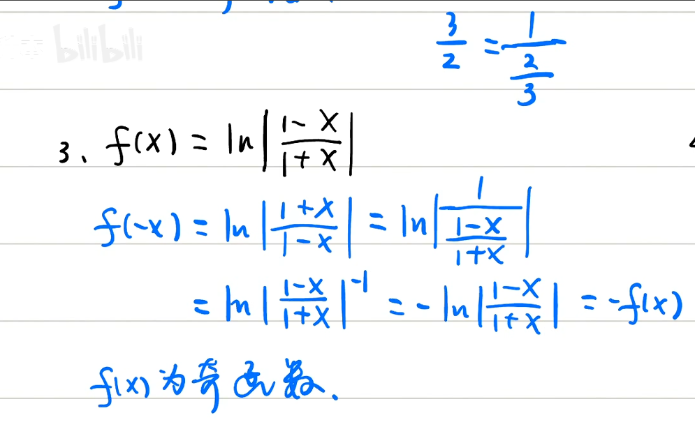

---

### [分数颠倒算法](https://www.bilibili.com/video/BV1husGzwEtZ?t=2611&p=8)

---

### [总结题四](https://www.bilibili.com/video/BV1husGzwEtZ?t=2860&p=8)

$$
f(x) = \frac{e^{x}-1}{e^{x}+1}
$$
答案: 奇函数

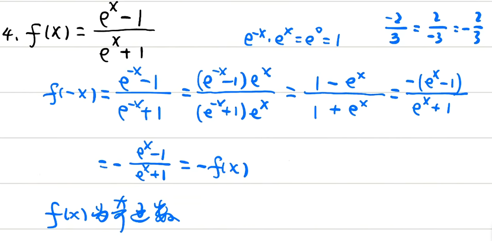

---

### [总结题五](https://www.bilibili.com/video/BV1husGzwEtZ?t=3073&p=8)

$$
g(x) = f(x) + f(-x)
$$
答案: 偶函数

---

### [总结题六](https://www.bilibili.com/video/BV1husGzwEtZ?t=3105&p=8)

$$
g(x) = f(x) - f(-x)
$$
答案: 奇函数

---

### [复盘](https://www.bilibili.com/video/BV1husGzwEtZ?t=3176&p=8)
---


## 1.9 基本初等函数

> 函数的分类

基本初等函数: 幂函数、指数函数、对数函数、三角函数、反三角函数。

### [幂函数](https://www.bilibili.com/video/BV1husGzwEtZ?t=87&p=9)

$$
形式: y = x^a
$$

$$
例: y = \frac{1}{x},\quad y = x,\quad y = \sqrt{x},\quad y = x^2,\quad y = x^3 (重点掌握)
$$

---

### [指数函数](https://www.bilibili.com/video/BV1husGzwEtZ?t=649&p=9)

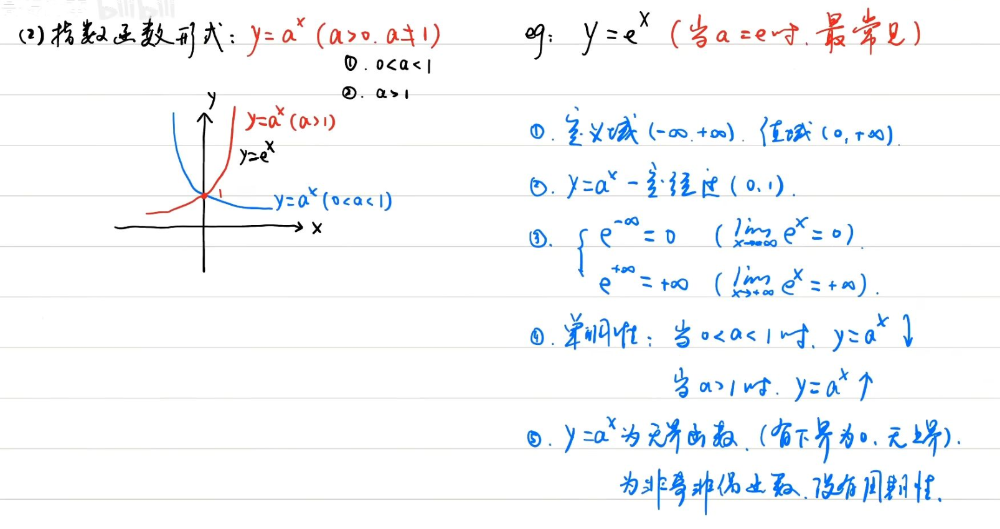

---

### [对数函数](https://www.bilibili.com/video/BV1husGzwEtZ?t=1147&p=9)

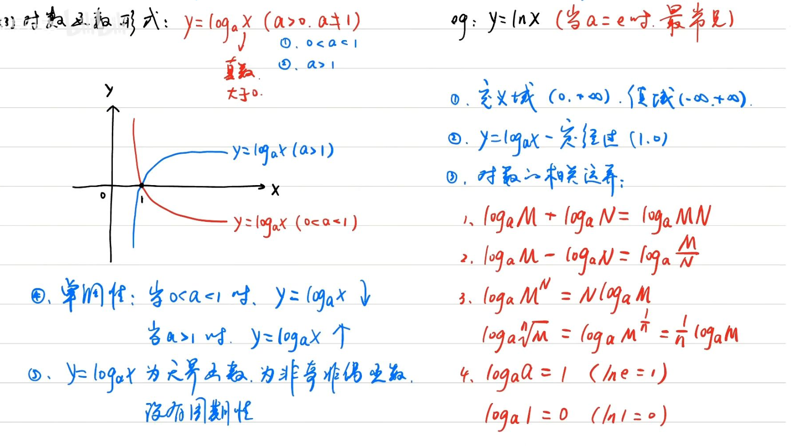

---

### [三角函数](https://www.bilibili.com/video/BV1husGzwEtZ?t=1708&p=9)

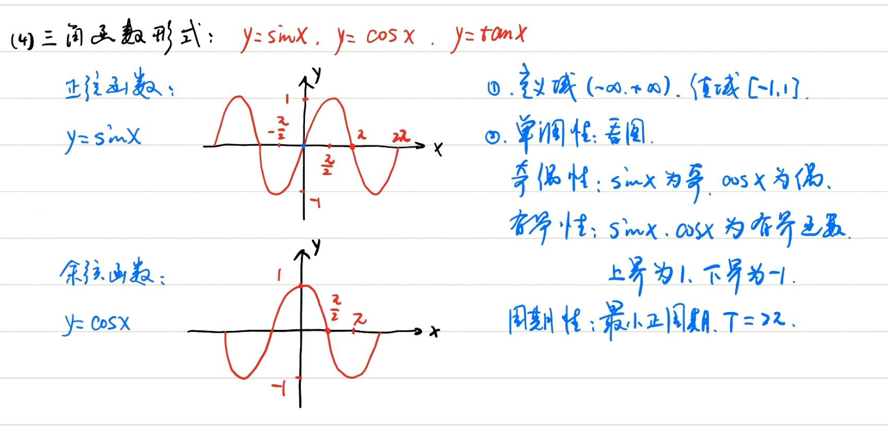

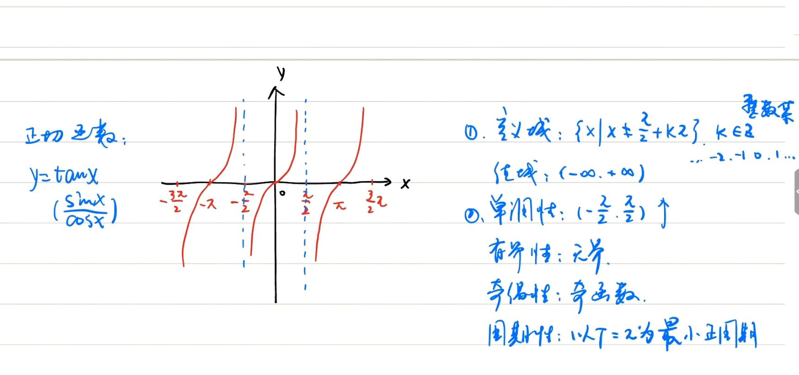

---

### [*特殊三角函数值](https://www.bilibili.com/video/BV1husGzwEtZ?t=2526&p=9)

$$
\begin{array}{|c|c|c|c|c|}
\hline
\text{角度} & \text{弧度} & \sin & \cos & \tan \\
\hline
0^\circ & 0 & 0 & 1 & 0 \\
\hline
30^\circ & \frac{\pi}{6} & \frac{1}{2} & \frac{\sqrt{3}}{2} & \frac{\sqrt{3}}{3} \\
\hline
45^\circ & \frac{\pi}{4} & \frac{\sqrt{2}}{2} & \frac{\sqrt{2}}{2} & 1 \\
\hline
60^\circ & \frac{\pi}{3} & \frac{\sqrt{3}}{2} & \frac{1}{2} & \sqrt{3} \\
\hline
90^\circ & \frac{\pi}{2} & 1 & 0 & \text{不存在} \\
\hline
\end{array}
$$

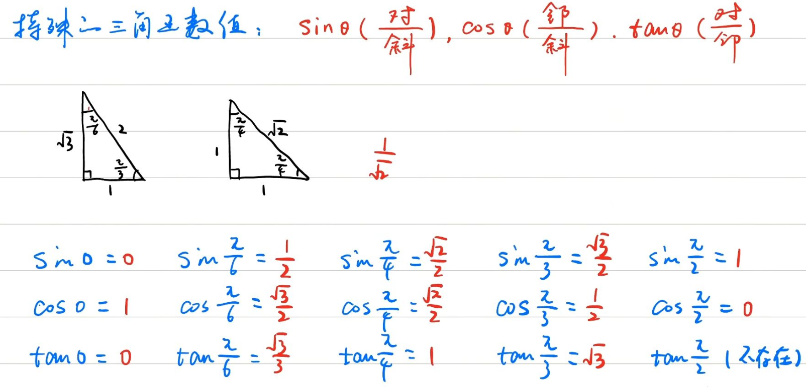

---

### [其他三角函数](https://www.bilibili.com/video/BV1husGzwEtZ?t=2857&p=9)

> 图像不强制要求掌握

$$
正割函数:y = \frac{1}{\cos x} = \sec x \\
余割函数:y = \frac{1}{\sin x} = \csc x \\
余切函数:y = \frac{1}{\tan x} = \frac{1}{\sin x / \cos x} = \frac{\cos x}{\sin x} = \cot x
$$

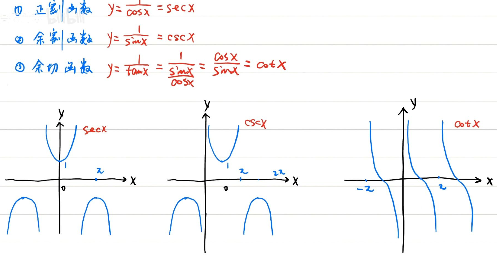

---

### [*三角函数相关公式](https://www.bilibili.com/video/BV1husGzwEtZ?t=2993&p=9)

$$
\sin^2 x + \cos^2 x = 1
$$

$$
\tan^2 x + 1 = \sec^2 x
$$

$$
\cot^2 x + 1 = \csc^2 x
$$

倍角公式

$$
\sin 2x = 2\sin x \cos x
$$

$$
\cos 2x = \cos^2 x - \sin^2 x = 2\cos^2 x - 1 = 1 - 2\sin^2 x
$$

降幂公式

> 由 2cos^2 x - 1推导到 cos 2x

$$
\cos^2 x = \frac{\cos 2x + 1}{2}
$$

过程：

$$
\cos 2x = 2\cos^2 x - 1 \quad \Rightarrow \quad \cos 2x + 1 = 2\cos^2 x \quad \Rightarrow \quad \cos^2 x = \frac{\cos 2x + 1}{2}
$$

> 由 cos 2x 推导到 1 - 2sin^2 x

$$
\sin^2 x = \frac{1 - \cos 2x}{2}
$$

过程：

$$
\cos 2x = 1 - 2\sin^2 x \quad \Rightarrow \quad 2\sin^2 x = 1 - \cos 2x \quad \Rightarrow \quad \sin^2 x = \frac{1 - \cos 2x}{2}
$$

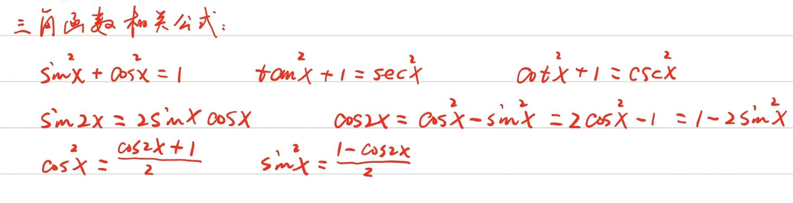

---

### [*反正切函数](https://www.bilibili.com/video/BV1husGzwEtZ?t=3310&p=9)

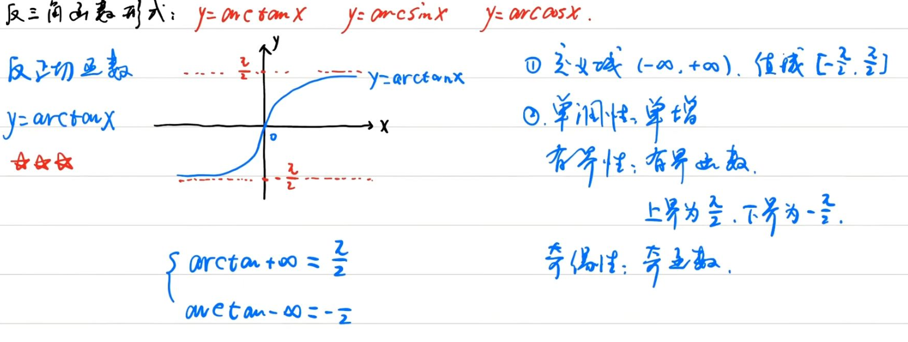

---

### [反正弦函数](https://www.bilibili.com/video/BV1husGzwEtZ?t=3617&p=9)

$$
\arcsin x
$$

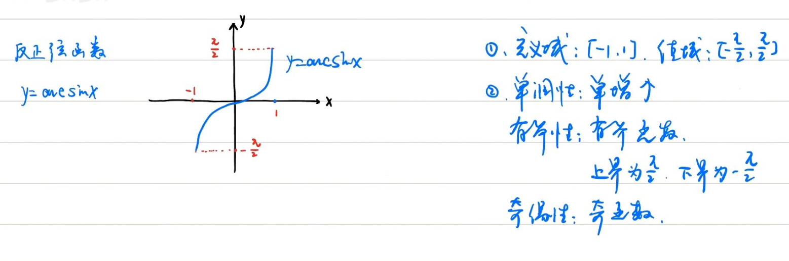

---

### [反余弦函数](https://www.bilibili.com/video/BV1husGzwEtZ?t=3753&p=9)

$$
\arccos x
$$

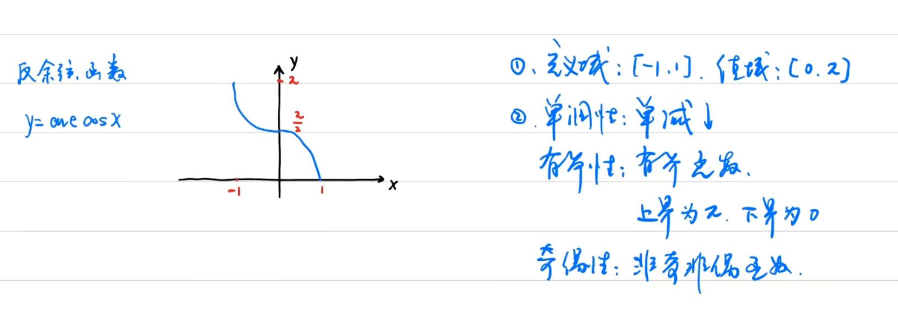

---

### [常数函数](https://www.bilibili.com/video/BV1husGzwEtZ?t=3854&p=9)

> 要清楚 y 轴和 x 轴对应的函数表达式

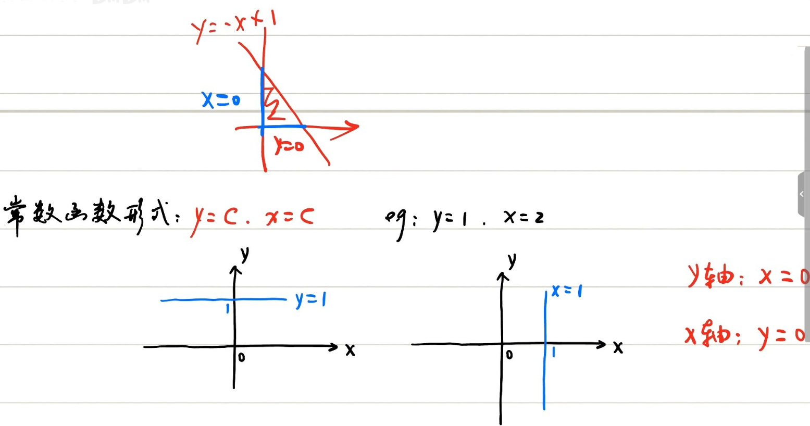

---

### [复盘](https://www.bilibili.com/video/BV1husGzwEtZ?t=3981&p=9)

---


## 1.10 复合函数

> 即: 将f(x)中的x换成另一个函数

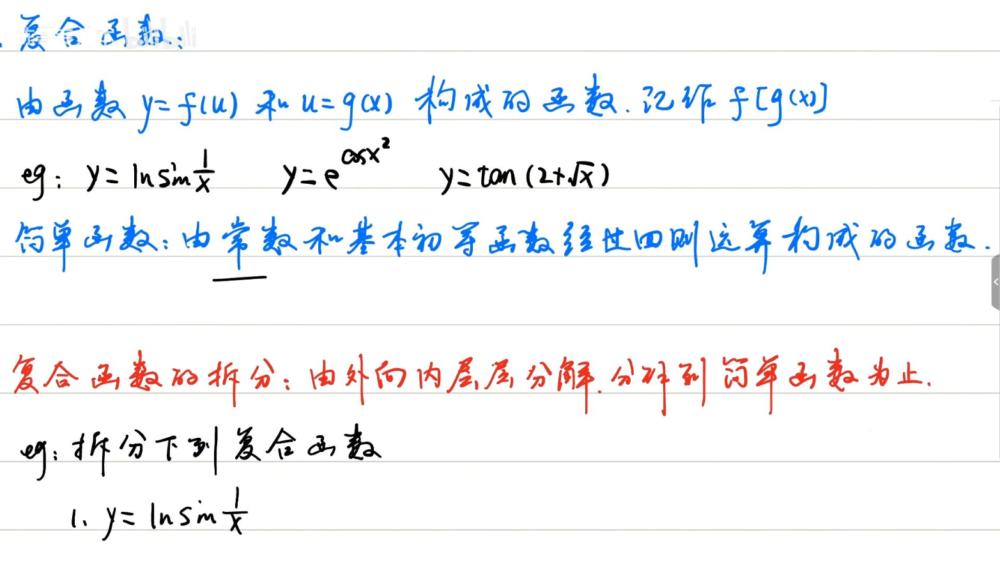

### [复合函数的拆分](https://www.bilibili.com/video/BV1husGzwEtZ?t=253&p=10)

由外向内层层分解，分解到简单函数 / 基本初等函数 为止，

注：每一层的函数都要对于基本初等函数。

$$
y = \ln \sin \frac{1}{x}
$$

拆分：

$$
y = \ln u, \quad u = \sin v, \quad v = \frac{1}{x}
$$

$$
y = \arctan^2 (\ln \cos \sqrt{x})
$$

拆分：

$$
y = u^2, \quad u = \arctan v, \quad v = \ln n, \quad n = \cos m, \quad m = \sqrt{x}
$$

---

### [复合函数复盘](https://www.bilibili.com/video/BV1husGzwEtZ?t=925&p=10)

（内容同上回顾，无新增例题）

---

### [初等函数](https://www.bilibili.com/video/BV1husGzwEtZ?t=1084&p=10)

> 由基本初等函数经过有限次的复合或四则运算所构成的函数

> 基本初等函数：反、对、幂、指、三

例1：

$$
y = 8x^2 + 3x + 1 \\
y = \ln(1 + x^2) + \sin \sqrt{x} \\
y = \arctan e^{x}
$$

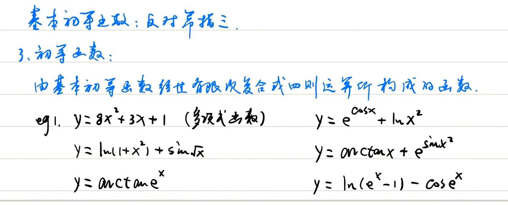

---


## 1.11 反函数

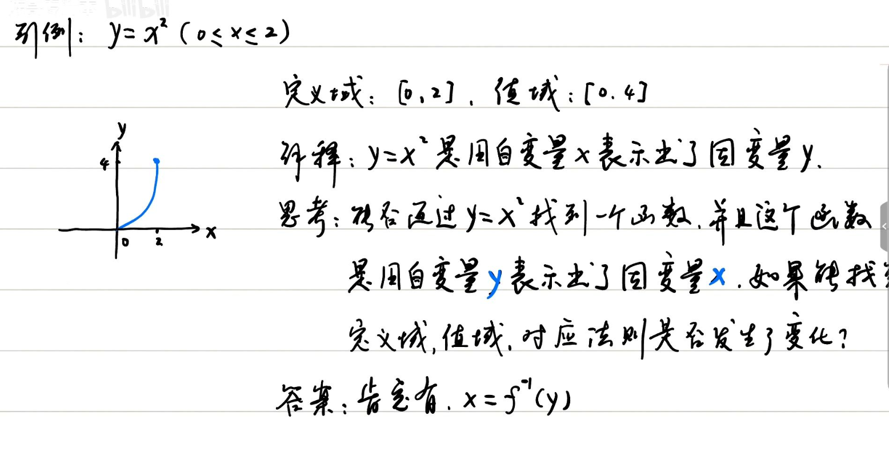

### [反函数的定义](https://www.bilibili.com/video/BV1husGzwEtZ?t=318&p=11)

> 反函数的定义域就是原函数的值域，反函数的值域就是原函数的定义域。图像关于直线 y=x 对称。

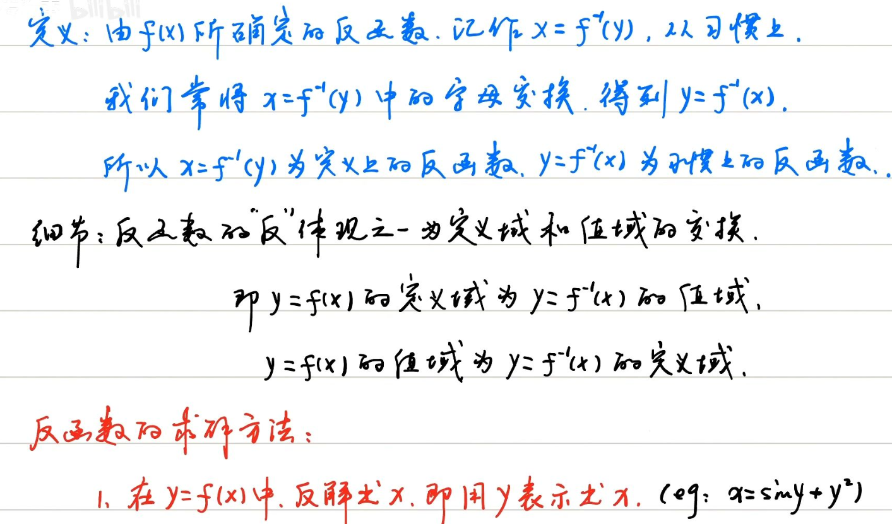

---

### [推导题](https://www.bilibili.com/video/BV1husGzwEtZ?t=476&p=11)

$$
y = x^2 \quad (0 \leq x \leq 2)
$$

推导过程：

$$
\sqrt{y} = \sqrt{x^2} \\
\sqrt{y} = x \\
x = \sqrt{y}
$$

反函数对应的法则就是开平方根。

习惯上的反函数：

$$
y = \sqrt{x}
$$

定义域与值域对应关系：

$$
0 \leq y \leq 2 \\
0 \leq x \leq 4
$$

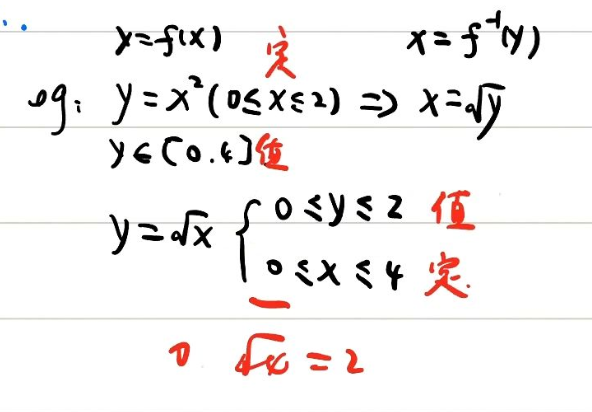

---

### [反函数的具体求法](https://www.bilibili.com/video/BV1husGzwEtZ?t=709&p=11)

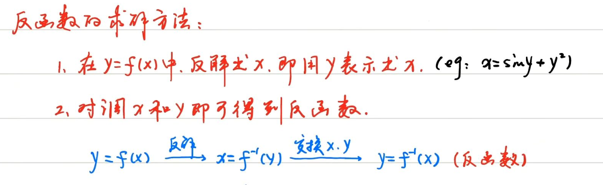

---

### [例求反函数](https://www.bilibili.com/video/BV1husGzwEtZ?t=831&p=11)

$$
求 y = e^{x} 的反函数。
$$

$$
解：\\
\ln y = \ln e^{x} \\
\ln y = x \ln e \\
\ln y = x
$$

$$
反函数为：\\
y = \ln x \\
y = e^{x} \text{ 和 } y = \ln x \text{ 互为反函数}
$$

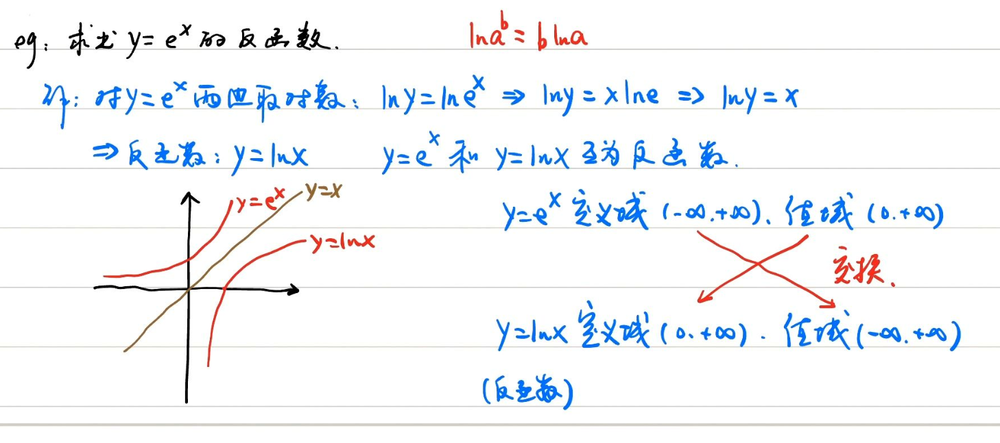

---

### [反函数的特点](https://www.bilibili.com/video/BV1husGzwEtZ?t=1268&p=11)

> 原函数和反函数的单调性是一致的。单调函数必定有反函数，如果不是单调函数，可以取单调部分求反函数。

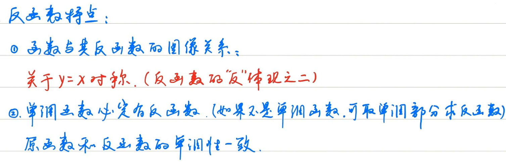

---

### [三角函数和反三角函数的图像](https://www.bilibili.com/video/BV1husGzwEtZ?t=1421&p=11)

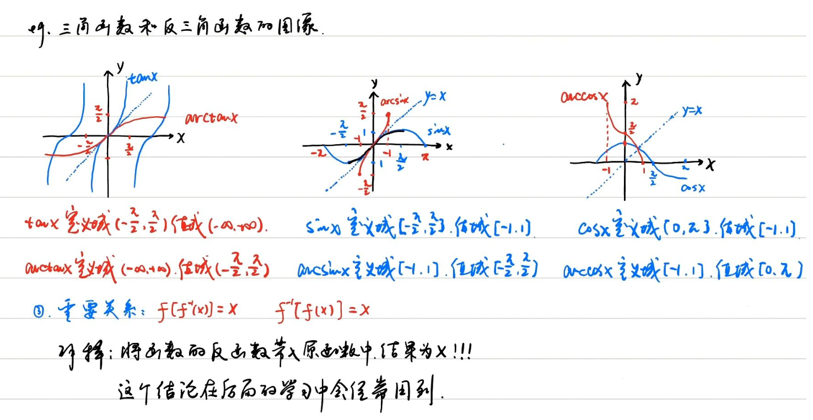

---

### [重要关系](https://www.bilibili.com/video/BV1husGzwEtZ?t=1940&p=11)

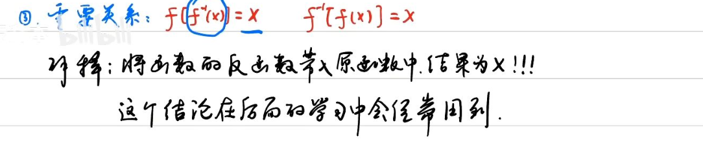

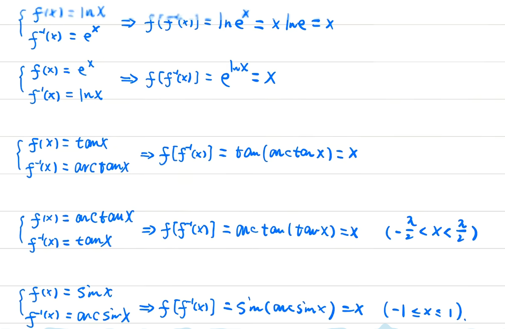

---

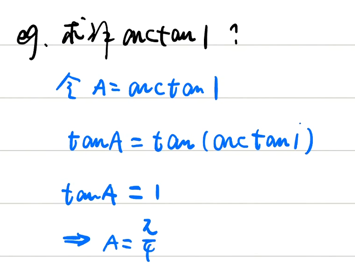

### [反函数重要关系作业](https://www.bilibili.com/video/BV1husGzwEtZ?t=2380&p=11)

考察公式：

$$
f(f^{-1}(x)) = x
$$


$$
① 求 \arcsin \frac{\sqrt{3}}{2} \\
解：令A = \arcsin \frac{\sqrt{3}}{2} \\
则\sin A = \sin \left( \arcsin \frac{\sqrt{3}}{2} \right) \\
\sin A = \frac{\sqrt{3}}{2} \\
所以 A = \frac{\pi}{3}
$$

---

$$
② 求 \arccos \frac{1}{2} \\
解：令 A = \arccos \frac{1}{2} \\
则 \cos A = \cos \left( \arccos \frac{1}{2} \right) \\
\cos A = \frac{1}{2} \\
所以 A = \frac{\pi}{3}
$$
---


## 1.12 反函数习题

### [至言](https://www.bilibili.com/video/BV1husGzwEtZ?t=2918.7&p=12)

> 坟绝: 原函数先乘后加，反函数就先减后除。详见第四题，但是这种只适用于一条线方程。

### [第一题](https://www.bilibili.com/video/BV1husGzwEtZ?t=150&p=12)

$$
\text{设函数 } f(x) = 1 + 3^{x} \text{ 的反函数为 } g(x) \text{，则 } g(10) = ( \quad )
$$

$$
\text{A. } -2 \quad \text{B. } -1 \quad \text{C. } 2 \quad \text{D. } 3
$$

解析：当 g(10) 说明 y = 10，则反求 x 为多少，即当 y = 10 时，x为多少。 
由1 + 3^x = 10 得 3^x = 9，x = 2。

答案：C

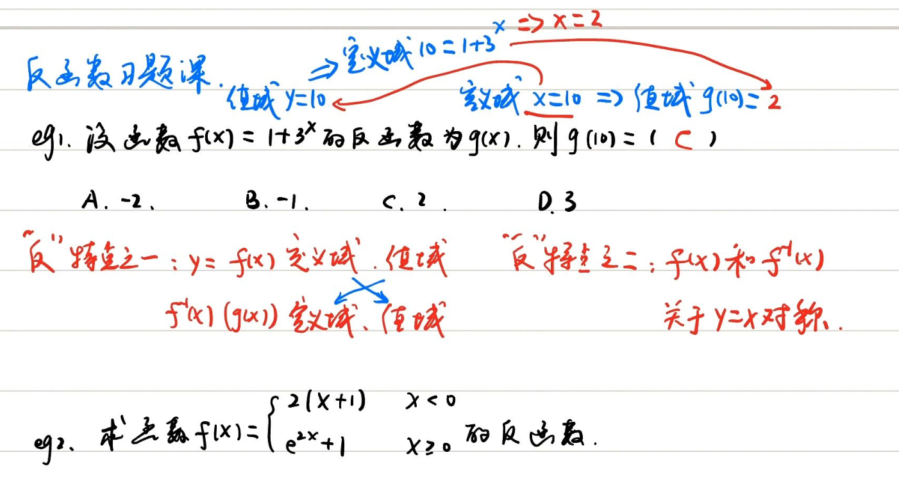

---

### [第二题](https://www.bilibili.com/video/BV1husGzwEtZ?t=385&p=12)

$$
\text{求函数 } f(x) \text{ 的反函数：}
$$

$$
f(x) = 
\begin{cases}
2(x+1), & x < 0 \\[6pt]
e^{2x} + 1, & x \geq 0
\end{cases}
$$

答案：

$$
1. y = \dfrac{x}{2} - 1,\quad x < 2 \\
2. y = \dfrac{1}{2} \ln(x-1),\quad x \geq 2
$$

---

### [第三题](https://www.bilibili.com/video/BV1husGzwEtZ?t=1018&p=12)

$$
\text{求函数 } y \text{ 的反函数：}
$$

$$
y = 
\begin{cases}
x^{2} + 1, & x \leq 0 \\[6pt]
-x + 1,   & x > 0
\end{cases}
$$

答案：

$$
1. y = -\sqrt{x-1},\quad x \geq 1 \\
2. y = -x + 1 或 y = x - 1,\quad x < 1
$$

---

### [第四题](https://www.bilibili.com/video/BV1husGzwEtZ?t=1400&p=12)

$$
核心公式：\arcsin(\sin x) = x，此公式对任意三角函数生效。  \\
核心需求：取单调区间  \\
运算：x \to +2 \to \text{取}\sin \to \text{乘以}\frac{1}{2} \to \text{减}1  \\
逆算：y \to +1 \to \text{除}\frac{1}{2} \to \text{取}\arcsin \to -2
$$

$$
\text{求 } y = \frac{1}{2} \sin(x+2) - 1 \text{ 的反函数。}
$$

答案：

$$
y = \arcsin(2x+2) - 2 ，定义域 [-\dfrac{3}{2}, -\dfrac{1}{2}]
$$

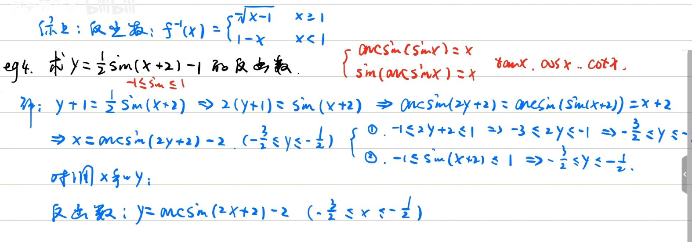


---

### [第五题](https://www.bilibili.com/video/BV1husGzwEtZ?t=2046&p=12)

> 这种函数一般不讨论定义域和值域

$$
\text{求 } y = \frac{2x-1}{x+1} \text{ 的反函数。}
$$

答案：  
$$
y = \frac{1+x}{2-x}\quad
$$

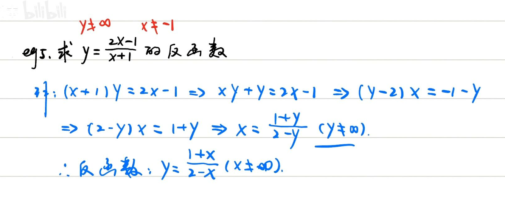

---

### [第六题](https://www.bilibili.com/video/BV1husGzwEtZ?t=2384&p=12)

> 点：e^lnx = x，联立方程，重要题目

$$
\text{求 } y = \ln\left(x + \sqrt{x^{2} - 1}\right) \text{ 的反函数。}
$$

答案：  
$$
y = \frac{e^{x} + e^{-x}}{2}
$$

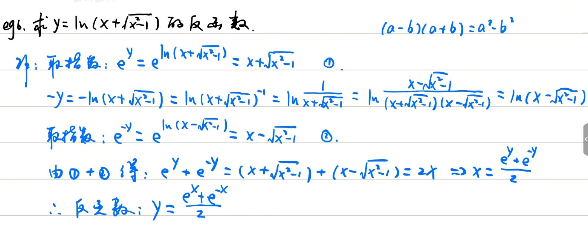

---

### [第七题](https://www.bilibili.com/video/BV1husGzwEtZ?t=2986&p=12)

> 重要题目，求根公式

$$
\text{求 } y = \frac{e^{x} - e^{-x}}{2} \text{ 的反函数。}
$$

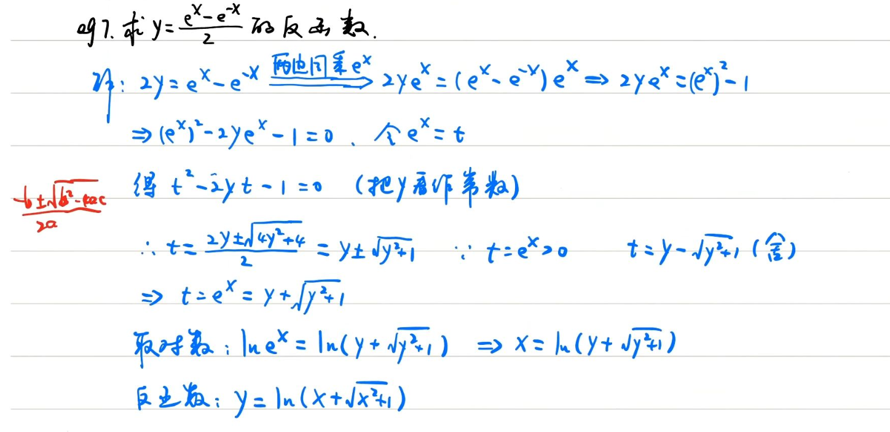

---


# bilibili笔记转

````markdown
1. 每个习题用 `### [短标题](链接)`，短标题：含“第X题”则用“第X题”；含“因式分解”用“因式分解”；含“对数和指数关系简单讲”用该短语。链接：`https://www.bilibili.com/video/BV1husGzwEtZ?t=秒数&p=P数`，秒数由 `MM:SS` 计算。习题后加 `---`。
2. 数学公式仅用块级 `$$ ... $$`，禁用行内。整个题目句子可放入一对 `$$` 中。**LaTeX 必须使用标准、兼容的命令**：
   - 不等号用 `\leq` 和 `\geq`（不用 `\leqq`、`\geqq`）。
   - 分数用 `\frac{分子}{分母}`，不要写成 `\frac{\text{Frac}{...}`。
   - 不要用 `\text` 包裹运算符或数字，除非是注释。
   - 普通文本与公式之间用自然换行或中文标点分隔，避免在公式内出现多余空格。
3. 特殊符号：`v` → `\sqrt{}`；`2x`（指数）→ `2^{x}`。
4. 答案中的区间（如 `[2, +∞)`）不用 `$$`，直接普通文本，使用 `∪`、`∞`。
5. 注释按原样保留，但不要放入 `$$` 内。
6. 最终输出使用```markdown ```包裹

输出示例:
输入: log以a为底a的x次方为真数 = x
输出:
```markdown
$$
\log_a a^x = x
$$
```
输入: 
```text
\t f(x) = 根号x平方 \t g(x)=x
定义域: x属于R \t x属于R
对应法则: f(x) = |x| \t g(x) =x
```
输出: 
```markdown
$$
\begin{array}{l|c|c}
& f(x) = \sqrt{x^2} & g(x) = x \\
\hline
\text{定义域:} & x \in \mathbb{R} & x \in \mathbb{R} \\
\hline
\text{对应法则:} & f(x) = |x| & g(x) = x
\end{array}
$$
```
````

