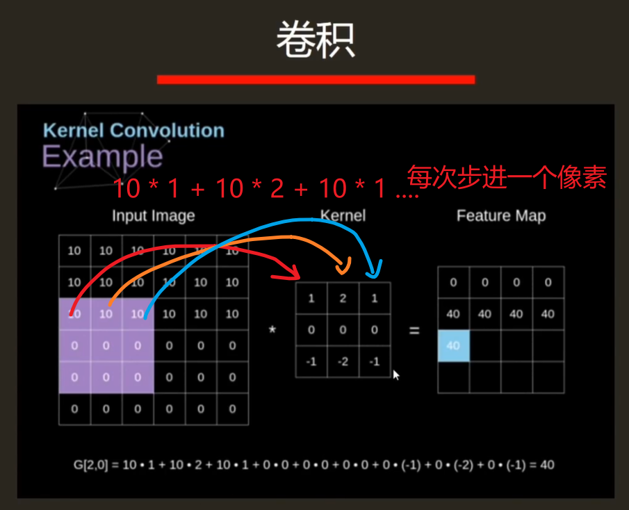
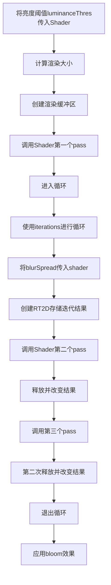

# Bloom效果

> 原理步骤: 提取亮处 -> 进行高斯模糊 -> 与原图混合
> 提取亮出: 有时候是针对于HDR来实现，因为HDR支持 1+的亮度

## 高斯模糊

> 为了模拟光线外扩

- 将输入图片的 3x3 区域乘以一个 卷积核



## 高斯核

高斯核的求法

> 核中心(0, 0)
> 核大小3x3
> 标准方差 \sigma 1.5
>
> 在标准方差不变的情况下，不必重复计算高斯核，因为他的结果就是固定的，使用时直接硬编码矩阵即可。

1. 以0,0 点为中心，取9个像素点(3x3的核)

| (-1, 1)  | (0, 1)  | (1, 1)  |
| -------- | ------- | ------- |
| (-1, 0)  | (0, 0)  | (1, 0)  |
| (-1, -1) | (0, -1) | (1, -1) |

2. 使用高斯函数(二维)

$$
G(x, y) = \frac{1}{2\pi\sigma^2} e^{-\frac{x^2 + y^2}{2\sigma^2}}
$$

| 0.0453 | 0.0566 | 0.0453 |
| ------ | ------ | ------ |
| 0.0566 | 0.0707 | 0.0566 |
| 0.0453 | 0.0566 | 0.0453 |

3. 归一化 (9个值加起来为1)

| 0.0947 | 0.1183 | 0.0947 |
| ------ | ------ | ------ |
| 0.1183 | 0.1478 | 0.1183 |
| 0.0947 | 0.1183 | 0.0947 |


## 实现

1. 准备材料

| 名称                   | 说明                                       | 取值范围   | 额外注释                                                     |
| ---------------------- | ------------------------------------------ | ---------- | ------------------------------------------------------------ |
| Texture                | 需要模糊的图形                             |            |                                                              |
| Shader                 | 执行模糊操作的着色器                       |            | pass1: 提取较量部分<br>pass2: 实现竖直方向模糊<br>pass3: 实现水平方向的模糊<br>pass4: 将量部与模糊图像混合<br>实际应用可以使用pass |
| iterations : int       | 高斯模糊的迭代次数(值越大 越模糊)          | 0,4        |                                                              |
| blurSpread : float     | 高斯模糊的范围(值越大 越模糊)              | 0.2f, 3.0f |                                                              |
| downSample : int       | 控制渲染纹理的大小，越大需要模糊的像素越少 | 1, 8       |                                                              |
| luminanceThres : float | 亮度阈值                                   | 0.0f, 4.0f | 大于1.0f仅适用于HDR                                          |

2. 渲染步骤



| 步骤名                        | 操作                                                         |
| ----------------------------- | ------------------------------------------------------------ |
| 计算渲染大小                  | 将屏幕框高除以`downSample`                                   |
| 创建渲染缓冲区(buffer0)       | 创建大小小于屏幕的RT2D<br>同时设置滤波模式为双线性滤波       |
| 调用Shader中的第一个pass      | 提取图形中较量的区域结果保存在上面创建的RT2D中               |
| 使用iterations进行循环        | 循环入口将`blurSpread`传入Shader`1.0f  + i *blurSpread`      |
| 创建RT2D存储迭代结果(buffer1) |                                                              |
| 调用Shader中的第二个pass      | 将上一步第一个pass的结果作为shader的输入`buffer0`<br>shader的输出传入存储迭代结果的RT2D中`buffer1` |
| 释放并改变结果                | 释放`buffer0`<br>将`buffer0`指向`buffer1`<br>将`buffer1`创建为新的`RT2D` |
| 调用Shader中的第三个pass      | 输入为`buffer0`，输出为`buffer1`                             |
| 第二次释放并改变结果          | 将`buffer0`释放，并指向`buffer1`<br>现在`buffer0`就表示被模糊后的图像 |
| 应用bloom效果                 | 设置shader模糊后的图像为`buffer0`<br>将屏幕材质传入shader<br>应用pass4 => 将原图与模糊后的图像进行混合 <br>释放`buffer0` |


### Unity C#

```cs
public int iterations = 3;
public float blurSpread = 0.6f;
public int downSample = 2;
public float luminanceThreshold = 0.6f;
void OnRenderImage(RenderTexture src, RenderTexture dest)
{
    material.SetFloat("_LuminanceThreshold", luminanceThreshold);
    int rtW = src.width / downSample;
    int rtH = src.height / downSample;
    
    RenderTexture buffer0 = RenderTexture.GetTemporart(rtW, rtH, 0);
    buffer0.filterMode = FilterMode.Bilinear;
    
    Graphices.Blit(src, buffer0, material, 0); //应用第一个pass
    
    for(int i = 0; i < iterations; i++){
        material.SetFloat("_BlurSize", 1.0f + i * blurSpread);
        RenderTexture buffer1 = RenderTexture.GetTemporart(rtW, rtH, 0);
        Graphices.Blit(buffer0, buffer1, material, 1); //应用第二个pass
        
        RenderTexture.ReleaseTemporary(buffer0); //释放buffer0
        buffer0 = buffer1;
        buffer1 = RenderTexture.GetTemporart(rtW, rtH, 0);
        Graphices.Blit(buffer0, buffer1, material, 2); //应用第三个pass
        
        RenderTexture.ReleaseTemporary(buffer0);
        buffer0 = buffer1;
    }
    material.SetTexture("_Bloom", buffer0);
    Graphics.Blit(src, dest, material, 3);
    RenderTexture.ReleaseTemporary(buffer0);
}
```


### Unity Shader

- 基础参数

```glsl
Properties
{
	_MainTex("Base(RGB)", 2D) = "white" {}
	_Bloom("Bloom(RGB)", 2D) = "black" {}
	_LuminanceThreshold("Luminance Threshold", Float) = 0.5
	_BlurSize("Blur Size", Float) = 1.0
}
SubShader
{
	CGINCLUDE
	#include "UnityCG.cginc"
	//定义传入参数
	sampler2D _MainTex;
	half4 _MainTex_TexelSize; //纹理数大小
	sampler2D _Bloom;
	float _LuminanceThreshold;
	float _BlurSize;
	 []

	//开启深度测试 关闭深度剔除和写入
	ZTest Always Cull Off ZWrite Off
	Pass { //提取较量区域
		CGPROGRAM
		#pragma vertex vertExtractBrightMethod
         #pragma fragment fragExtractBright
		ENDCG
	}
	
	Pass { //竖直方向模糊
		CGPROGRAM
            #
            #
		ENDCG
	}	
	
	Pass { //水平方向模糊
		CGPROGRAM
            #
            #
		ENDCG
	}	
	
	Pass { //bloom
		CGPROGRAM
            #
            #
		ENDCG
	}
}
```


- 较亮区域

```glsl
//定义较亮区域的顶点输出结构
struct v2fExteactBright 
{
    float pos : SV_POSITION;
    half2 uv : TEXCOORD0;
}

//定义较亮区域的顶点着色器 返回v2fExteactBright
v2fExteactBright vertExtractBrightMethod(appdata_img v)
{
    v2fExteactBright o;
    o.pos = UnityObjectToClipPos(v.vertex);
    o.uv = v.texcoord;
    return o;
}

//亮度计算方法
fixed luminance(fixed4 color)
{
    //使用亮度计算公式计算
    return 0.2125 * color.r + 0.7154 + color.g + 0.0721 * color.b;
}

//较亮区域的片元着色器
fixed4 fragExtractBright(v2fExteactBright i) : SV_TARGET0
{
    fixed4 c = tex2D(_MainTex, i.uv); //对渲染纹理采样
    fixed val = clamp(luminance(c) - _LuminanceThreshold, 0.0, 1.0); //去阈值
    return c * val; //较亮区域返回值 否则0
}
```


- 竖直方向

> 第二个pass

```glsl
//定义顶点输出
struct v2fBlur 
{
    float4 pos : SV_POSITION;
    half2 uv[5] : TEXCCORD0; //卷积核为5的二维高斯核 计算5个纹理坐标
}

//定义顶点着色器方法
v2fBlur vertBlurVertical(appdata_img v)
{
    v2fBlur o;
    o.pos = UnityObjectToClipPos(v.vertex);
    
    half2 uv = v.texcoord; //当前像素的uv
    o.uv[0] = uv;
    o.uv[1] = uv + float2(0.0, _MainTex_TexelSize.y * 1.0) * _BlurSize; //上偏1个像素
    o.uv[2] = uv - float2(0.0, _MainTex_TexelSize.y * 1.0) * _BlurSize; //下偏1个像素
    o.uv[3] = uv + float2(0.0, _MainTex_TexelSize.y * 2.0) * _BlurSize; //上偏2个像素
    o.uv[4] = uv - float2(0.0, _MainTex_TexelSize.y * 2.0) * _BlurSize; //下偏2个像素
    return o;
}

```


- 水平方向

> 第三个pass

```glsl
//定义顶点着色器方法
//与垂直一致 不过变的是x轴而已
v2fBlur vertBlurHorizontal(appdata_img v)
{
    v2fBlur o;
    o.pos = UnityObjectToClipPos(v.vertex);
    
    half2 uv = v.texcoord; //当前像素的uv
    o.uv[0] = uv;
    o.uv[1] = uv + float2(_MainTex_TexelSize.x * 1.0, 0.0) * _BlurSize; //上偏1个像素
    o.uv[2] = uv - float2(_MainTex_TexelSize.x * 1.0, 0.0) * _BlurSize; //下偏1个像素
    o.uv[3] = uv + float2(_MainTex_TexelSize.x * 2.0, 0.0) * _BlurSize; //上偏2个像素
    o.uv[4] = uv - float2(_MainTex_TexelSize.x * 2.0, 0.0) * _BlurSize; //下偏2个像素
    return o;
}
```


- 高斯模糊

```glsl
//定义高斯模糊的片元着色器
fixed4 fragBlur(v2fBlur i) : SV_TARGET0
{
    //二维高斯核具有可分离性，分离得到的一维高斯核具有对称性，所以放3个高斯核权重就可以
    float weight[3] = {0.4026, 0.2442, 0.0545}; //高斯核权重
	fixed3 sum = tex2D(_MainTex, i.uv[0].rgb * weight[0]); //获取模糊后的颜色值

    for(int it = 1; it < 3; it++){
        //第一次 利用第二个和第三个像素值计算对应像素值        
        //第二次 利用第四个和第五个像素值计算对应像素值
		sum += tex2D(_MainTex, i.uv[it * 2 - 1]).rgb * weight[it];
		sum += tex2D(_MainTex, i.uv[it * 2]).rgb * weight[it];
    }
    
    return fixed4(sum, 1.0);
}
```


- bloom效果

> 第四个pass

```glsl
struct v2fBloom
{
    float4 pos : SV_POSITION;
    half4 uv : TEXCOORD0;
}

v2fBloom vertBloom(appdata_img v)
{
    v2fBloom o;
    o.pos = UnityObjectToClipPos(v.vertex);
    o.uv.xy = v.texcoord; //原本的纹理坐标
    o.uv.zw = v.texcoord; //模糊后的纹理坐标
}

//片元着色器
fixed4 fragBloom(v2fBloom i) : SV_TARGET0
{
    //将两个纹理相加后返回
    return tex2D(_MainTex, i.uv.xy) + tex2D(_Bloom, i.uv.zw);
}
```

对于高锐(GodRay)效果 可以将高斯模糊替换为径向模糊


## tModLoader

```glsl
sampler uImage0 : register(s0); // 原图像
float Intensity = 0.6;
float bulurSize = 0.3; //模糊大小
// float2 uImageTexelSize;  //x => 1f / 宽度, y => 1 / 高度

// 计算亮度的方法
float CountLight(float4 color)
{
    return 0.2125 * color.r + 0.7154 * color.g + 0.0721 * color.b;
}

float4 Pixel(float4 pos : SV_POSITION, float2 uv : TEXCOORD0) : COLOR
{
    float2 textureSize = float2(66.0, 200.0);
    float2 texelSize = float2(1.0 / textureSize.x, 1.0 / textureSize.y);
    
    // 提取亮部
    float4 color = tex2D(uImage0, uv);
    float brightness = CountLight(color);
    float val = clamp(brightness - Intensity, 0.0, 1.0);

    //够亮 返回原色
    if (val <= 0.0)
        return color;
    
    float weights[3] = {0.27, 0.46, 0.27}; // 高斯核权重
    float offsets[3] = {0.0, 1.384615, 3.230769}; // 偏移量

    // 水平方向模糊
    float4 blurredColor = tex2D(uImage0, uv) * weights[0];
    for (int i = 1; i < 3; i++) {
        float2 offset = float2(offsets[i] * texelSize.x * bulurSize, 0.0);
        blurredColor += tex2D(uImage0, uv + offset) * weights[i];
        blurredColor += tex2D(uImage0, uv - offset) * weights[i];
    }

    // 垂直方向模糊
    float4 verticalBlur = tex2D(uImage0, uv) * weights[0];
    for (int j = 1; j < 3; j++) {
        float2 offset = float2(0.0, offsets[j] * texelSize.y * bulurSize);
        verticalBlur += tex2D(uImage0, uv + offset) * weights[j];
        verticalBlur += tex2D(uImage0, uv - offset) * weights[j];
    }    

    // 合并结果
    float4 finalColor = (blurredColor + verticalBlur) * 0.5;
    
    // 应用强度
    return (finalColor * val) + color;
}

technique Technique1
{
    pass Pass1
    {
        PixelShader = compile ps_2_0 Pixel();
    }
}
```

