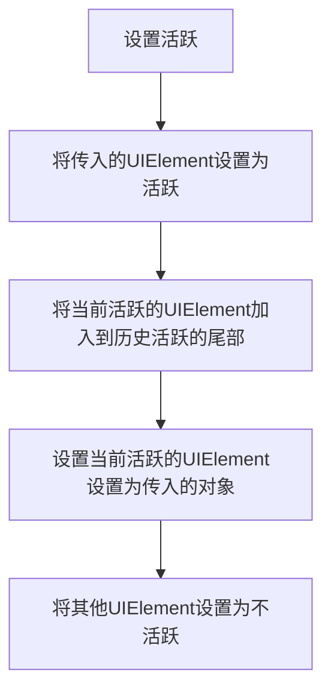

## ActiveTrue


```mermaid
graph
设置活跃 --> 将传入的UIElement设置为活跃 --> 将当前活跃的UIElement加入到历史活跃的尾部 --> 设置当前活跃的UIElement设置为传入的对象 --> 将其他UIElement设置为不活跃
```


## ActiveFalse

```mermaid
graph
设置不活跃 --> 将传入的UIElement设置为不活跃 --> 将历史列表中的最后一个对象设置为活跃并设置为当前活跃 --> 将其他对象设置为不活跃 --> 从历史列表删除当前活跃