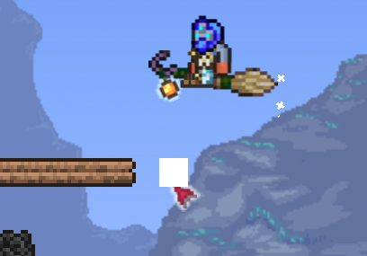

tModLoader绘制当前所属图格区域

> 图格大小为 16 * 16

Terraria.Utils中提供了由Vector2转为图格坐标的方法`ToTileCoordinates16`。

首先，我们获取鼠标在世界中的图格位置。随后将其坐标转为图格坐标`Main.MouseWorld.ToTileCoordinates16()`，返回的坐标是你当前鼠标位置所属的图格坐标，在二维数组中的。

我们只需要将结果的XY分别乘以16，就可以得到当前所指的确切的图格左上角。如果要在屏幕上绘制，还需要转换为屏幕坐标`- Main.screenPosition;`。

```cs
var mouseWorldTile = Main.MouseWorld.ToTileCoordinates16();
var drawPoint = new Vector2(mouseWorldTile.X * 16, mouseWorldTile.Y * 16) - Main.screenPosition;
var drawRectangle = new Rectangle((int)drawPoint.X, (int)drawPoint.Y, 16, 16);
mouseWhiteRectBatch.Begin(SpriteSortMode.Deferred, BlendState.NonPremultiplied, SamplerState.PointWrap, DepthStencilState.None, RasterizerState.CullNone, null, Main.GameViewMatrix.TransformationMatrix);
mouseWhiteRectBatch.Draw(whiteTexture, drawRectangle, null, Color.White);
mouseWhiteRectBatch.End();
```

