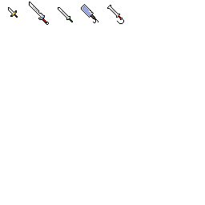
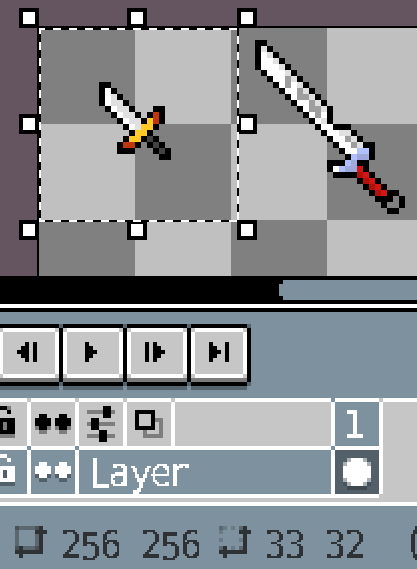
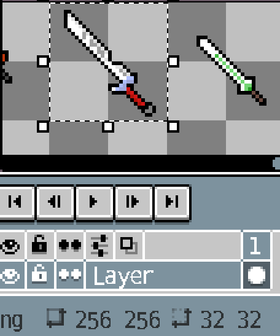
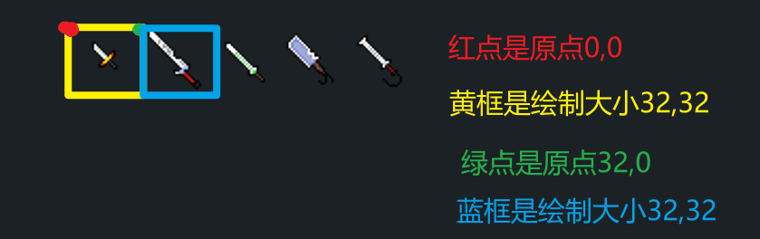

# 基础绘制

​	没有理论直接上手，我们创建一个新类，放哪里看你心情，然后使用他继承`PlayerDrawLayer`，我这边不打算直接讲重写弹幕绘制，而是在`Player`的绘制层进行绘制，我认为知道这个东西比知道重写弹幕绘制更有用。

```cs
public class MyPlayerDrawLayer : PlayerDrawLayer
{
}
```

​	继承后会报错，`ALT + 回车` 重写两个方法

```cs
public class MyPlayerDrawLayer : PlayerDrawLayer
{
	public override Position GetDefaultPosition()
	{
    	throw new NotImplementedException();
	}


    protected override void Draw(ref PlayerDrawSet drawInfo)
    {
        throw new NotImplementedException();
    }
}
```

​	关于`GetDefaultPosition`是返回要绘制在哪个层的，`Draw`就是实际进行绘制的地方，我们还需要重写一个方法用来控制图层的可见性`GetDefaultVisibility`

```cs
public class MyPlayerDrawLayer : PlayerDrawLayer
{
    public override bool GetDefaultVisibility(PlayerDrawSet drawInfo)
    {
        return base.GetDefaultVisibility(drawInfo);
    }
}
```

​	这个我给出几个有关玩家的 字段/属性 便于你们去进行判断什么时候需要启用绘制层

| 字段 / 属性        | 说明                  |
| ------------------ | --------------------- |
| dead               | true玩家死亡          |
| itemAnimation == 0 | 为0玩家没有在使用物品 |
| HeldItem.type      | 玩家手持物品的ID      |
| pulley             | true玩家被绑在绳子上  |
| isPettingAnimal    | 是否在抚摸动物        |

​	给出几个有关玩家的 字段/属性 便于你们进行绘制

| 字段 / 属性                 | 作用                                                      |
| --------------------------- | --------------------------------------------------------- |
| direction                   | 玩家的朝向 1右边 -1左边                                   |
| gravDir                     | 玩家的重力方向  1正 -1反                                  |
| (方法) RotatedRelativePoint | 给定一个位置 自动调整为正确方位<br>自动计算玩家旋转方向等 |
| mount.Active                | 是否骑坐骑                                                |

---

​	现在我们开始进行绘制，作为演示，我将`GetDefaultVisibility`始终返回`true` 注意 始终为 `true`是默认的，你不重写该方法，就是`true`

```cs
public override bool GetDefaultVisibility(PlayerDrawSet drawInfo)
{
    return true;
}
```

​	现在我们将目光放到`GetDefaultPosition`方法，我们需要返回我们所需绘制的层级，可以`CTRL + 左键`进入`Position`探索一番，我这里直接给出说明

​	`BeforeParent`在给定图层之前绘制

​	`AfterParent`在给定图层之后绘制

​	我们这边使用`AfterParent`，图层我们使用`HairBack` 是哪一层可以使用`Visual Studio`的文档提示进行观察，玩家的所有图层基本上都在`PlayerDrawLayers` 使用 `.(成员访问操作符)` 如果字段/属性的类型是`PlayerDrawLayer`就是可以用的

```cs
public override Position GetDefaultPosition()
{
    return new AfterParent(PlayerDrawLayers.HairBack);
}
```

---

​	开始进行绘制了，`drawInfo`中可以获取太多太多东西，这个可以自行研究，我们探讨的是基础的绘制，我们本次绘制要基于玩家中心，我们可以使用`drawInfo`获取玩家

```csharp
using Terraria;
protected override void Draw(ref PlayerDrawSet drawInfo)
{
    Player player = drawInfo.drawPlayer;
}
```

​	准备一张贴图 / 一张长帧图，(来自于同学)



​	我这张图每个图片大小为32，没有线条分割





​	我们前往`Mod`主类中的`Load()`方法加载贴图

```cs
using ReLogic.Content;
public class TempMod : Mod
{
    public static Asset<Texture2D> TempTex2D;
    public override void Load()
    {
        //这里注意以下，使用这个方法加载 字符串内容从 模组名称开始
        //名字名称/存储文件夹/贴图名称	不带后缀.png
        //贴图需要png格式
        //如果贴图放在根目录 那就=> 	模组名称/贴图名称
        TempTex2D = ModContent.Request<Texture2D>("TempMod/Content/Items/MeleeWeapon");
    }
}
```

​	这边我们定义一个字段来存储这个贴图的资源，为了方便访问，我使用`static`修饰

​	现在我们回到`MyPlayerDrawLayer`的`Draw`方法

​	我们获取用于绘制的画笔`Main.spriteBatch`

```cs
protected override void Draw(ref PlayerDrawSet drawInfo)
{
    Player player = drawInfo.drawPlayer;
    SpriteBatch sb = Main.spriteBatch;
}
```

​	我们使用`sb`的`Draw()`方法开始绘制，由于Draw本身是在`sb.Begin()`中的 所以我们直接调用 `Draw()`，他有7个重载，我们使用

---

```cs
public void Draw(
	Texture2D texture,	//贴图
	Vector2 position,	//绘制位置 屏幕坐标
	Rectangle? sourceRectangle,		//绘制贴图的哪一部分,null全部
	Color color
) 
```

更泛用的方法

```cs
public void Draw(
	Texture2D texture,	//贴图
	Vector2 position,	//绘制位置 屏幕坐标
	Rectangle? sourceRectangle,		//绘制贴图的哪一部分,null全部
	Color color,		//染色 我们给白色
	float rotation,		//绘制的旋转角度，一般获取特定对象的角度确保正确绘制
	Vector2 origin,		//贴图的原点
	float scale,		//绘制的缩放大小
	SpriteEffects effects,	//特效
	float layerDepth	//图层深度，影响绘制顺序
) 
```

---

我们开始进行绘制

```cs
protected override void Draw(ref PlayerDrawSet drawInfo)
{
    Player player = drawInfo.drawPlayer;
    SpriteBatch sb = Main.spriteBatch;
    sb.Draw(
        //我们使用的是资源，而不是直接的贴图，所以需要 Value 取值
        texture: 		TempMod.TempTex2D.Value,
        //由于是屏幕坐标系，所以我们需要获取玩家所在屏幕的位置
        //Main.screenPosition是屏幕左上角在世界中的位置
        position: 		player.Center - Main.screenPosition,
        //绘制范围 x,y是绘制原点，高宽是基于原点绘制的高宽
        sourceRectangle: new Rectangle(0, 0, 32, 32),
        color: 			Color.White
        );
}
```



想要绘制帧图的话，我们只需循环改变 `new Rectangle`中 `x,y`的位置就行了

```cs
private int num = 0;
protected override void Draw(ref PlayerDrawSet drawInfo)
{
    Player player = drawInfo.drawPlayer;
    SpriteBatch sb = Main.spriteBatch;
    sb.Draw(
        texture: TempMod.TempTex2D.Value,
        position: player.Center - Main.screenPosition,
        //注意这里，我们使num乘上了单个贴图宽度 num为0就是第一张了，num为1就第二张了，以此类推
        //num的最大大小应该为 贴图数量 - 1
        sourceRectangle: new Rectangle(num * 32, 0, 32, 32),
        color: Color.White
        );
    num++;
    if (num > 4)
        num = 0;
}
```

​	我们现在如果进入游戏看效果，会发现贴图快的要命，因为绘制速度是与玩家`FPS`相关的，默认情况下是`60FPS`也有特殊情况，例如玩家将 `设置 -> 视频 -> 跳帧` 设置为 `关 / 隐蔽` 时，会超越，达到等同于屏幕的FPS

​	我们可以进行一些更改

```cs
private int num = 0;
protected override void Draw(ref PlayerDrawSet drawInfo)
{
    Player player = drawInfo.drawPlayer;
    SpriteBatch sb = Main.spriteBatch;
    sb.Draw(
        texture: TempMod.TempTex2D.Value,
        position: player.Center - Main.screenPosition,
        sourceRectangle: new Rectangle(num / 100 * 32, 0, 32, 32),
        color: Color.White
        );
    num++;
    if (num > 400)
        num = 0;
}
```

​	现在我们的绘制就缓慢了许多，如果想要绘制在鼠标位置，`position` 更改为 `Main.MouseWorld - Main.screenPosition` ，对于弹幕 与这个一样，绘制在弹幕位置`Projectile.Center - Main.screenPosition`，要绘制拖尾需要在弹幕`SetStaticDefaults()`中增加如下

```cs
public override void SetStaticDefaults()
{
    //记录轨迹和旋转 Type是本弹幕自身的ID
    ProjectileID.Sets.TrailingMode[Type] = 2;
    //记录多少帧
    ProjectileID.Sets.TrailCacheLength[Type] = 20;
    base.SetStaticDefaults();
}
```

​	访问`Projectile.oldPosition[i]`可以i帧前的数据，想让绘制正常旋转需要使用`Projectile.oldRot[i]`获取角度，并使用更泛用的`Draw`，并使`position`为`Projectile.oldRot[i]`
