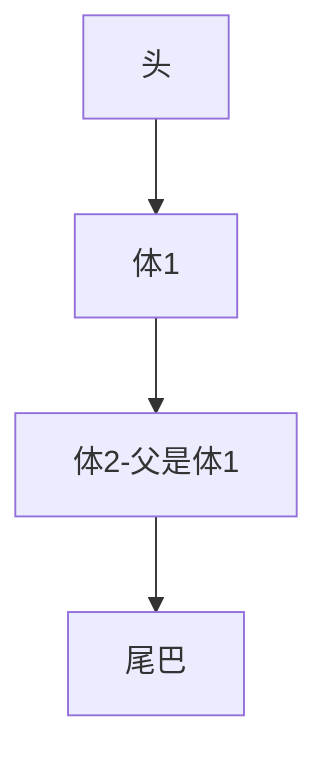
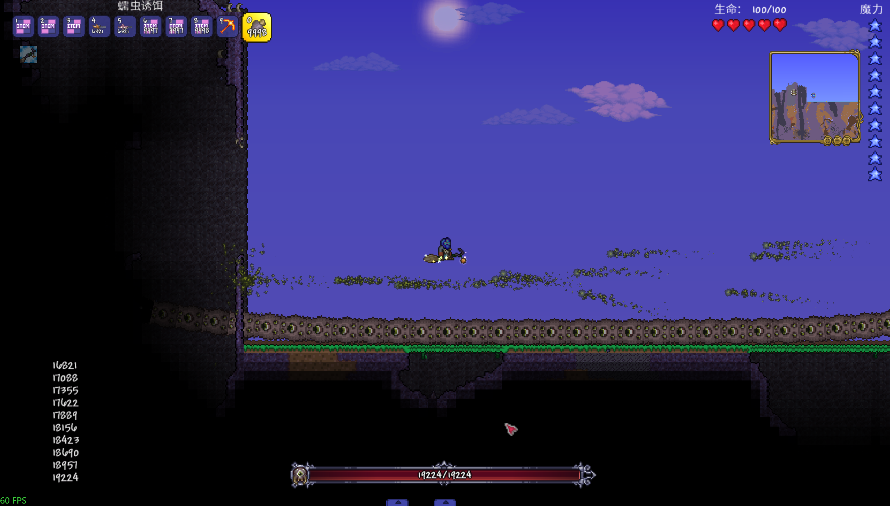

# 多目标Boss索取判断

```cs
public override void OnSpawn(NPC npc, IEntitySource source)
{
    if(source is not EntitySource_BossSpawn bossSpawn) { // Boss被召唤将会使用BossSpawn
    }

    if(source is not EntitySource_Parent rootNPC) { // 此NPC是被Boss召唤的
    }
    base.OnSpawn(npc, source);
}
```

如果是根Boss，那么他将会是`EntitySource_BossSpawn`，同时此生成源的实体，一般为召唤此Boss的玩家。
如果是子Boss，那么他将会是`EntitySource_Parent`，同时此生成源的实体，一般为父NPC。

但是例如世界吞噬者，他的`EntitySource_Parent`中的实体，可能不是脑袋，他是一条条串下去的，就像糖葫芦




获取世界吞噬者血量示例
```cs
public class MuchBossBarInfo
{
    public int MaxLife { get; set; }
    public int Life {get; set; }
    
    // 如果key不存在则创建
    public static MuchBossBarInfo IfNotKeyThenCreate<TKey>(IDictionary<TKey, MuchBossBarInfo> dic, TKey tarKey)
    {
        if(dic.TryGetValue(tarKey, out var value)) {
            return value;
        } else {
            var info = new MuchBossBarInfo();
            dic[tarKey] = info;
            return info;
        }
    }
}
public class MuchBossBarSystem : ModSystem
{
    // Key => whoAmI
    // Value => Info
    public readonly static Dictionary<int, MuchBossBarInfo> whoAmIAndLife = [];
    
    // 世界吞噬者体结ID
    public readonly static int[] wroldTheEating = [NPCID.EaterofWorldsBody, NPCID.EaterofWorldsHead, NPCID.EaterofWorldsTail];
}
public class MuchBossBarGlobalNPC : GlobalNPC
{
    public override bool InstancePerEntity => true;
    public NPC RootNPC; // 记录父
    public override void OnSpawn(NPC npc, IEntitySource source)
    {
        source.BossSpawn(npc, BossSpawn);
        source.NPCParent(npc, NPCParent);

        base.OnSpawn(npc, source);
    }

    
    private static void BossSpawn(NPC npc, EntitySource_BossSpawn spawn)
    {
        // 只创建父的Info 用于累加血量
        var info = MuchBossBarInfo.IfNotKeyThenCreate(whoAmIAndLife, npc.whoAmI);
        info.MaxLife = npc.lifeMax;
    }

    private static void NPCParent(NPC npc, EntitySource_Parent spawn, NPC parentNPC)
    {
        // 获取gnpc
        var son = npc.GetGlobalNPC<MuchBossBarGlobalNPC>();
        var parent = parentNPC.GetGlobalNPC<MuchBossBarGlobalNPC>();
        
        // 如果子NPC没有父，并且父NPC没有父，那么父NPC就是顶级NPC
        if (son.RootNPC is null && parent.RootNPC is null) { 
            son.RootNPC = parentNPC;
        } else {
            // 否则父NPC就是子NPC
            son.RootNPC = parent.RootNPC; 
        }
		
        // 判断此NPC是否属于世界吞噬怪
        if (wroldTheEating.Contains(npc.type)) {
            // 累积
            var info = whoAmIAndLife[parent.RootNPC?.whoAmI ?? parentNPC.whoAmI];
            info.MaxLife += npc.lifeMax;
            info.Life += npc.life;
            Main.NewText(info.MaxLife);
        }
    }
}


public static class MuchBossBarEntitySourceExtension
{
    extension(IEntitySource source)
    {
        /// <param name="npc">传入NPC对应实体</param>
        /// <param name="call">你传入的NPC</param>
        public void BossSpawn(NPC npc, Action<NPC, EntitySource_BossSpawn> call)
        {
            if(source is EntitySource_BossSpawn spawnSource) {
                call(npc, spawnSource);
            }
        }

        /// <param name="sourceNPC"> NPC实体 </param>
        /// <param name="call"> 第一个NPC是你传入的NPC实体，第二个NPC是父实体 </param>

        public void NPCParent(NPC sourceNPC, Action<NPC, EntitySource_Parent, NPC> call)
        {
            if (source is EntitySource_Parent spawnSource && spawnSource.Entity is NPC npc) {
                call(sourceNPC, spawnSource, npc);
            }
        }
    }

    extension(NPC npc)
    {
        /// <param name="call">你传入的NPC</param>
        public void BossSpawn(IEntitySource source, Action<NPC, EntitySource_BossSpawn> call)
        {
            if (source is EntitySource_BossSpawn spawnSource) {
                call(npc, spawnSource);
            }
        }

        /// <param name="sourceNPC"> NPC实体 </param>
        /// <param name="call"> 第一个NPC是你传入的NPC实体，第二个NPC是父实体 </param>

        public void NPCParent(IEntitySource source, Action<NPC, EntitySource_Parent, NPC> call)
        {
            if (source is EntitySource_Parent spawnSource && spawnSource.Entity is NPC parentNPC) {
                call(npc, spawnSource, parentNPC);
            }
        }
    }
}
```


