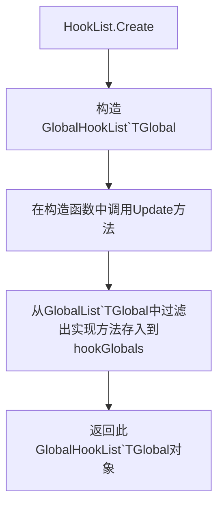

# 重新方法意味着什么

以`GlobalNPC`为例，他最终的继承是`ModType`而`ModType`实际是`tModLoader`中自定义实体的最终父类，并且实现`ILoadable`，在自动加载中，`tModLoader`会自动搜寻`ILoadanle`的类型，并在[实例化](https://github.com/tModLoader/tModLoader/blob/7b0042b13b48d7327b7928d94e746ef900f0964c/patches/tModLoader/Terraria/ModLoader/Mod.Internals.cs#L62)后[调用](https://github.com/tModLoader/tModLoader/blob/7b0042b13b48d7327b7928d94e746ef900f0964c/patches/tModLoader/Terraria/ModLoader/Mod.cs#L175C3-L175C23)`Load`方法，凡是继承自`ModType`的 都需要实现`Register`方法，而此方法，便是对类型进行注册。

```cs
public abstract class GlobalNPC : GlobalType<NPC, GlobalNPC>;
public abstract class GlobalType<TGlobal> : ModType where TGlobal : GlobalType<TGlobal>;
public abstract class ModType : IModType, ILoadable
```

就拿`GlobalType<TGlobal>`来说，这是他的`Register`方法，他在注册的时候会对`GlobalList<TGlobal>`进行注册
```cs
protected override void Register()
{
	ModTypeLookup<TGlobal>.Register((TGlobal)this);
	(StaticIndex, PerEntityIndex) = GlobalList<TGlobal>.Register((TGlobal)this);
}
```

`NPC`钩子实际运作的类型是`Terraria.ModLoader.NPCLoader`, 我们以`PostAI` or `AI`为例。我们找到 `NPCLoader.PreAI(NPC npc)`，我们可以看到如下代码，他会先遍历`GlobalNPC`并执行相应方法，然后再执行原NPC应该的逻辑，而`HookPreAI`的类型是`HookList`，这个其实只是一个别名。

```cs
using HookList = Terraria.ModLoader.Core.GlobalHookList<Terraria.ModLoader.GlobalNPC>;
private static HookList HookPreAI = AddHook<Func<NPC, bool>>(g => g.PreAI);

public static bool PreAI(NPC npc)
{
	bool result = true;
	foreach (var g in HookPreAI.Enumerate(npc)) {
		result &= g.PreAI(npc);
	}
	if (result && npc.ModNPC != null) {
		return npc.ModNPC.PreAI();
	}
	return result;
}
```

---

我们主要查看的是 `AddHook`做了什么
```cs
private static HookList AddHook<F>(Expression<Func<GlobalNPC, F>> func) where F : Delegate
{
	var hook = HookList.Create(func);
	hooks.Add(hook);
	return hook;
}
```

下面罗列`HookList.Create(func)`的流程 其中`TGlobal`为`GlobalNPC`，而`HookPreAI.Enumerate(npc)`就是直接返回`hookGlobals`


---

当我们有了完整的流程后，又是由谁来调用这个方法？这便是补丁的作用，`tModLoader`在原版代码中打了非常多的补丁，来执行这些，所以我们每重写一个全局方法，都会在原有逻辑上多执行一次内容。以`AI`为例[更改](https://github.com/tModLoader/tModLoader/blob/7b0042b13b48d7327b7928d94e746ef900f0964c/patches/tModLoader/Terraria/NPC.cs.patch#L1146)