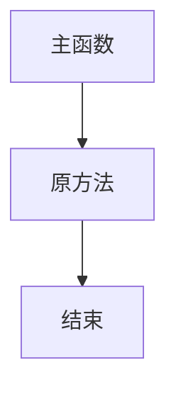
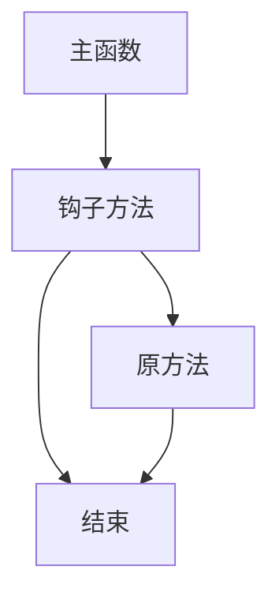

# 钩子

理解钩子，有助于后续的模组开发。如果不去知晓这个东西的话，我认为最终的结果是不具可维护性的，因为你只知道某个重写方法可以做什么，而不知道为什么他可以做这个内容。我认为他有必要在刚开始写模组的时候就被认识。
我们先认识一下钩子的工作流程（图）

> 原方法

> 挂钩后

他劫持原始方法，或者更改原始方法，从而插入我们需要的逻辑。tml所做的就是为我们将大量的钩子封装成了类型，让我们能够非常简单的使用。
我们要了解的就是，tml如何为我们封装。
演示用的是moditem，我们在任意可重写函数的方法尾插入一个断点，然后使用逐步执行，我们就可以进入到调用方法的地方。
可以看到，他将我们的方法封装成了委托。这里涉及到几个C#高级编程，一是反射获取全部类型，并将对象实体的方法抽离为单个委托。
所以后面会认识到一个特性[autoload]而tml为我们封装的游戏实体，默认都是被标记的，从而利用反射自动创建并封装。
看完了tml的实现后，我们可以把钩子的实现流程分解为下面几个步骤
理解源码
分析后果
挂钩
我们也知道了 我们重写Entity的某个方法意味着什么。

涉及的类

`ModType` `ModContent` `ItemLoader` `par Mod` 

`ModType`实现接口 `ILoadable` 而`ILoadable`的`Load`方法会自动调用，从而在一开始对内容进行注册

