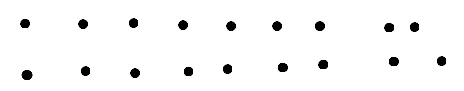
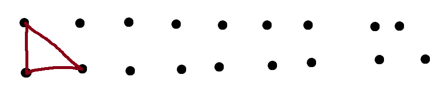
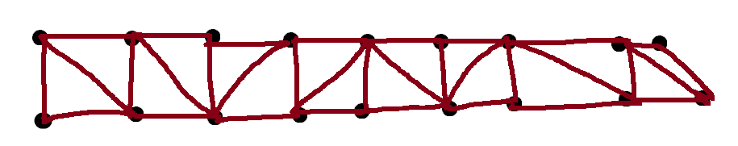
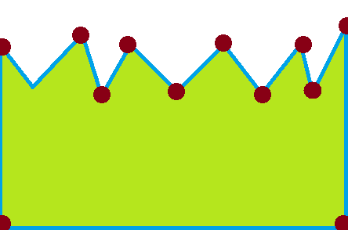
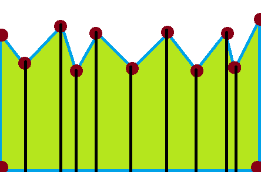
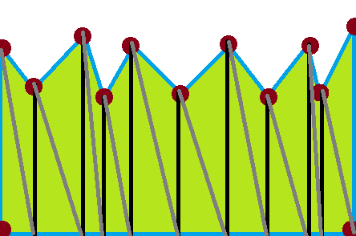

# 顶点绘制

**每个对象都由叫做顶点的点构成** 如图 




**在顶点间绘制三角形 就可以使对象成为纹理(贴图)**






**然后将纹理(贴图)覆盖在三角形的顶部 呈现对象的真实外观 例如应用灯光**

**这个纹理其实是要贴在原贴图上的**


**值得注意的是，屏幕上的所有内容都是从3D空间中的三角形集合开始的，这些三角形就被称为基元**

XNA并没有直接公开绘制基元的简单方法，而是旨在绘制更高级的项目， 比如2D对象的Sprite

我们的方形纹理实际上就是用了两个三角形完成绘制


```c#
//PrimitiveType是个枚举类型
//TriangleList是三角形列表
sb.Begin(PrimitiveType.TriangleList)
```


**现在我们需要绘制如下的东西，锯齿状的顶部边缘表示地形**




**首先我们垂直分割定义的每个点上的形状**




**现在看到的是矩形，我们需要将他分割为两个三角形**

这就是画出图形的方法




每个三角形包含3个顶点，每个方形包含6个顶点A