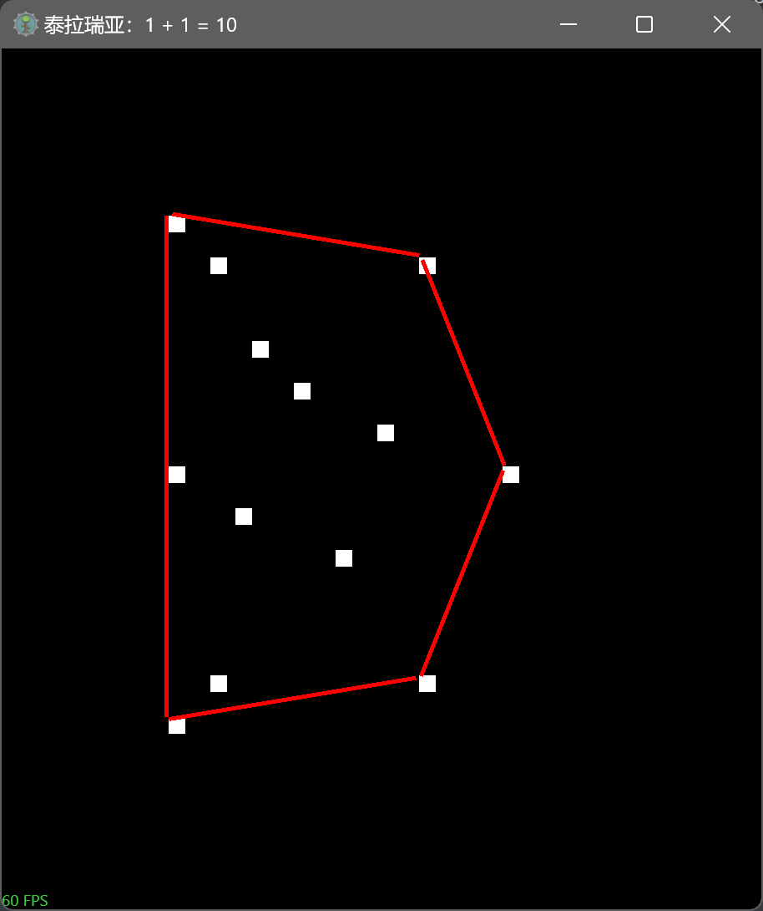

# 凸包的定义

在一个实数向量空间V中，对于给定集合X，所有包含X的凸集的交集S被称为X的凸包


# 角排序

1. 以哪个点为中心进行排序?

   以给定点集合中任意一点或均点为中心进行排序

2. 点集合中的点与排序中心点重合怎么办?

   以排序中心点重合点的角度为0

# 方向计算

叉积 

1. A点位于向量OB的左边，B与A叉积为正
2. B点位于向量OA的右边，A与B叉积为负

一个点B中向量OA的左边，则OA与OB的叉积为正
一个点B中向量OB的右边，则OA与OB的叉积为负


# a

对栈顶两个元素向量，判断下一个元素是否在左边。

如果在，下一元素出栈

不在左边，栈顶元素出栈

如果栈内元素不足两个，无论如何，下一个元素都入栈。


任选一点，计算角度，按照角度排序。
然后选择最左边顶点作为起始元素

```cs
#region 定义点
pointList.AddRange([
    new EntityPoint() { position = new Vector2(200, 200) },     // 左上
    new EntityPoint() { position = new Vector2(500, 250) },     // 右上偏上
    new EntityPoint() { position = new Vector2(600, 500) },     // 右中
    new EntityPoint() { position = new Vector2(500, 750) },     // 右下偏下
    new EntityPoint() { position = new Vector2(200, 800) },     // 下顶点
    new EntityPoint() { position = new Vector2(250, 750) },     // 左下偏下
    new EntityPoint() { position = new Vector2(200, 500) },     // 左中
    new EntityPoint() { position = new Vector2(250, 250) },     // 左上偏上
    // 内部点（都在凸包内部）
    new EntityPoint() { position = new Vector2(350, 400) },
    new EntityPoint() { position = new Vector2(300, 350) },
    new EntityPoint() { position = new Vector2(400, 600) },
    new EntityPoint() { position = new Vector2(450, 450) },
    new EntityPoint() { position = new Vector2(280, 550) }
]);
#endregion
```


```cs
public override void DoUpdate(Main main, ref GameTime gametime)
{
    if (drawArithmentic == false) return;
    foreach (var item in pointList) {
        item.Update(main, ref gametime);
    }
    凸包点.Clear();
    if (pointList.Count < 3) return;

    //1. 计算最左边的点作为起始点 or MaxBy(p => p.Y);
    // - 随机获取一个初始点
    // - 遍历点列表，比较Y轴位置

    //2. 计算下一个凸包点
    // |- 进入循环前 设置起始点为当前点 并将起始点加入到集合中
    // |- 随机选取下一个点 pointlist[0]
    // |- 遍历点列表
    //   |- 计算三点叉积  当前点, 下一个点, 遍历到的点
    //   |- 如果nextPoint == currentPoint || 叉积 > 0 ||
    //     |- (共线判断): |叉积|  < 0.001 && Vector2.Distance(currentPoint.position, candidate.position) > Vector2.Distance(currentPoint.position, nextPoint.position)
    //     |- 下一个点就为当前遍历到的点
    // |- 设置当前点为下一个点
    // |- 如果当前点不等于起始点，加入到合集
    // do while的结束条件为 (currentPoint != startPoint && 凸包点.Count <= pointList.Count)


    var startPoint = pointList.MinBy(ep => ep.X);
    var currentPoint = startPoint;
    凸包点.Add(currentPoint);
    do {
        var nextPoint = pointList[0];
        foreach (var 预选 in pointList) {
            if(预选 == currentPoint) {
                continue;
            }
            var cross = Cross(currentPoint, nextPoint, 预选);
            if(nextPoint == currentPoint || cross > 0 || (Math.Abs(cross) < 0.001f && 共线且更远(currentPoint, 预选, nextPoint))) {
                nextPoint = 预选;
            }
        }
        currentPoint = nextPoint;
        if(currentPoint != startPoint) {
            凸包点.Add(currentPoint);
        }
    } while(currentPoint != startPoint && 凸包点.Count < pointList.Count);
}

private bool 共线且更远(EntityPoint ep1, EntityPoint ep2, EntityPoint ep3)
{
    return Vector2.Distance(ep1, ep2) > Vector2.Distance(ep1, ep3);
}

// 计算叉积 (p1->p2) × (p1->p3)
//叉积 > 0：b在a的逆时针方向（左转）
//叉积 = 0：a和b共线（方向相同或相反）
//叉积< 0：b在a的顺时针方向（右转）
private static float Cross(Vector2 p1, Vector2 p2, Vector2 p3)
{
    //想象你站在点 p1，面朝点 p2：
    //Cross(p1, p2, p3) > 0：点 p3 在你的左手边
    //Cross(p1, p2, p3) = 0：点 p3 在你正前方或正后方（共线）
    //Cross(p1, p2, p3) < 0：点 p3 在你的右手边
    return (p2.X - p1.X) * (p3.Y - p1.Y) - (p2.Y - p1.Y) * (p3.X - p1.X);
}
```


