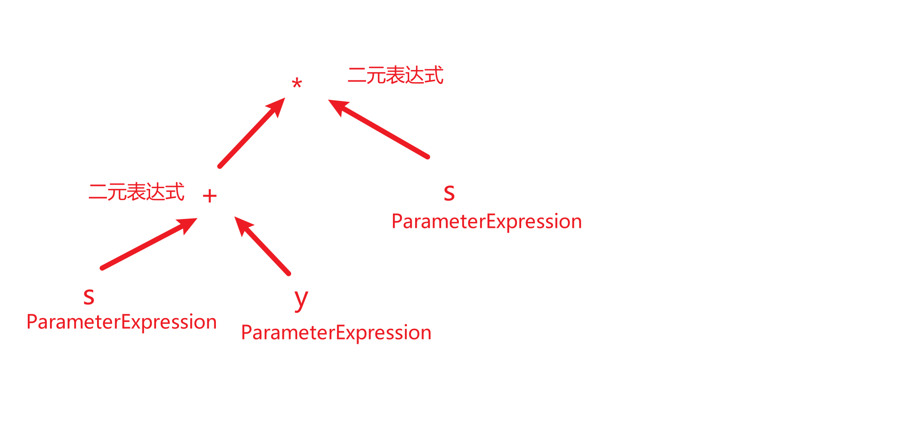

# 表达式树

```cs
Expression<Func<int, int, int>> ExFunc = (s,y) => (s + y) * s;
```




# 手动拼接表达式树

1. 初始化委托的时候，他是一个匿名方法		=>	做事情
2. 初始化表达树的时候，他是一个表达式树            =>        描述事物
3. 表达式只有调用后才会去**做事情**


- 创建常量表达式

```cs
//该常量表达式含一个5
ConstantExpression ConExp = Expression.Constant(5, typeof(int));
```

```cs
Expression<Func<int>> ConExp = () => 5;
```

- 构建

```cs
//告诉表达式，我们的是一个func，然后构建Lambda表达式，其body就是我们创建的常量表达式
//这个是最终树
Expression<Func<int>> RootExp = Expression.Lambda<Func<int>>(ConExp, null);
RootExp
    .Compile()
    .Invoke();
```


- 较为复杂的表达树

```cs
Expression<Func<int, int>> fExp = (y) => y + 5;
```

```cs
//先构建右子树 (常量表达式)
ConstantExpression consExp = Expression.Constant(5, typeof(int));

//构建左子树 (参数表达式) 参数类型是int 参数名是y
ParameterExpression parExp = Expression.Parameter(typeof(int), "y");

//构建主树 (二元表达式) 传入运算符 + 左子树 + 右子树
BinaryExpression binExp = Expression.MakeBinary(ExpressionType.Add, parExp, consExp);

//构建表达式 传入参数
Expression<Func<int, int>> expression = Expression.Lambda<Func<int, int>>(binExp, new ParameterExpression[]
{
    parExp
});
```


- 复习

```cs
Expression<Func<int, int, int>> fcunExp = (x, y) => 5 + x * y - x;
```

```cs
// 5 + (x * y) - x
//构建参数 表达式
ParameterExpression x = Expression.Parameter(typeof(int), "x");
ParameterExpression y = Expression.Parameter(typeof(int), "y");

//构建常量表达式
ConstantExpression constExp = Expression.Constant(5, typeof(int));

//构建 (x * y)
BinaryExpression XxY = Expression.MakeBinary(ExpressionType.Multiply, x, y);

//构建 5 + (x * y)
BinaryExpression constAMultiply = Expression.MakeBinary(ExpressionType.Add, constExp, XxY);

//构建 - x
BinaryExpression fiExp = Expression.MakeBinary(ExpressionType.Subtract, constAMultiply, x);

//主表达式
Expression<Func<int, int, int>> expression = Expression.Lambda<Func<int, int ,int>>(fiExp, new ParameterExpression[]
{
    x,
    y
});
```


- 将StudentInfo的Id ToString

```cs
//对象表达式 获取对象
ParameterExpression parameter = Expression.Parameter(typeof(StudentInfo), "student");
//成员访问表达式 获取属性
MemberExpression studentID = Expression.Property(parameter, "Id");
//方法调用表达式 调用方法
MethodCallExpression MCExp = Expression.Call(studentID, "ToString", null);
//最终表达式树
Expression<Func<StudentInfo,string>> expression = Expression.Lambda<Func<StudentInfo,string>>(MCExp, new ParameterExpression[]
{
    parameter,
});
```


